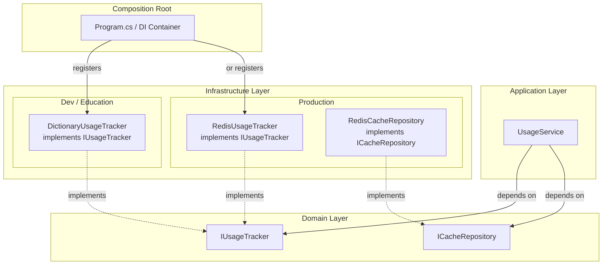
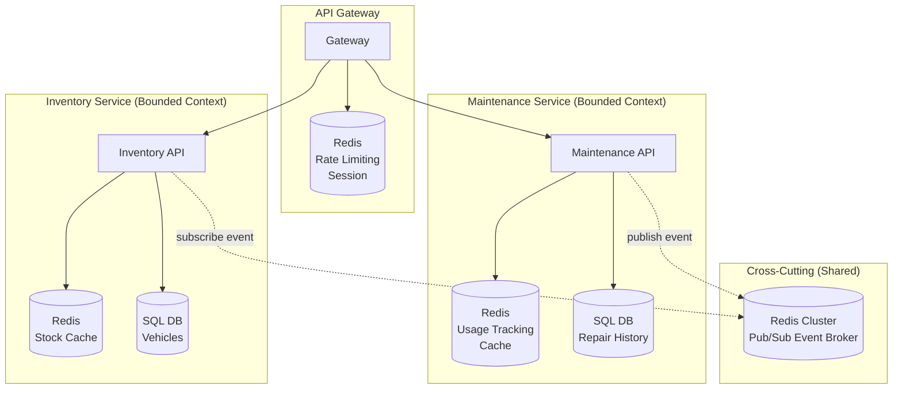
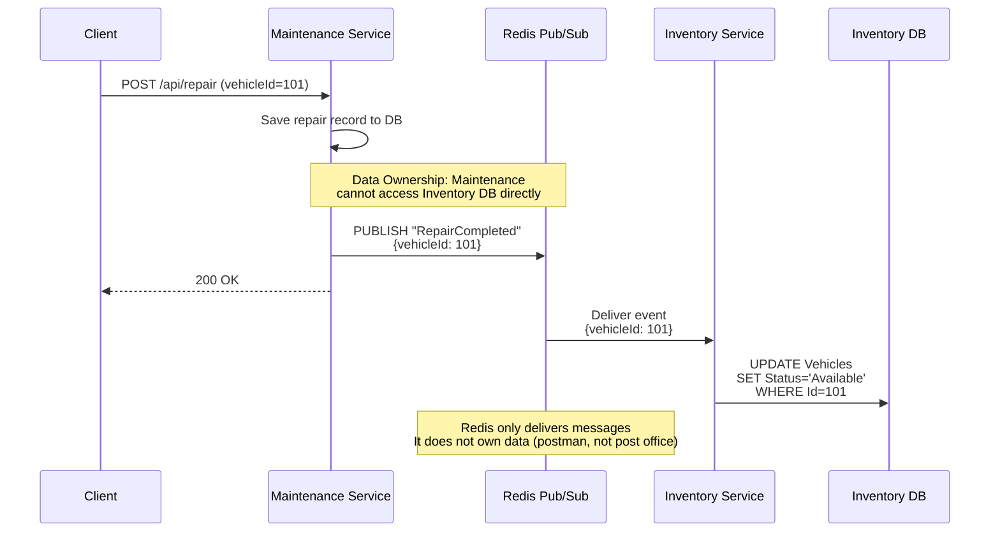

# In-Memory State: Scale-Up Path

## Why This Note Exists
While learning Stateful Tracking in PROG3176 Lab 5, the lab used a Singleton `Dictionary<string, int>` in ASP.NET Core to track API usage counts. It felt like a forced, toy example that only teaches the concept without showing how it actually works in the real world. This note bridges that gap — from the lab's Singleton Dictionary to production-grade solutions like Redis, and how it all fits into Clean Architecture and Microservices.

## Dictionary → ConcurrentDictionary → Redis

| | Dictionary | ConcurrentDictionary | Redis |
|---|---|---|---|
| Scope | Single process | Single process | External (independent server) |
| Thread-safe | No | Yes | Yes (single-threaded event loop) |
| Survives restart | No | No | Yes |
| Shared across instances | No | No | Yes |
| TTL (auto-expiry) | No | No | Yes |

## When to Use Redis
- API call tracking (rate limiting, usage counting)
- Session storage
- Caching (temporary DB query results)
- Any fast read/write for ephemeral to semi-persistent data

## Key Insight
- Redis = "a super-fast Dictionary that lives outside your app"
- Faster than DB (in-memory), more durable than Dictionary (persists, shareable)
- First choice to replace a Singleton Dictionary in production

---

## Redis in Clean Architecture (Single Service)



### Key Points
- **Domain Layer**: Only defines contracts (interfaces) like `IUsageTracker`
- **Infrastructure Layer**: Contains implementations — Dictionary or Redis
- **Composition Root (Program.cs)**: DI decides which implementation to use
- Swapping implementations requires zero changes to Domain/Application layers (DIP)

### Lab 5 vs Production
```csharp
// Lab 5 (education) — Program.cs
builder.Services.AddSingleton(new Dictionary<string, int>());

// Production — Program.cs
builder.Services.AddSingleton<IUsageTracker, RedisUsageTracker>();
```

---

## Redis in Microservices (Multiple Services)



### Redis Roles by Pattern

| Pattern | Redis Location | Ownership | Purpose |
|---------|---------------|-----------|---------|
| Per-service cache | Dedicated to each service | Inside Bounded Context | DB caching, usage tracking |
| API Gateway | Dedicated to Gateway | Gateway-owned | Rate limiting, sessions |
| Pub/Sub broker | Shared Redis Cluster | Shared infra | Inter-service event delivery |

### DDD Principles
- **Data Ownership**: Each service owns its own Redis (no direct access by others)
- **Bounded Context**: Per-service cache lives in that Context's Infrastructure Layer
- **Shared Redis**: Only acts as event broker (delivers messages, doesn't own data)

---

## Event-Driven Communication via Redis Pub/Sub

### Example: Repair Completed → Vehicle Status Update



### Why Events Instead of Direct API Calls?

Without a broker, "service-to-service events" is just an HTTP call in disguise — Maintenance would still need `httpClient.PostAsync("https://inventory-service/...")`.

A broker enables true decoupling: Maintenance just publishes `"RepairCompleted"` to Redis — it doesn't know or care who listens. New subscribers (e.g., Billing) can be added without touching Maintenance code.

| | Direct Call (Sync) | Event via Broker (Async) |
|---|---|---|
| Coupling | Maintenance must know Inventory URL | Neither knows the other |
| Failure propagation | Inventory down → Maintenance fails too | Maintenance responds normally |
| Scalability | 1:1 | 1:N (multiple subscribers) |

### Redis is a Multi-Purpose Tool

Pub/Sub is not a separate product — it's a **built-in feature** of Redis. If you already use Redis for caching, you get messaging for free. No additional infrastructure needed.

```
One Redis server provides:
├── Cache        (GET/SET)              ← key-value store
├── Counters     (INCR)                 ← usage tracking
├── Sessions     (SETEX + TTL)          ← auto-expiring data
└── Pub/Sub      (PUBLISH/SUBSCRIBE)    ← event delivery
```

### Message Broker Comparison

| | Redis Pub/Sub | Kafka / RabbitMQ |
|---|---|---|
| Message retention | No (lost if no subscriber) | Yes (queued until consumed) |
| Best for | Real-time notifications, loss OK | Orders, payments, loss unacceptable |
| Complexity | Low (just Redis) | High (separate infrastructure) |

---

## Source
- PROG3176 Lab 5: Stateful Behaviour (2026-02-19)
