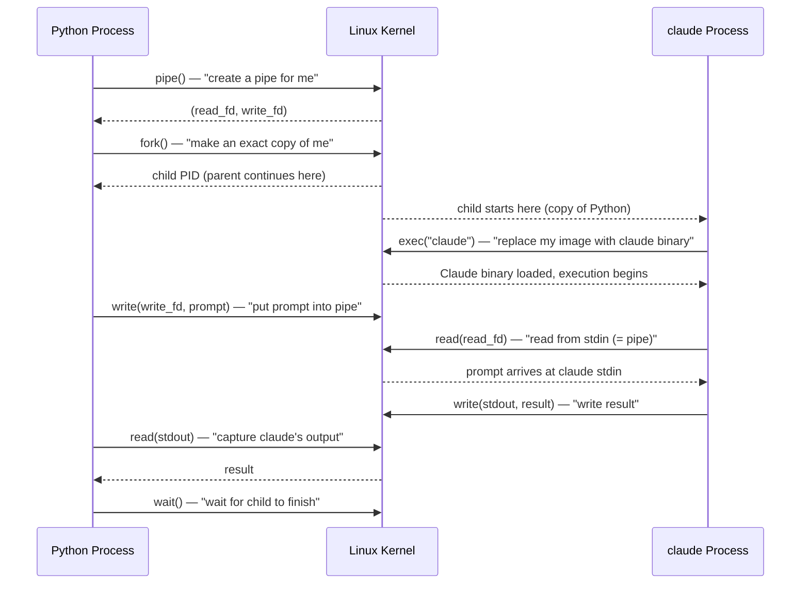
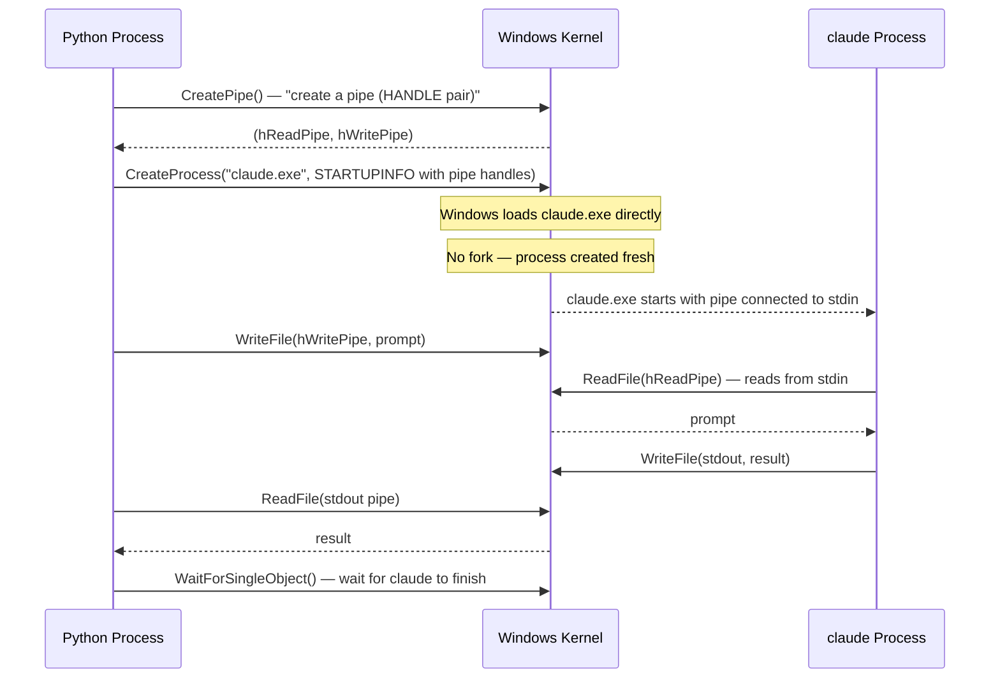
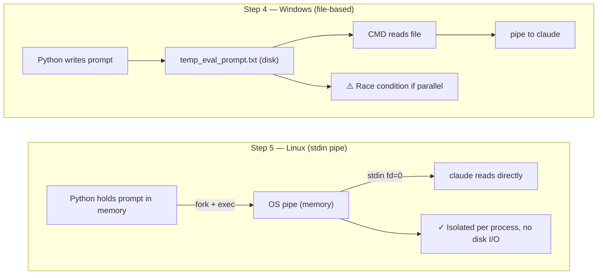

# Processes, System Calls, and Linux vs Windows

> **Context**: Understanding why Step 4 (Windows) and Step 5 (Linux/Docker) use different subprocess approaches
> **Date**: 2026-02-17

---

## 1. User Space vs Kernel Space

Programs can't directly touch hardware (disk, network, other processes' memory).
They have to **ask the OS kernel** via system calls.

```
┌─────────────────────────────────────────────┐
│               User Space                     │
│                                              │
│   Your Python script                         │
│   Claude CLI binary                          │
│   Any application you run                    │
│                                              │
├──────────── System Call Interface ───────────┤
│               Kernel Space                   │
│                                              │
│   Process management  (create, kill, wait)   │
│   File I/O            (open, read, write)    │
│   Memory management   (allocate, free)       │
│   Network             (socket, connect)      │
│   IPC                 (pipe, signal)         │
│                                              │
└──────────────────────────────────────────────┘
```

A **system call** = a user space program knocking on this boundary and saying
"Kernel, please do this for me."

`subprocess.run` is NOT a system call — it's a Python library function that
**orchestrates multiple system calls** on your behalf.

---

## 2. How Linux Creates a Process — fork + exec

Linux uses a two-step model inherited from Unix:



Key point: `fork()` **duplicates** the current process first, then `exec()` **replaces** it.
The child starts as a copy of Python, then becomes `claude`.

---

## 3. How Windows Creates a Process — CreateProcess

Windows has no concept of `fork()`. It creates processes differently:



Key point: Windows goes directly to `CreateProcess()`.
No copying, no replacing — fresh process from the start.

---

## 4. Why `type` Only Works on Windows

```
Windows CMD:    type file.txt | claude -
Linux bash:     cat file.txt  | claude -
```

| | Windows `type` | Linux `cat` |
|---|---|---|
| What it is | CMD.exe **built-in** command | A separate executable (`/bin/cat`) |
| Exists as file | No — only inside cmd.exe | Yes — `/usr/bin/cat` |
| Works in subprocess without shell=True | No | Yes |

`type` is not a program — it lives inside `cmd.exe`.
To use it from Python, you must use `shell=True`, which launches `cmd.exe /c "type file..."`.

```python
# Windows only — type is a CMD built-in, needs shell=True
subprocess.run('type temp.txt | claude ...', shell=True)

# Linux — cat is a real executable, shell=True not required
subprocess.run('cat temp.txt | claude ...', shell=True)

# Both platforms — stdin=PIPE, no shell, no file needed
subprocess.run(['claude', ...], input=prompt, capture_output=True, text=True)
```

---

## 5. Why subprocess.run(input=) is Better Than Files



| | Windows file-based | Linux stdin pipe |
|---|---|---|
| Disk I/O | Yes (write + read) | None |
| Parallel safe | No (shared file path) | Yes (each pipe is isolated) |
| Shell required | Yes (`shell=True` for `type`) | No |
| Works in Docker | No (`type` not available in Linux) | Yes |

---

## 6. Summary — The Chain from Python to OS

```
subprocess.run(['claude', '-'], input=prompt)
        │
        ├── pipe()         → Kernel creates in-memory pipe
        ├── fork()         → Kernel duplicates Python process    [Linux only]
        ├── exec('claude') → Kernel loads claude binary into child
        ├── write(pipe)    → Kernel writes prompt bytes to pipe buffer
        ├── read(pipe)     → claude reads prompt from its stdin
        ├── write(stdout)  → claude writes result
        ├── read(stdout)   → Python reads claude's output
        └── wait()         → Python waits for claude to exit
```

`subprocess.run` is the friendly Python wrapper.
Every step underneath it is a **system call** — a request to the kernel.
