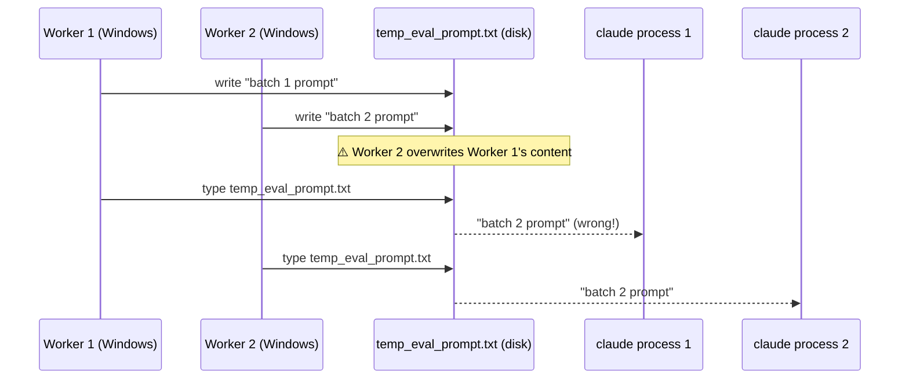
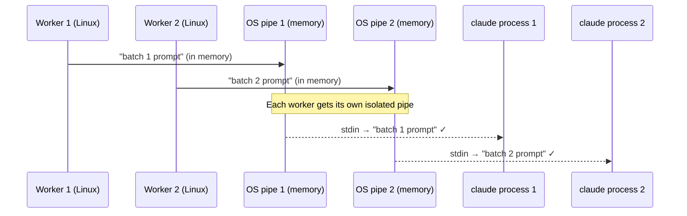

# Unix — Pipes and Standard Streams

> **Context**: Learned while designing Step 5 Spark + Claude CLI (gilJOBi)
> **Why it matters**: Replaced temp file approach with stdin pipe → solves race conditions in parallel workers
> **Date**: 2026-02-17

---

## 1. Standard Streams — stdin, stdout, stderr

Every process that starts on Unix gets 3 "channels" automatically:

| Stream | fd | Direction | Default |
|--------|----|-----------|---------|
| stdin  | 0  | Input  → process | keyboard |
| stdout | 1  | process → Output | terminal |
| stderr | 2  | process → Error output | terminal |

**fd** = file descriptor — just a number the OS uses to identify the channel.

```
Keyboard ──▶ [ stdin=0 ]
                  │
             [ Process ]
                  │
         ┌────────┴────────┐
   [ stdout=1 ]      [ stderr=2 ]
         │                 │
      Terminal           Terminal
```

When you type in a terminal, you're writing to a process's stdin.
When a program prints something, it writes to stdout.
Errors go to stderr (separate so you can redirect them independently).

---

## 2. "Everything is a File" (Unix Philosophy)

In Unix, stdin/stdout/stderr aren't special — they're just **file descriptors**.
The OS treats them the same way it treats actual files.

This means you can **redirect** them:

```bash
# Redirect stdout to a file (write output to file instead of terminal)
python script.py > output.txt

# Redirect stdin from a file (read input from file instead of keyboard)
python script.py < input.txt

# Redirect stderr separately
python script.py > output.txt 2> errors.txt
```

---

## 3. Pipes — Connecting Processes Without Files

The `|` operator connects stdout of one process directly to stdin of another:

```bash
echo "hello world" | grep "hello"
#        │                  ▲
#        └── stdout ──▶ stdin
```

No file is created. The OS creates an **in-memory buffer** (a pipe) between the two processes.

```
Process A          OS pipe (memory)          Process B
  stdout ─────────── buffer ──────────────▶ stdin
```

### Why this matters: Parallel safety

#### Step 4 — Windows, File-based (race condition)



#### Step 5 — Linux, stdin pipe (parallel safe)



Each worker's pipe is a separate OS resource. They never touch the same file.

---

## 4. subprocess.run with input= (Python)

```python
# Step 4 — File based (Windows only, not parallel safe)
with open('temp_eval_prompt.txt', 'w') as f:
    f.write(prompt)
result = subprocess.run('type temp_eval_prompt.txt | claude ...', shell=True)

# Step 5 — stdin pipe (Linux/Mac, parallel safe)
result = subprocess.run(
    ['claude', '--print', '--output-format', 'json', '--model', 'sonnet', '-'],
    input=prompt,        # Python passes this string to claude's stdin
    capture_output=True, # capture stdout + stderr
    text=True            # decode bytes as string
)
```

What `input=prompt` does internally:
```
1. OS creates a pipe: (read_end, write_end)
2. Python forks a new process (claude)
3. claude's stdin (fd=0) is connected to read_end
4. Python writes prompt to write_end
5. claude reads prompt from its stdin
6. Claude processes and writes result to its stdout
7. Python captures stdout via capture_output=True
```

The `-` at the end of the claude command means "read from stdin" (instead of a file).

---

## 5. Quick Reference

```bash
# Pipe: connect stdout → stdin
cmd1 | cmd2

# Redirect stdout to file
cmd > file.txt

# Redirect stdin from file
cmd < file.txt

# Pipe a string into a command
echo "some text" | cmd

# Python: pipe a string into subprocess stdin
subprocess.run(['cmd'], input="some text", capture_output=True, text=True)
```
