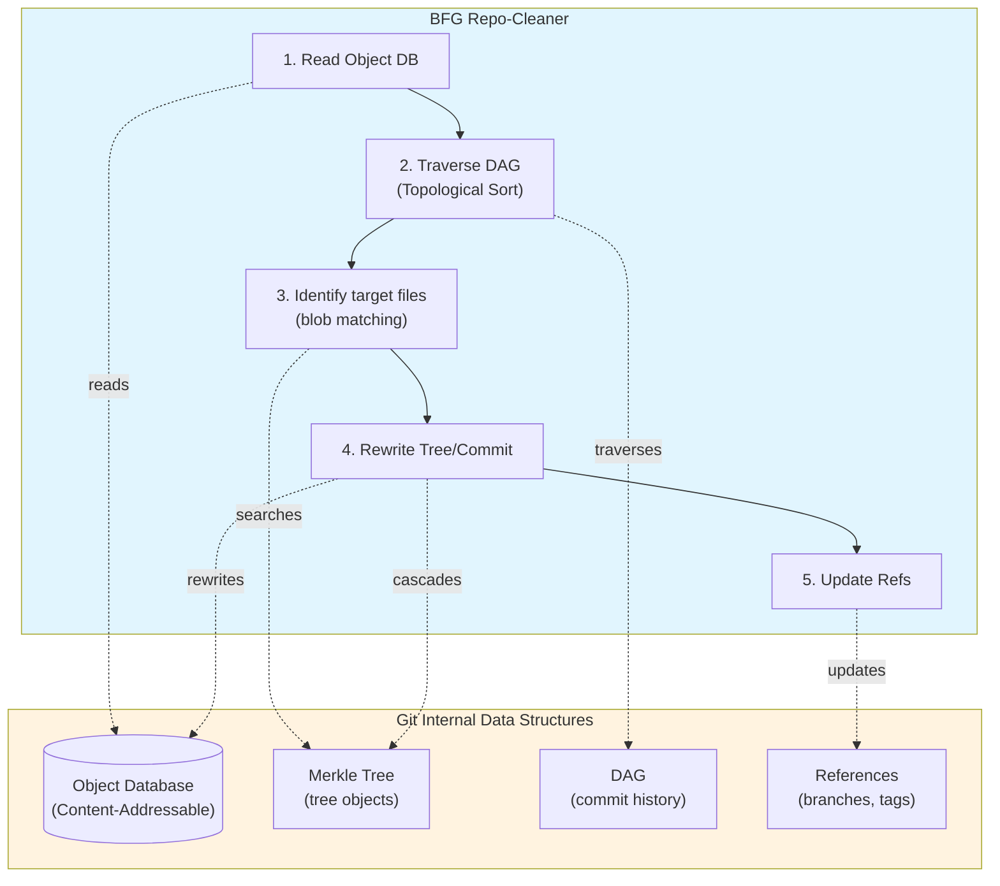

# Git Internals: Data Structures and Algorithms

## Overview

Git is not merely a version control tool — it is a **content-addressable filesystem** that leverages core computer science data structures.

---

## 1. Content-Addressable Storage

### Concept

```
Regular filesystem:
  path → content
  /path/to/file.txt → "Hello World"

Git (Content-Addressable):
  hash of content → content
  5e1c309dae7f45e0f39b1bf3ac3cd9db12e7d689 → "Hello World"
```

### Characteristics

| Property | Description |
|----------|-------------|
| **Address = hash of content** | Same content = same address |
| **Automatic deduplication** | Storing the same file multiple times saves only one copy |
| **Integrity guaranteed** | Hash mismatch = data corruption detected |
| **Immutability** | Changing content changes the address (no overwriting) |

### Hash Function

```
Git uses: SHA-1 (160-bit, 40-character hex)

Input:  "Hello World"
Output: 5e1c309dae7f45e0f39b1bf3ac3cd9db12e7d689

Properties:
- Deterministic: same input → always same output
- Collision-resistant: different input → different output (probabilistic)
- One-way: cannot recover original from hash

※ Git is transitioning to SHA-256 (for improved security)
```

---

## 2. Git Object Model

### Object Types

```
┌─────────────────────────────────────────────────────────┐
│                      Git Objects                         │
├─────────────────────────────────────────────────────────┤
│                                                          │
│  ┌─ blob ─────────────────────────────────────────────┐ │
│  │ • The raw file content itself                       │ │
│  │ • No filename or permission info                    │ │
│  │ • Hash = SHA-1(file_content)                       │ │
│  └────────────────────────────────────────────────────┘ │
│                                                          │
│  ┌─ tree ─────────────────────────────────────────────┐ │
│  │ • Directory structure                               │ │
│  │ • Pointers to blobs/trees + metadata               │ │
│  │ • [mode] [type] [hash] [name]                      │ │
│  └────────────────────────────────────────────────────┘ │
│                                                          │
│  ┌─ commit ───────────────────────────────────────────┐ │
│  │ • Snapshot metadata                                 │ │
│  │ • tree pointer + parent pointer + author/message   │ │
│  └────────────────────────────────────────────────────┘ │
│                                                          │
│  ┌─ tag ──────────────────────────────────────────────┐ │
│  │ • Annotated tag (can be signed)                    │ │
│  │ • commit pointer + metadata                        │ │
│  └────────────────────────────────────────────────────┘ │
│                                                          │
└─────────────────────────────────────────────────────────┘
```

### Real Structure Examples

```
# blob (file content)
$ git cat-file -p 5e1c309
Hello World

# tree (directory)
$ git cat-file -p abc123
100644 blob 5e1c309... README.md
100644 blob 7f3a8b2... main.py
040000 tree def456... src/

# commit
$ git cat-file -p 1a2b3c4
tree abc123def456...
parent 9f8e7d6c5b4a...
author John <john@example.com> 1706123456 -0500
committer John <john@example.com> 1706123456 -0500

Initial commit
```

---

## 3. Merkle Tree

### Concept

```
Merkle Tree = Hash Tree
- Each node's hash includes the hashes of its child nodes
- Any change propagates all the way up to the root

In Git:
- tree object = Merkle Tree node
- blob object = Merkle Tree leaf
```

### Structure

```
                    commit (root)
                    hash: 1a2b3c
                         │
                    tree (dir/)
                    hash: abc123
                    ┌────┴────┐
                    │         │
               blob         tree
            (file1.txt)    (subdir/)
            hash: 5e1c30   hash: def456
                               │
                             blob
                          (file2.txt)
                          hash: 7f3a8b

hash(tree) = SHA-1(
    "100644 blob 5e1c30... file1.txt" +
    "040000 tree def456... subdir/"
)
```

### Properties

| Property | Meaning |
|----------|---------|
| **Change propagation** | File change → tree hash change → commit hash change |
| **Efficient comparison** | Comparing only the root hash confirms full equality |
| **Partial verification** | Can verify a specific file without downloading everything |

### Use Cases

```
1. Why git diff is fast
   - Only traverses directories with changed tree hashes

2. git clone --depth 1
   - Can fetch only the tree of a specific commit

3. Deduplication
   - Files/directories with identical content automatically share the same hash
```

---

## 4. DAG (Directed Acyclic Graph)

### Concept

```
Git History = DAG

Directed:  Has direction (child → parent)
Acyclic:   No cycles (no edges leading back to the past)
Graph:     Multiple paths possible (branches, merges)
```

### Structure

```
    A ← B ← C ← D ← E (main)
              ↖
               F ← G (feature)
                   ↑
                   H (merge commit)

A: Initial commit (no parent)
B, C, D, E: Regular commits (1 parent)
H: Merge commit (2 parents: E, G)
```

### Properties

| Property | Description |
|----------|-------------|
| **Reachability** | Find all ancestors reachable from a given commit |
| **Common Ancestor** | The common ancestor of two branches (merge-base) |
| **Topological Order** | An ordering where parents always come before children |

### Algorithms

```python
# Find common ancestor (git merge-base)
def find_merge_base(commit1, commit2):
    ancestors1 = get_all_ancestors(commit1)
    ancestors2 = get_all_ancestors(commit2)

    # Find the nearest common ancestor via BFS/DFS
    return find_nearest_common(ancestors1, ancestors2)

# Topological sort (git log --topo-order)
def topological_sort(commits):
    # Kahn's algorithm or DFS-based
    result = []
    in_degree = {c: len(c.children) for c in commits}
    queue = [c for c in commits if in_degree[c] == 0]

    while queue:
        commit = queue.pop()
        result.append(commit)
        for parent in commit.parents:
            in_degree[parent] -= 1
            if in_degree[parent] == 0:
                queue.append(parent)

    return result
```

---

## 5. References (Refs)

### Structure

```
refs = pointers (pointing to a commit hash)

.git/
├── HEAD                    → refs/heads/main (current branch)
├── refs/
│   ├── heads/
│   │   ├── main           → abc123 (commit hash)
│   │   └── feature        → def456
│   ├── tags/
│   │   └── v1.0.0         → 789abc
│   └── remotes/
│       └── origin/
│           └── main       → abc123
```

### Properties

```
Branch creation = create a new ref file (O(1))
Branch switch   = change HEAD (O(1))
Commit          = update the hash the ref points to (O(1))

→ Why branches are "lightweight"
```

---

## 6. Packfile (Compressed Storage)

### Problem

```
1000 commits, each with a 100KB file
→ Naive storage: 100MB

But most commits contain only small changes
→ Wasteful duplication
```

### Solution: Delta Compression

```
┌─ Loose Objects ─────────────────────┐
│ Initially: each object stored as     │
│ a separate file                      │
│ .git/objects/5e/1c309...            │
│ .git/objects/ab/c123...             │
└─────────────────────────────────────┘
           │
           ▼ git gc
┌─ Packfile ──────────────────────────┐
│ Compressed: similar objects stored   │
│ as deltas                            │
│                                      │
│ Object A: [full content]             │
│ Object B: [delta from A]             │
│ Object C: [delta from B]             │
│                                      │
│ .git/objects/pack/pack-xxx.pack     │
│ .git/objects/pack/pack-xxx.idx      │
└─────────────────────────────────────┘
```

### Algorithm

```
Delta = the difference between two versions

1. Find similar object pairs
   - Heuristics based on filename, size, etc.

2. Compute delta
   - Copy instruction: copy from the base object
   - Insert instruction: insert new data

3. Choose the smaller option
   - If delta < original, store the delta
   - Otherwise, store the original
```

---

## 7. Index (Staging Area)

### Structure

```
.git/index = binary file

┌─ Index Entry ───────────────────────┐
│ ctime, mtime (file timestamps)      │
│ dev, ino (filesystem info)          │
│ mode (permissions)                  │
│ uid, gid (ownership)                │
│ file_size                           │
│ SHA-1 hash (blob)                   │
│ flags                               │
│ path (file path)                    │
└─────────────────────────────────────┘
```

### Role

```
Working Directory → Index → Repository
      (files)      (staging)  (commit)

git add:      Working Dir → Index
git commit:   Index → Repository
git reset:    Repository → Index
git checkout: Repository → Working Dir
```

### Performance Optimization

```
Information cached by the Index:
- File modification time (mtime)
- File size
- inode number

How git status works:
1. Compare mtime in Index vs actual file mtime
2. If different → compare content (SHA-1)
3. If same → no change (fast!)
```

---

## 8. Time Complexity Summary

| Operation | Complexity | Description |
|-----------|------------|-------------|
| `git add` | O(N) | N = file size (hash computation) |
| `git commit` | O(F) | F = number of changed files |
| `git branch` | O(1) | create a ref file |
| `git checkout` | O(F) | F = number of files being changed |
| `git log` | O(C) | C = number of commits to output |
| `git diff` | O(D) | D = size of differences |
| `git merge` | O(F + C) | F = files, C = conflicts |
| `git clone` | O(P) | P = packfile size |

---

## 9. BFG and Git Data Structures

### BFG leverages Git's existing structures rather than defining its own

BFG Repo-Cleaner does not create new data structures — it **reads and rewrites** the structures Git already uses.



### Key Points

| BFG Operation | Git Data Structure Used | Description |
|---------------|-------------------------|-------------|
| Read object | Content-Addressable Storage | Access blob/tree/commit via SHA-1 hash |
| Traverse history | DAG + Topological Sort | Process all commits in parent→child order |
| Search files | Merkle Tree | Find target blobs in tree objects for deletion |
| Rewrite objects | Merkle Tree property | Delete file → tree hash changes → commit hash changes (cascade) |
| Update refs | References | Update branch/tag to point to new commit hash |

### Why use Git's structures as-is?

```
1. Efficiency
   - Reuse Git's proven data structures
   - Delegate packfile compression/decompression to Git

2. Compatibility
   - Output is a standard Git repository
   - git push works without additional tooling

3. Integrity
   - Automatic verification via Merkle Tree properties
   - Hash mismatch = immediate error detection
```

---

## 10. Related CS Concept Mapping

| CS Concept | Application in Git |
|------------|--------------------|
| **Hash Table** | Object Database (SHA-1 → content) |
| **Merkle Tree** | Tree objects, integrity verification |
| **DAG** | Commit history |
| **Topological Sort** | git log, history rewrite |
| **Delta Encoding** | Packfile compression |
| **Copy-on-Write** | Why branches are lightweight |
| **Bloom Filter** | commit-graph (ancestor search optimization) |
| **LRU Cache** | Object cache |

---

## 11. References

- [Pro Git Book - Git Internals](https://git-scm.com/book/en/v2/Git-Internals-Plumbing-and-Porcelain)
- [Git Source Code](https://github.com/git/git)
- [Git Data Structures and Algorithms](https://git-scm.com/docs/technical-docs)
