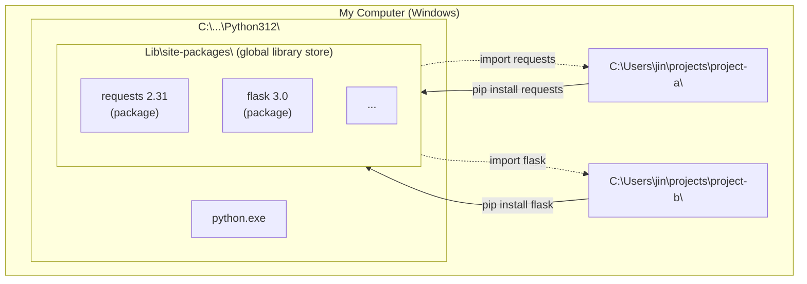
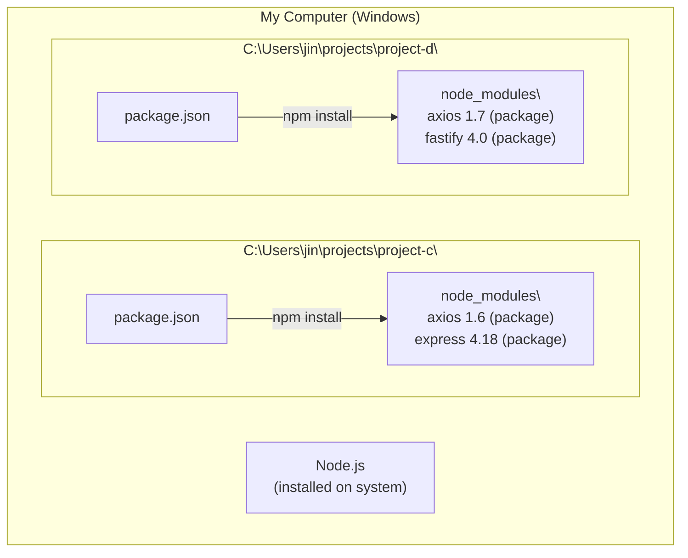
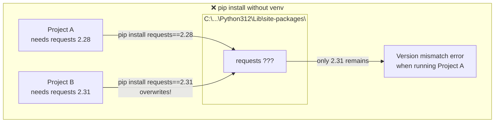
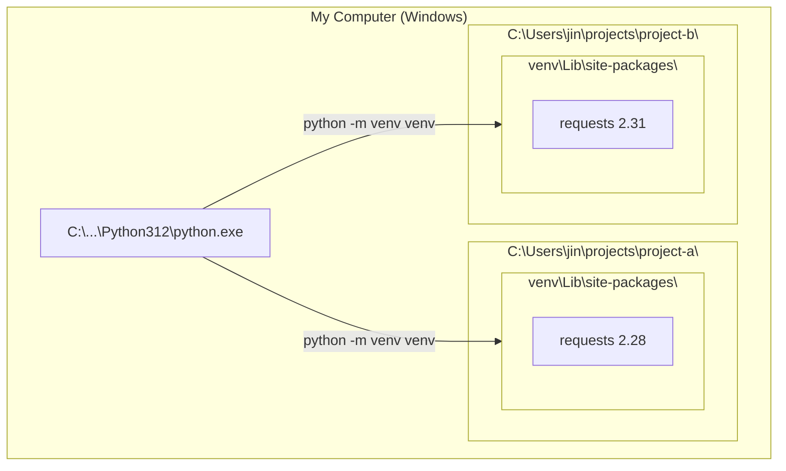
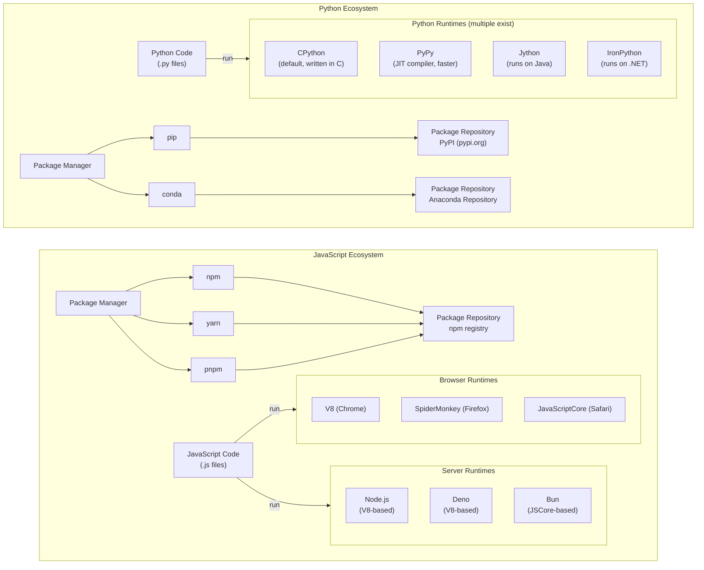
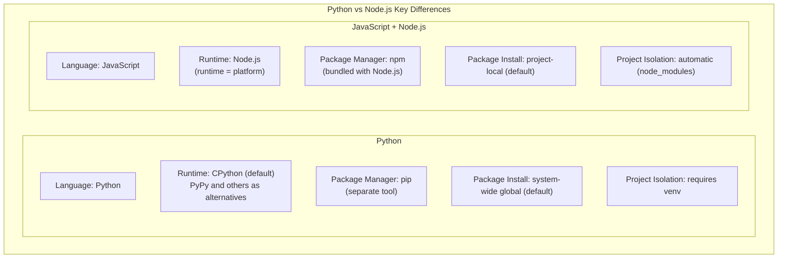
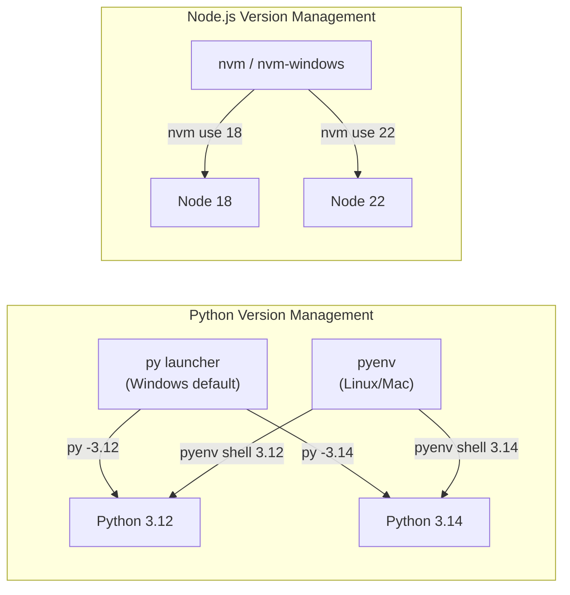

# Python vs JavaScript/Node.js: Why Are They So Different?

---

## 0. Start Here

Python and Node.js differ fundamentally in **where packages are installed**. Actual paths on Windows:

```
C:\
├── Users\jin\AppData\Local\Programs\Python\Python312\
│   └── Lib\site-packages\              ← pip install puts packages here (global)
│       ├── requests\
│       ├── flask\
│       └── ...
│
├── Users\jin\projects\project-a\
│   └── venv\Lib\site-packages\         ← isolated here when using venv
│       └── requests 2.28
│
├── Users\jin\projects\project-b\
│   └── venv\Lib\site-packages\         ← isolated separately here too
│       └── requests 2.31
│
├── Users\jin\projects\project-c\       ← Node.js project
│   └── node_modules\                   ← npm install always puts packages here
│       └── axios 1.6
│
└── Users\jin\projects\project-d\
    └── node_modules\                   ← automatically here for each project
        └── axios 1.7
```

**pip installs to the system-wide location by default; npm installs to the project folder.** Every other difference follows from this one.

---

## 1. Where Does pip install Put Packages?

When you install Python, a system Python is placed on the OS. `pip install` by default installs packages into that system Python's `site-packages/`.



No matter which project you run `pip install` from, everything goes into the same `site-packages/`.

---

## 2. Why Is npm install Different?

npm creates a `node_modules/` folder **inside the current project folder** and installs packages there. Project-local is the default, not system-wide.



**The key difference**: pip installs to the system Python (global); npm installs to the project folder (local).

---

## 3. What If Two Python Projects Need Different Versions?

There's a problem. There is only one `site-packages/` in the system Python.



The later installation overwrites the earlier one. Project A needs 2.28 but 2.31 is installed, which can cause problems.

Note: `requirements.txt` is just "a memo listing what to install." It looks like Node.js's `package.json`, but it does not change the install location to the project folder. Running `pip install -r requirements.txt` still installs to the system `site-packages/`.

---

## 4. How Do You Solve That?

Create a **venv (virtual environment)**. It creates a separate `site-packages/` per project to isolate packages.



```bash
# Project A
cd C:\Users\jin\projects\project-a
python -m venv venv              # create virtual environment
venv\Scripts\activate            # activate (Windows)
pip install requests==2.28       # installed inside venv

# Project B
cd C:\Users\jin\projects\project-b
python -m venv venv
venv\Scripts\activate
pip install requests==2.31       # installed in a separate venv
```

With the venv activated, `pip install` installs to that project's `venv\Lib\site-packages\` instead of the system.

**Node.js does not need this process.** `npm install` installs to the project folder's `node_modules\` from the start.

---

## 5. Why Were They Designed So Differently?

### A Difference in Era

This is not about the runtimes (CPython vs V8) — it is about **the era in which the package managers were created**.

**Python's pip (2008)**: Python itself was created in 1991, when installing libraries globally to a system path was the norm. This followed the same convention as installing C libraries to `/usr/lib/`. pip inherited that convention.

**Node.js's npm (2010)**: Isaac Z. Schlueter decided there was no suitable package management system for the Node.js ecosystem and built npm from scratch. From npm 1.0, local installation was the default, with global installation explicitly reserved for CLI tools.

> References:
> - [pip User Guide](https://pip.pypa.io/en/stable/user_guide/) - pip's default global install behavior
> - [npm 1.0: Global vs Local installation](https://nodejs.org/en/blog/npm/npm-1-0-global-vs-local-installation) - npm's design philosophy for local/global installation
> - [npm - Wikipedia](https://en.wikipedia.org/wiki/Npm) - npm history

### What Does venv Actually Do?

It does not create a separate OS like a VM or Docker. What venv does is **swap out the PATH environment variable**.

When you run `venv\Scripts\activate`, the terminal's PATH changes so that the `python` and `pip` commands point to the python/pip inside the venv folder instead of the system Python. That is why `pip install` installs to the venv's `site-packages/`.

| | venv | VM/Docker |
|---|---|---|
| **What it does** | Modifies PATH + separate site-packages | Creates a separate OS environment |
| **Isolation scope** | Python packages only | Filesystem, network, processes — everything |
| **Overhead** | Nearly none | Present |

In the end, despite the name "virtual environment," venv is really just **a way to install packages to a new non-global path**. Python with venv ends up doing the same thing npm does by default.

### Why Does Global Install Still Exist?

Global installation is useful for **CLI tools**. Tools like `black` (code formatter), `flake8` (linter), and `jupyter` — tools you want available anywhere, not tied to a specific project. This is the same use case as `npm install -g typescript` in Node.js.

There is almost no reason to install globally for project development. The Python community recognizes this too: [PEP 668](https://peps.python.org/pep-0668/) introduced a mechanism to prevent conflicts between OS package managers and pip. On recent Linux distributions such as Debian 12 and Ubuntu 23.04+, running `pip install` without a venv will produce an error (not yet applied on Windows). Modern tools like Poetry and uv enforce project-level management entirely.

> References:
> - [PEP 668](https://peps.python.org/pep-0668/) - Marking Python base environments as "externally managed"
> - [Python Packaging User Guide - Installing Packages](https://packaging.python.org/tutorials/installing-packages/) - virtual environment recommendations

### What About Deployment?

In a deployment environment (server), global installation is generally avoided. Using venv or Docker containers is the standard. With Docker, the container itself is an isolated environment so global installation within it won't cause conflicts — but that is Docker doing the isolation, not a benefit of global installation.

**Whether in development or deployment, managing packages in an isolated environment is the current standard.**

> For runtime execution structure (Python's PVM, Node.js's V8, etc.), see [Runtime Comparison: Source to Hardware](./runtime-comparison.md).

---

## 6. Looking at the Whole Ecosystem



Python has multiple runtimes (CPython is the default; PyPy and others are alternatives), while JavaScript's execution environments are split between browsers and servers.

---

## 7. Summary

### Key Differences



### Comparison Table

| | Python | JavaScript/Node.js |
|------|--------|------------|
| **Package install location** | System-wide global (default) | Project-local (default) |
| **Project isolation** | Requires explicitly creating venv | Automatic isolation via node_modules |
| **Runtime** | CPython default; PyPy and others as alternatives | Node.js (V8-based, all-in-one) |
| **Package manager** | pip (separate) | npm (bundled with Node.js) |
| **Package repository** | PyPI | npm registry |
| **Version management** | py (Windows), pyenv | nvm, fnm |
| **Execution model** | Bytecode interpretation (CPython) | JIT compilation (V8) |

### Command Comparison

```bash
# Python
py hello.py           # using Windows py launcher
python hello.py       # running python directly
python3 hello.py      # Linux/Mac

# Node.js
node app.js           # run with Node.js
```

### Version Management Comparison



### Package Installation Comparison

```bash
# Python
pip install requests              # default install (installs inside venv if venv is active)
pip install requests --user       # user install
python -m venv venv              # create virtual environment
pip install -r requirements.txt  # install from dependency file

# Node.js
npm install axios                # local install (node_modules)
npm install -g typescript        # global install
npm install                      # install based on package.json
```
