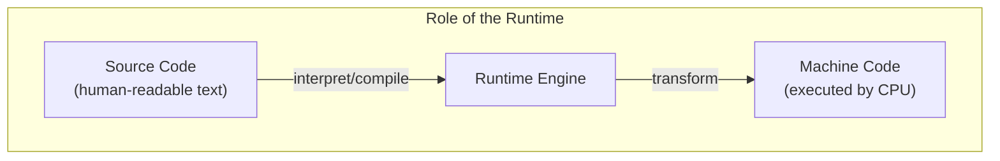
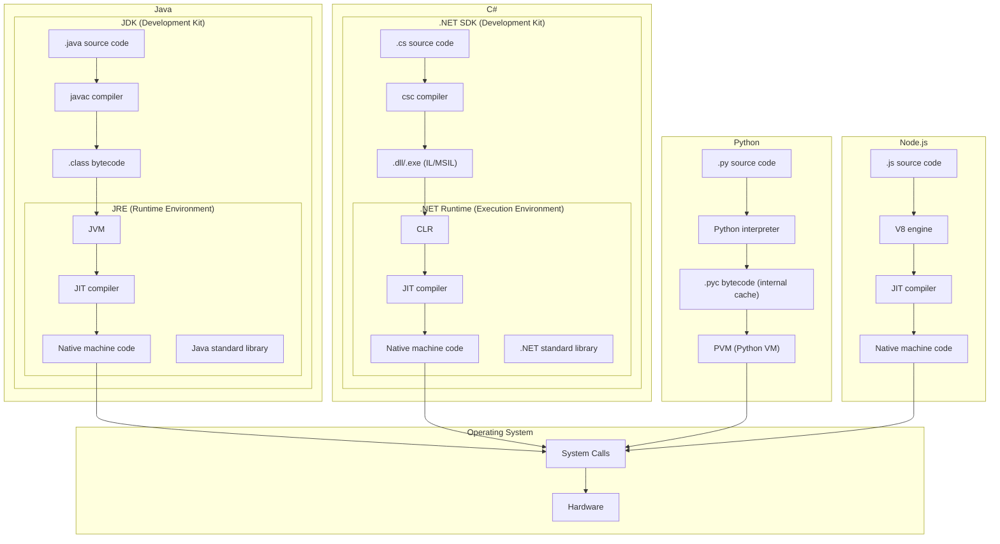
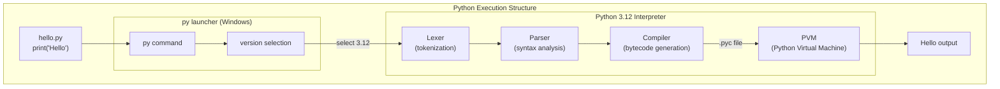
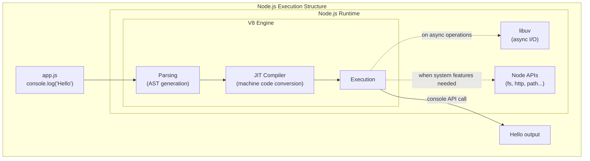

# Runtime Comparison: Source to Hardware

## Core Insight
> "All code eventually becomes system calls"

No matter the language or runtime, all operations that interact with hardware (file I/O, network, memory) must go through OS system calls. This is why understanding the execution pipeline matters - it reveals what's actually happening beneath your code.

## Why This Matters
- Understanding how code executes from source to hardware
- Foundation for system-level thinking (data flow across network, memory, disk)
- Explains performance characteristics of each language

## So What Exactly Is a Runtime?

It's the environment that transforms source code into something the CPU can execute.

Whether it's Python code or JavaScript code, the CPU can't understand it on its own. The runtime handles the translation in between.

---

## Execution Pipeline

## Key Insights

| Language | Compilation | Runtime | Characteristic |
|----------|-------------|---------|----------------|
| Java | AOT → Bytecode | JVM + JIT | Write once, run anywhere |
| C# | AOT → IL | CLR + JIT | .NET ecosystem integration |
| Python | None (interpreted) | PVM | Rapid development, slower execution |
| Node.js | None | V8 + JIT | Event-driven, non-blocking I/O |

## Key Concepts

- **AOT (Ahead-of-Time)**: Compiled before execution
- **JIT (Just-in-Time)**: Compiled during execution for optimization
- **Bytecode**: Intermediate representation between source and machine code
- **VM (Virtual Machine)**: Abstracts hardware, enables portability

## 6. How Are Python and Node.js Runtimes Different?

### Python: Interpreter converts to bytecode → PVM executes

### Node.js: V8 engine directly compiles to machine code via JIT

**The difference**: Python (CPython) has the PVM interpret bytecode line by line, while Node.js (V8) uses JIT to compile to machine code that the CPU executes directly.

---
