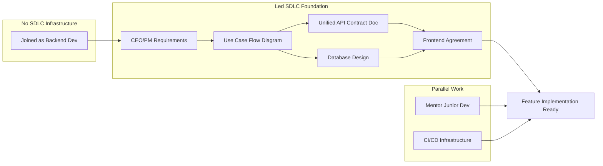
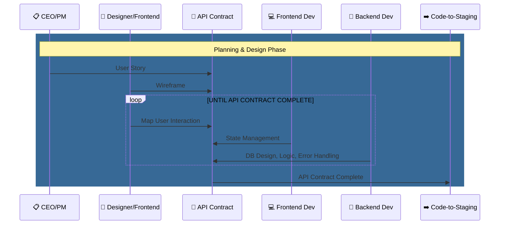
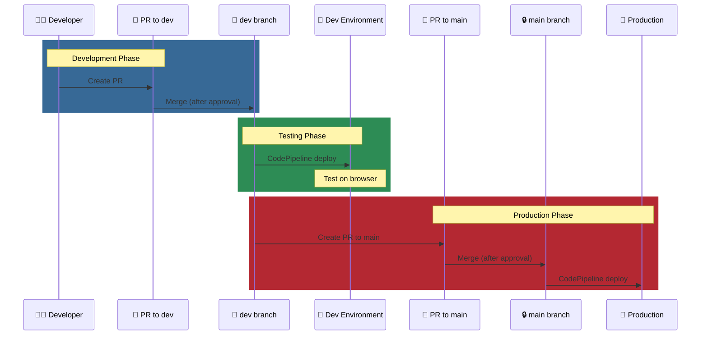

# Joined as Backend Developer... But Couldn't Write Code

## The Problem

Joined as backend developer, but discovered multiple blockers:

1. **No Requirements-to-Code Workflow**
   - No documentation system to translate CEO/PM requirements into implementable specs
   - Developers couldn't design code or database without clear specifications

2. **No Safe Testing Environment**
   - CEO/PM hesitant to give developers access to production repo
   - Main branch directly affects production - no protection against human error
   - Had to work on forked repo, but no third-party credentials, environment config, or mock database existed

3. **No CI/CD Access Control**
   - Developers couldn't verify their code changes in staging environment

## What I Did

Took ownership to build the foundation before feature implementation could begin.

## The Result

- Led team's first successful SDLC by establishing development infrastructure
- Unblocked stalled development by designing unified feature specification format combining user stories, wireframes, and API contracts, and leading cross-functional team to adopt it as standard reference
- Resolved bottlenecked backend code integration workflow by configuring GitHub Ruleset and AWS IAM policies on CodePipeline, enabling developer-owned code-to-staging feedback loop

**Role changed: Backend Developer → Backend Development Lead**

---

## Role Info

| | |
|---|---|
| **Position** | Backend Development Lead |
| **Type** | Contract Part-time |
| **Period** | Sep 2025 - Present |
| **Location** | Toronto, Ontario, Canada (Remote) |

## Responsibilities

- Lead backend development for mental wellness application adding mood-based care features
- Ramped up on Django codebase
- Mentored junior backend developer through database schema design and API implementation

---

## Progress Tracker

| Passage | Date | Topic | Note |
|---------|------|-------|------|
| 1 | 2025-12-23 | Documentation Restructure | 3 categories: Backend Onboarding, API-Contract, Implementation |
| 2 | 2025-12-29 | AWS IAM Setup | CodePipeline permissions, IAM Policy/User/Group, Confluence docs |
| 3 | 2026-01-02 | CodePipeline PR Merge Demo | Synced fork, verified pipeline, recorded demo video |
| 4 | 2026-01-04 | New Backend Developer Onboarding | Full workflow demo, PR→Merge→CI/CD, documentation walkthrough |
| 5 | 2026-01-06 | S3 & CodePipeline IAM | Created S3 buckets, CodePipelines, IAM Policy documentation |
| 6 | 2026-01-19 | GitHub Branch Protection | Ruleset setup guide, Confluence docs, shared with PM |

---

## SDLC Foundation I Built

*Context: Part-time team, Students with limited SDLC experience, Startup environment*

### Unified Feature Specification (SDLC: Planning & Analysis, Design Phases)
- API Contract Instruction - *Not available due to NDA*
- [API Contract Template](logbook/2025-12-23/resources/api-contract-template.pdf) - Instruction included
- Database Design - *Not available due to NDA*
- API Contracts (Feature Implementation) - *Not available due to NDA*

> **Outcome:** Enables fully independent development

### Code-to-Staging Infrastructure (SDLC: Implementation, Testing, Deployment Phases)
- [CodePipeline Permission Setup Guide](logbook/2025-12-29/resources/codepipeline-permission-guide.pdf)
- [IAM Permission Verification Demo](logbook/2025-12-29/resources/iam-permission-demo.pdf)
- [CodePipeline PR Merge Demo](logbook/2026-01-02/resources/CodePipeline-PR-Merge-Demo.mp4)
- [Dev-Only CodePipeline Access Setup Guide](logbook/2026-01-06/resources/dev-only-codepipeline-access-setup-guide.pdf)
- [GitHub Branch Protection Setup Guide](logbook/2026-01-19/resources/github-branch-protection-setup-guide.pdf)

### Code-to-Production SDLC Workflow

---

## References
- Production Website: https://web.helprr.ai/

---