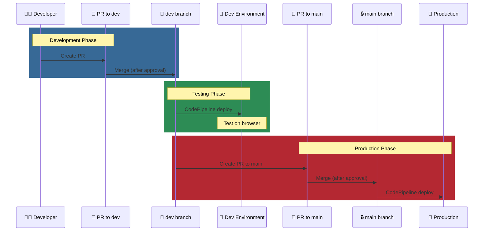

# Joined as Backend Developer... But Couldn't Write Code

## The Problem

Joined as backend developer, but discovered multiple blockers:

1. **No Requirements-to-Code Workflow**
   - No documentation system to translate CEO/PM requirements into implementable specs
   - Developers couldn't design code or database without clear specifications

2. **Isolated Development Environment**
   - Production branch exposed to human error, causing CEO/PM hesitant to give developer access to base repo
   - Had to work on forked repo, but no third-party credentials, environment config, or mock database existed

3. **No CI/CD Feedback Loop**
   - Developers couldn't see if integration succeeded, failed, or why it failed on the pipeline

## What I Did

> I didn't limit myself to my position title.
>
> The situation was challenging: **part-time schedules** across the team, **no development process**, **limited real-time communication**. Development couldn't move forward.
>
> To unblock my own development and set up future developers, I designed and led the adoption of a workflow system that guides each role naturally through the SDLC. That system is now the team's standard reference.

## The Result

- Led team's first successful SDLC by establishing development infrastructure and workflow
    - **Workflow:** Unblocked stalled development by designing unified feature specification format combining user stories, wireframes, and API contracts, and leading cross-functional team to adopt it as standard reference
    - **Infrastructure:** Resolved bottlenecked backend code integration workflow by configuring GitHub Ruleset and AWS IAM policies on CodePipeline, enabling developer-owned code-to-staging feedback loop

**Role changed: Backend Developer → Backend Development Lead**

---

## Role Info

| | |
|---|---|
| **Position** | Backend Development Lead |
| **Type** | Contract Part-time |
| **Period** | Sep 2025 - Present |
| **Location** | Toronto, Ontario, Canada (Remote) |

## Responsibilities

- Lead backend development for mental wellness application adding mood-based care features
- Mentored junior backend developer through database schema design and API implementation

---

## Progress Tracker

| Passage | Date | Topic | Note |
|---------|------|-------|------|
| - | Sep-Nov 2025 | Discovery & Design | Codebase analysis, feature specification, backend design (database, API, logic), implementation roadmap |
| 1 | 2025-12-23 | Documentation Restructure | 3 categories: Backend Onboarding, API-Contract, Implementation |
| 2 | 2025-12-29 | AWS IAM Setup | CodePipeline permissions, IAM Policy/User/Group, Confluence docs |
| 3 | 2026-01-02 | CodePipeline PR Merge Demo | Synced fork, verified pipeline, recorded demo video |
| 4 | 2026-01-04 | New Backend Developer Onboarding | Full workflow demo, PR→Merge→CI/CD, documentation walkthrough |
| 5 | 2026-01-06 | S3 & CodePipeline IAM | Created S3 buckets, CodePipelines, IAM Policy documentation |
| 6 | 2026-01-19 | GitHub Branch Protection | Ruleset setup guide, Confluence docs, shared with PM |

---

## SDLC Foundation I Built

*Context: Part-time team, Students with limited SDLC experience, Startup environment*

### Unified Feature Specification (SDLC: Planning & Analysis, Design Phases)
- Instruction Document - *Not available due to NDA*
- [Unified Feature Specification Template](logbook/2025-12-23/resources/unified-feature-specification-template.pdf)
  - User Story
  - Wireframe & User Action
  - Frontend Requirements (UI Components, State Management)
  - Backend Requirements (Business Logic, Validation Rules)
  - API Contract (Endpoint, Request, Response)
  - Discussion Points
- Database Design - *Not available due to NDA*
- Feature Specifications - *Not available due to NDA*

> **Outcome:** Enables fully independent development

### Code-to-Staging Infrastructure (SDLC: Implementation, Testing, Deployment Phases)
- [CodePipeline Permission Setup Guide](logbook/2025-12-29/resources/codepipeline-permission-guide.pdf)
- [IAM Permission Verification Demo](logbook/2025-12-29/resources/iam-permission-demo.pdf)
- [CodePipeline PR Merge Demo](logbook/2026-01-02/resources/CodePipeline-PR-Merge-Demo.mp4)
- [Dev-Only CodePipeline Access Setup Guide](logbook/2026-01-06/resources/dev-only-codepipeline-access-setup-guide.pdf)
- [GitHub Branch Protection Setup Guide](logbook/2026-01-19/resources/github-branch-protection-setup-guide.pdf)

### Code-to-Production SDLC Workflow

---

## References
- Production Website: https://web.helprr.ai/

---