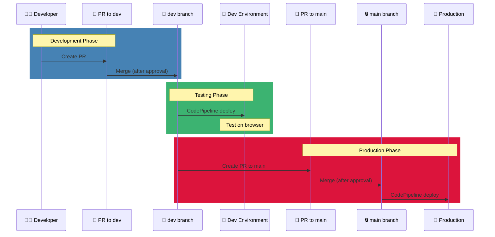

```mermaid
sequenceDiagram
    participant Dev as 👨‍💻 Developer
    participant PR1 as 📝 PR to dev
    participant DevBranch as 🔧 dev branch
    participant DevEnv as 🧪 Dev Environment
    participant PR2 as 📝 PR to main
    participant Main as 🔒 main branch
    participant Prod as 🚀 Production
    
    rect rgb(70, 130, 180)
        Note over Dev,PR1: Development Phase
        Dev->>PR1: Create PR
        PR1->>DevBranch: Merge (after approval)
    end
    
    rect rgb(60, 179, 113)
        Note over DevBranch,DevEnv: Testing Phase
        DevBranch->>DevEnv: CodePipeline deploy
        Note over DevEnv: Test on browser
    end
    
    rect rgb(220, 20, 60)
        Note over PR2,Prod: Production Phase
        DevBranch->>PR2: Create PR to main
        PR2->>Main: Merge (after approval)
        Main->>Prod: CodePipeline deploy
    end
```