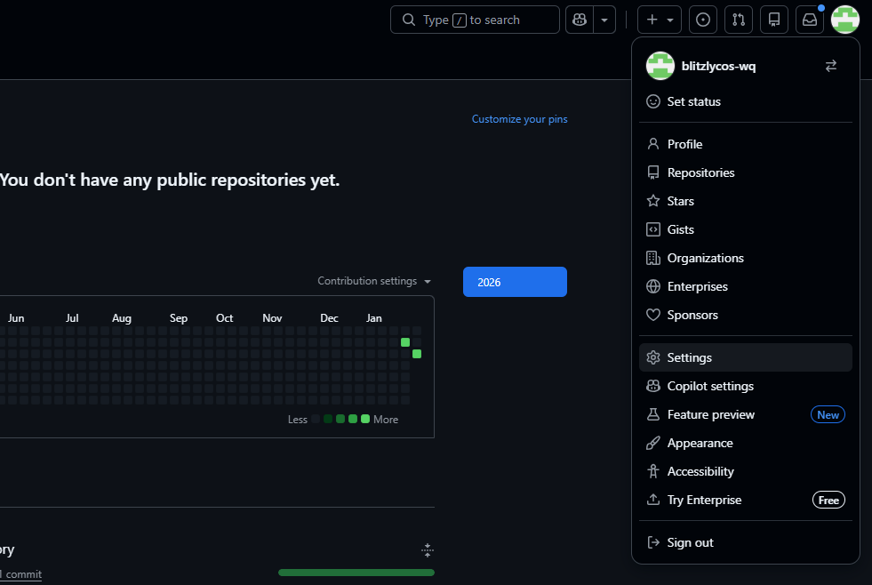
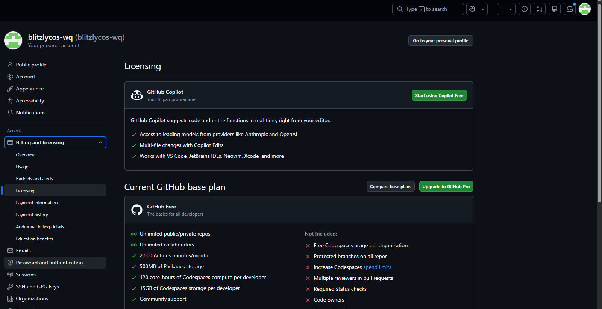
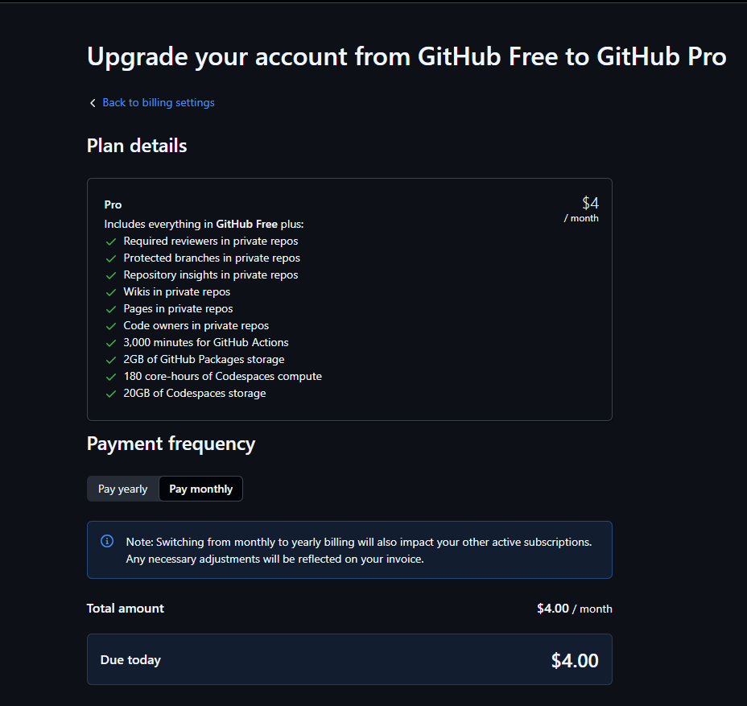
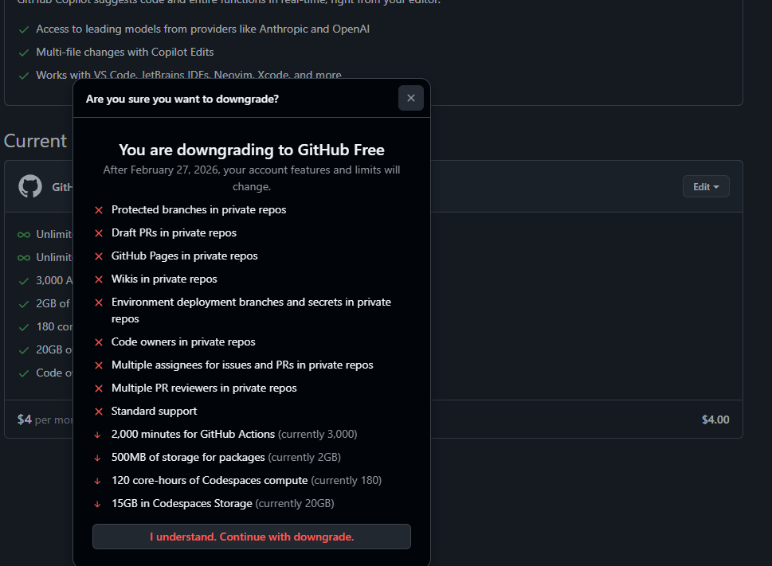

# GitHub Plans - Ruleset Support

## Overview

Helprr.ai project needed Pro plan to use Branch Protection Rules on private repos.

## How to Access

Profile > Settings > Billing and licensing > Licensing

## GitHub Free

Free Plan Does NOT Include:
- Protected branches on all repos
- Required status checks
- Code owners
- Multiple reviewers in pull requests

## Pro Plan ($4/month)

Additional Features (ruleset related):
- Required reviewers in private repos
- **Protected branches in private repos**
- Code owners in private repos

## Downgrade Warning

Features lost when downgrading Pro → Free:
- Protected branches in private repos
- Code owners in private repos
- Multiple PR reviewers

**Effective date**: Downgrade applies after current billing period ends (e.g., February 27, 2026)
