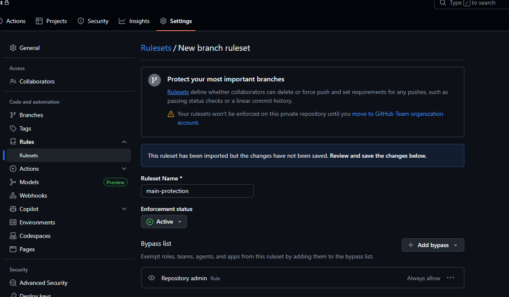
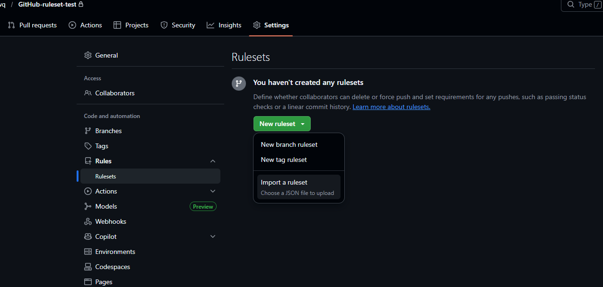
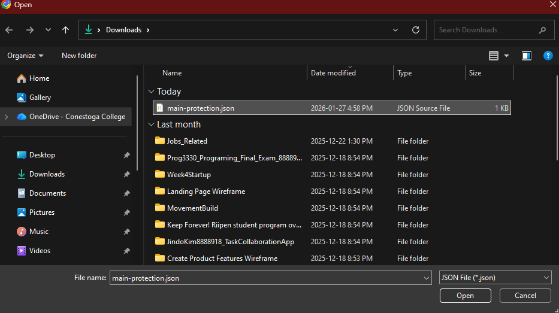
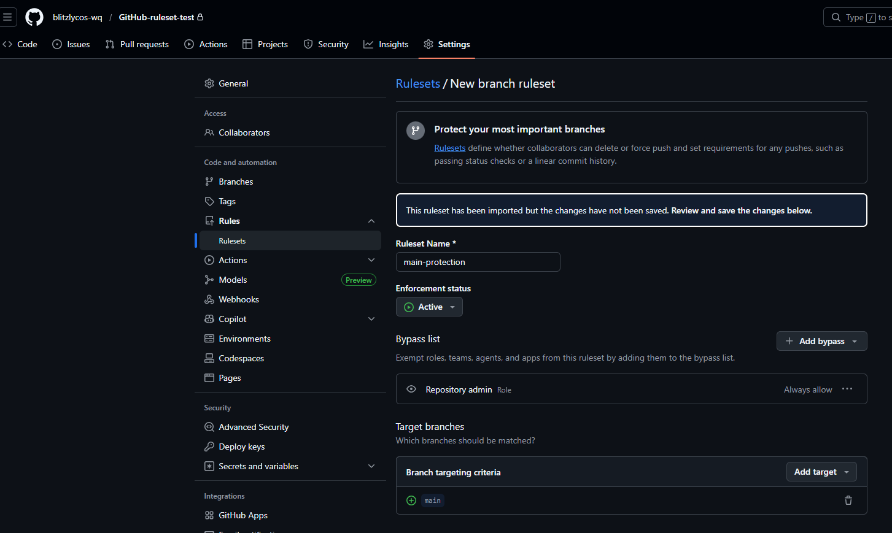
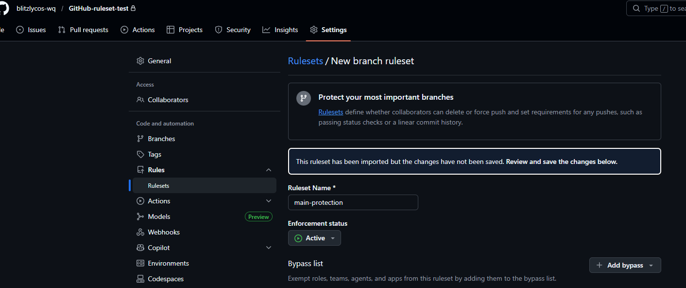

# GitHub Rulesets Setup Guide

## What is Branch Protection Ruleset?

Rulesets prevent collaborators from deleting or force pushing to branches, and set requirements like passing status checks or linear commit history.

**Note**: Free plan cannot apply rulesets to private repos. Requires Organization account or Pro plan.

## How to Access

Repository > Settings > Rules > Rulesets

## Setup Methods

### Method 1: Manual Creation

1. Click "New ruleset"
2. Select "New branch ruleset" or "New tag ruleset"

### Method 2: JSON Import (Recommended)

Useful for reusing existing ruleset across repos.

1. Select "New ruleset" > "Import a ruleset"
2. Choose JSON file

3. Review and save imported settings

## main-protection Example

### Basic Settings

| Field | Value |
|-------|-------|
| Ruleset Name | main-protection |
| Enforcement status | Active |
| Target branches | main |

### Bypass List

- Repository admin: Always allow

### Branch Rules (3 rules)

Typical main branch protection:
- Require pull request before merging
- Require status checks to pass
- Block force pushes

## Test Repository

Tested settings on separate repo: `GitHub-ruleset-test`

