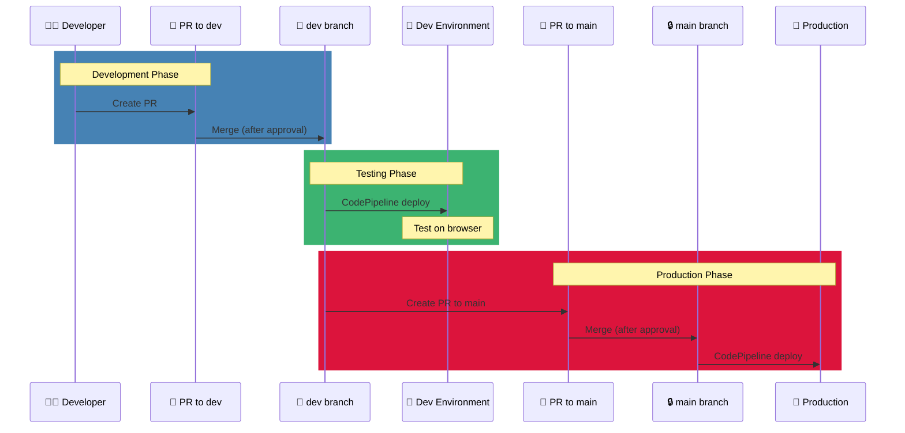

## Why
- Gain startup experience as backend developer
- Learn new framework and domain

### Expectation
- **Outcome:** Implement core feature as backend developer
- **Learn:** Django (new framework), Mental Health domain
- **Harvest:** Professional reference, portfolio project

## What
Backend Development Lead (Part-time Contract) at Helprr.ai - a mood-based mental wellness application.

### Role Info

| | |
|---|---|
| **Position** | Backend Development Lead |
| **Type** | Contract Part-time |
| **Period** | Sep 2025 - Present |
| **Location** | Toronto, Ontario, Canada (Remote) |

## How

### Key Achievements
- Led team's first successful SDLC by establishing development infrastructure
- Unblocked stalled development by designing unified feature specification format combining user stories, wireframes, and API contracts, and leading cross-functional team to adopt it as standard reference
- Resolved bottlenecked backend code integration workflow by configuring GitHub Ruleset and AWS IAM policies on CodePipeline, enabling developer-owned code-to-staging feedback loop

### Responsibilities
- Lead backend technical architecture for mood-based mental wellness application
- Ramped up on Django codebase
- Mentored junior backend developer through database schema design and API implementation

---

## Sailing Orders

### Plotted (Underway)

### Plotted Courses

### Plotted (Reached)

| Order | Deadline | Created | Purpose |
|-------|----------|---------|---------|
| GitHub Branch Protection documentation | - | Jan 19 | Team onboarding support |

| Order | Deadline | Created | Purpose |
|-------|----------|---------|---------|
| Reply to Anshita's Lead Backend Engineer title offer | - | Jan 19 | Role clarification |

- No time for direct development due to job search
- Can do: Help when issues arise, backend logic review
- Cannot do: Active development participation

---

## Progress Tracker

| Passage | Date | Topic | Note |
|---------|------|-------|------|
| 1 | 2025-12-23 | Documentation Restructure | 3 categories: Backend Onboarding, API-Contract, Implementation |
| 2 | 2025-12-29 | AWS IAM Setup | CodePipeline permissions, IAM Policy/User/Group, Confluence docs |
| 3 | 2026-01-02 | CodePipeline PR Merge Demo | Synced fork, verified pipeline, recorded demo video |
| 4 | 2026-01-04 | Yafet Onboarding | Full workflow demo, PR→Merge→CI/CD, documentation walkthrough |
| 5 | 2026-01-06 | S3 & CodePipeline IAM | Created S3 buckets, CodePipelines, IAM Policy documentation |
| 6 | 2026-01-19 | GitHub Branch Protection | Ruleset setup guide, Confluence docs, shared with PM |

---

## References
- Production Website: https://web.helprr.ai/

## Resources

### Documentation (Created by me)
- API Contract Instruction - *Not available due to NDA*
- API Contract Template - *Not available due to NDA*
- Database Design - *Not available due to NDA*
- API Contracts (Feature Implementation) - *Not available due to NDA*

### AWS Documentation
- [CodePipeline Permission Setup Guide](logbook/2025-12-29/resources/codepipeline-permission-guide.pdf)
- [IAM Permission Verification Demo](logbook/2025-12-29/resources/iam-permission-demo.pdf)
- [CodePipeline PR Merge Demo](logbook/2026-01-02/resources/CodePipeline-PR-Merge-Demo.mp4)
- [Dev-Only CodePipeline Access Setup Guide](logbook/2026-01-06/resources/dev-only-codepipeline-access-setup-guide.pdf)

### GitHub Documentation
- [GitHub Branch Protection Setup Guide](logbook/2026-01-19/resources/github-branch-protection-setup-guide.pdf)

### Development Workflow

---

## Notes
-

---

## Reflection
### Outcome
- actual:

### Learn
- actual:

### Harvest
- actual:
  - LinkedIn Recommendation from Anshita Pandey (January 2, 2026)
  - Reference Letter (Helprrai_Reference_Letter.pdf)
  - Backend Development Lead title on Resume & LinkedIn
