# Refactoring Result Snapshot

> **Note**: This document is analyzed based on commit `12910c1`.
>
> **Analysis Direction**:
> - 4-Layer Architecture detailed structure
> - Design Patterns application status
> - Integration Flow (Mermaid Diagrams)
> - Code Duplication Before/After comparison

---

This document provides a comprehensive analysis of the codebase after the refactoring effort.

- **Commit**: `12910c1` (Latest on Temporary-Branch)
- **Purpose**: Portfolio documentation, Resume preparation, Interview reference, Technical blog content

---

## Table of Contents

1. [Overview](#1-overview)
   - [1.1 File Statistics](#11-file-statistics)
   - [1.2 Architecture Summary](#12-architecture-summary)
2. [Complete File Structure](#2-complete-file-structure)
3. [Folder-by-Folder Analysis](#3-folder-by-folder-analysis)
   - [3.1 sharedLibraries/vars/](#31-sharedlibrariesvars---pipeline-stage-functions)
   - [3.2 sharedLibraries/src/](#32-sharedlibrariessrc---core-business-logic)
   - [3.3 DLXJenkins/ & JsJenkins/](#33-dlxjenkins--jsjenkins---pipeline-definitions)
   - [3.4 groovy/](#34-groovy---legacy-helpers-migration-in-progress)
   - [3.5 python/](#35-python---legacy-scripts-to-be-eliminated)
   - [3.6 tests/](#36-tests---unit-tests)
4. [Design Patterns Applied](#4-design-patterns-applied)
5. [Integration Flow](#5-integration-flow)
6. [Current State Summary](#6-current-state-summary)
7. [Dependency Graph](#7-dependency-graph)
8. [Remaining Work](#8-remaining-work-migration-targets)
9. [Code Duplication Analysis](#9-code-duplication-analysis)
10. [Conclusion](#10-conclusion)

---

## 1. Overview

### 1.1 File Statistics

| Category | Files | Lines (approx) | Status |
|----------|-------|----------------|--------|
| **sharedLibraries/vars/** | 13 | 1,104 | NEW - Pipeline stages |
| **sharedLibraries/src/** | 7 | 1,126 | NEW - Core business logic |
| **groovy/** | 3 | 1,824 | Legacy (being migrated) |
| **DLXJenkins/** | 2 | 286 | Refactored |
| **JsJenkins/** | 2 | 743 | Being Refactored |
| **PipelineForJenkins/** | 1 | 185 | Being Refactored |
| **python/** | 15 | 2,069 | Legacy (to be eliminated) |
| **Bash/** | 2 | 330 | Shell scripts |
| **tests/** | 6 | 243 | NEW - Unit tests |
| **TOTAL** | 51 | 7,910 | |

### 1.2 Architecture Summary

> The refactored codebase implements a **4-Layer Architecture** with clear separation of concerns:


---

## 2. Complete File Structure

```
devops-linux-jenkins/
│
├── sharedLibraries/                                    [20 files - Core Library]
│   ├── vars/                                           [13 files - Pipeline Functions]
│   │   ├── logger.groovy                                   - Centralized logging
│   │   ├── shellScriptHelper.groovy                        - Shell execution wrapper
│   │   ├── bitbucketApiHelper.groovy                       - Bitbucket API facade
│   │   ├── bitbucketApiLibrary.groovy                      - API request builder
│   │   ├── stageInitialization.groovy                      - Pipeline initialization
│   │   ├── stageProjectPrepare.groovy                      - Project preparation
│   │   ├── stageLintUnity.groovy                           - Unity linting
│   │   ├── stageLintGroovyJenkinsfile.groovy               - Groovy linting
│   │   ├── stageUnityExecution.groovy                      - Unity test execution
│   │   ├── stageStaticAnalysis.groovy                      - SonarQube analysis
│   │   ├── stageSendBuildResults.groovy                    - Build result reporting
│   │   ├── stageDeployBuild.groovy                         - Build deployment
│   │   └── stageCleanupPRBranchArtifacts.groovy            - PR cleanup
│   │
│   └── src/                                            [7 files - Library Source]
│       ├── resource/
│       │   └── Status.groovy                               - Status constants
│       │
│       ├── service/
│       │   ├── general/
│       │   │   ├── HttpApiService.groovy                   - HTTP client
│       │   │   └── PrepareWorkspaceService.groovy
│       │   │
│       │   └── unity/
│       │       └── BuildProjectService.groovy
│       │
│       └── utils/
│           ├── GitLibrary.groovy                           - Git operations
│           ├── ShellLibrary.groovy                         - Shell operations
│           └── SSHShellLibrary.groovy                      - SSH operations
│
├── DLXJenkins/                                         [2 files - Unity Pipeline]
│   ├── Jenkinsfile
│   └── JenkinsfileDeployment
│
├── JsJenkins/                                          [2 files - JavaScript Pipeline]
│   ├── Jenkinsfile
│   └── JenkinsfileDeployment
│
├── PipelineForJenkins/                                 [1 file - Self Pipeline]
│   └── Jenkinsfile
│
├── groovy/                                             [3 files - Legacy Helpers]
│   ├── generalHelper.groovy                                - Being migrated
│   ├── jsHelper.groovy                                     - Being migrated
│   └── unityHelper.groovy                                  - Being migrated
│
├── python/                                             [15 files - Supporting Scripts]
│   ├── send_bitbucket_build_status.py                      - Being migrated
│   ├── create_bitbucket_test_report.py                     - Being migrated
│   ├── create_bitbucket_coverage_report.py                 - Being migrated
│   ├── create_bitbucket_webgl_build_report.py              - Being migrated
│   ├── create_log_report.py                                - Being migrated
│   ├── get_bitbucket_commit_hash.py                        - Being migrated
│   ├── get_unity_failure.py                                - Being migrated
│   ├── get_unity_version.py                                - Being migrated
│   ├── linting_error_report.py                             - Being migrated
│   ├── npm_audit.py                                        - Being migrated
│   ├── extract_build_error_log_messages.py                 - Being migrated
│   ├── Lint_groovy_report.py                               - Being migrated
│   └── JsReporting/
│       ├── extract_coverage_rates.py                       - Being migrated
│       └── extract_test_result.py                          - Being migrated
│
├── Bash/                                               [2 files]
│   ├── .editorconfig
│   └── Linting.bash
│
├── tests/                                              [6 files - Unit Tests]
│   ├── GeneralHelperSpec.groovy
│   └── src/
│       ├── resource/
│       │   ├── JenkinsFile.groovy                          - Mock interface
│       │   └── StatusSpec.groovy
│       └── service/
│           ├── MyPipelineTest.groovy
│           ├── general/
│           │   └── PrepareWorkspaceServiceSpec.groovy
│           └── unity/
│               └── BuildProjectServiceSpec.groovy
│
└── Configuration Files
    ├── build.gradle
    ├── .groovylintrc.groovy.json
    └── .groovylintrc.jenkins.json
```

---

## 3. Folder-by-Folder Analysis

### 3.1 sharedLibraries/vars/ - Pipeline Stage Functions

#### Purpose
> The `vars/` directory in Jenkins Global Shared Library defines global functions that can be called directly from pipelines.

#### File Analysis

| File | Lines | Purpose | Design Pattern |
|------|-------|---------|----------------|
| `logger.groovy` | 83 | 3-level hierarchical logging | Facade |
| `shellScriptHelper.groovy` | 105 | Validated shell execution | Command/Adapter |
| `bitbucketApiHelper.groovy` | 36 | Bitbucket API facade | Facade |
| `bitbucketApiLibrary.groovy` | 69 | API request builder | Builder |
| `stageInitialization.groovy` | 103 | Environment setup | Initialization |
| `stageProjectPrepare.groovy` | 186 | Git workspace preparation | State Machine |
| `stageLintUnity.groovy` | 67 | Unity C# linting | Wrapper |
| `stageLintGroovyJenkinsfile.groovy` | 96 | Groovy/Jenkinsfile linting | Wrapper |
| `stageUnityExecution.groovy` | 99 | Unity test execution | Strategy |
| `stageStaticAnalysis.groovy` | 87 | SonarQube analysis | Configuration |
| `stageSendBuildResults.groovy` | 39 | Build result publishing | Publisher |
| `stageDeployBuild.groovy` | 72 | SSH deployment | Command |
| `stageCleanupPRBranchArtifacts.groovy` | 62 | PR artifact cleanup | Cleanup |

#### logger.groovy - 3-Level Hierarchical Logging

```mermaid
flowchart TB
    subgraph Level1["Level 1: Stage"]
        SS[stageStart]
        SE[stageEnd]
    end

    subgraph Level2["Level 2: Steps Group"]
        SGS[stepsGroupStart]
        SGE[stepsGroupEnd]
    end

    subgraph Level3["Level 3: Step"]
        SSTART[stepStart ➡️]
        SINFO[stepInfo 🗒️]
        SATT[stepAttention ❗]
        SPROC[stepProcessing 🏃]
        SSUC[stepSuccess ✅]
        SWARN[stepWarning ⚠️]
        SFAIL[stepFailed ❌]
        SERR[stepError 🔥]
    end

    SS --> SGS
    SGS --> SSTART
    SGS --> SINFO
    SGS --> SATT
    SGS --> SPROC
    SGS --> SSUC
    SGS --> SWARN
    SGS --> SFAIL
    SGS --> SERR
    SGE --> SE
```



**Key Features:**
- Automatic stack trace capture (`stepError(String, Throwable)`)
- Emoji-based visual identification
- Consistent formatting across all pipeline stages

#### shellScriptHelper.groovy - Validated Shell Execution

```mermaid
flowchart LR
    subgraph Input
        CL[Closure from Library]
        ARGS[Arguments List]
    end

    subgraph Validation
        V1[Non-null script]
        V2[Non-null label]
        V3[Mutually exclusive flags]
    end

    subgraph Execution
        RS[returnStatus → int]
        RO[returnStdout → String]
        RV[returnVoid → void]
    end

    subgraph Output
        LOG[Logger Integration]
        RES[Result]
    end

    CL --> V1
    ARGS --> V1
    V1 --> V2
    V2 --> V3
    V3 --> RS
    V3 --> RO
    V3 --> RV
    RS --> LOG
    RO --> LOG
    RV --> LOG
    LOG --> RES
```



**Validation Rules:**
- `script`: Non-null, non-empty string required
- `label`: Non-null, non-empty string required
- Return flags: `returnStatus`, `returnStdout`, `returnStderr` are mutually exclusive

---

### 3.2 sharedLibraries/src/ - Core Business Logic

#### 3.2.1 utils/ - Command Libraries

##### GitLibrary.groovy (480 lines, 31 operations)

| Category | Operations |
|----------|------------|
| **Fetch** | FetchOriginReturnStatus, FetchOriginReturnStdout, FetchOriginBranchReturnStatus, FetchOriginBranchReturnStdout |
| **Branch** | ShowCurrentBranch, CheckoutBranch, GetOriginDefaultBranch, CheckOriginBranchExists, CheckBranchExists |
| **Status** | StatusPorcelain, CheckUpToDateWithRemote, CheckIsRemoteBranchAncestor |
| **Reset/Clean** | ResetHard, CleanUntracked, RestoreWorkingDirectory, RemoveIndexLock |
| **Clone/Pull** | CloneRepository, Pull, ResetHardOriginBranch |
| **Merge** | MergeOriginBranch |
| **LFS** | LfsFilesMissingFromGitIndex, LfsFetchAndCheckout |
| **Hash** | GetRemoteBranchHash |

**Command Pattern Implementation:**
```groovy
static final Closure ShowCurrentBranch = {
    [
        script: 'git branch --show-current 2>&1',
        label: 'Show current branch name',
        returnStdout: true
    ]
}
```

##### ShellLibrary.groovy (252 lines, 15+ operations)

| Category | Operations |
|----------|------------|
| **Environment** | PrintJenkinsEnv |
| **Directory** | FindPRJobDirectory, FindProjectDirectory, CreateLintingResultsDir |
| **Docker** | DockerInfo, GroovyLint |
| **Unity** | GetUnityExecutable, LintUnity, CopyWebGLBuilder, CopyLintConfig |
| **Python** | ExecutePythonStatusReport, CreateBitbucketBuildReport, CreateBitbucketTestReport |
| **SonarQube** | SonarqubeScanner |
| **Azure** | UploadWebGLBuildToWebStorageContainer |

##### SSHShellLibrary.groovy (115 lines, 8 operations)

| Operation | Purpose |
|-----------|---------|
| CheckSSHConnectivity | Test SSH connection |
| CreateDirectoryAndSetPermission | Create remote directory |
| CopyBuildToHostServer | SCP build artifacts |
| UpdateBuildURL | Execute remote script |
| CleanMergedPRBranchFromHostServer | Remove PR artifacts |
| CreateDirectoryAndSetPermissionForEconestogaDlxServer | Econestoga server setup |
| CopyBuildToEconestogaDlxServer | Econestoga deployment |
| UpdateBuildURLForEconestogaDlxServer | Econestoga URL update |

#### 3.2.2 service/ - Business Logic Services

##### HttpApiService.groovy (171 lines)


**Key Features:**
- Built on Apache HttpClient
- Bearer Token authentication
- 6 exception types handled
- Automatic resource cleanup

##### PrepareWorkspaceService.groovy (34 lines)

- Git LFS file management
- Untracked LFS file detection and pull

##### BuildProjectService.groovy (45 lines)

- Unity build asset validation
- LightingData.asset, ReflectionProbe verification

#### 3.2.3 resource/ - Constants

##### Status.groovy (29 lines)

```groovy
class Status {
    static final Map<String, String> STAGE_STATUS = [
        'SUCCESS': 'SUCCESS',
        'UNSTABLE': 'UNSTABLE',
        'FAILURE': 'FAILURE',
        'ABORTED': 'ABORTED',
        'SKIPPED': 'SKIPPED'
    ]

    static final Map<String, String> BUILD_STATUS = [...]

    static final Map<String, String> COMMIT_STATUS = [
        'SUCCESSFUL': 'SUCCESSFUL',
        'INPROGRESS': 'INPROGRESS',
        'FAILED': 'FAILED',
        'STOPPED': 'STOPPED'
    ]
}
```

---

### 3.3 DLXJenkins/ & JsJenkins/ - Pipeline Definitions

#### Jenkinsfile Structure (After Refactoring)

```groovy
@Library('global-trusted-shared-library@Temporary-Branch') _

import resource.Status
import utils.GitLibrary

pipeline {
    agent any
    tools { ... }
    parameters { ... }
    triggers { ... }

    stages {
        stage('Initialize') {
            steps { script { stageInitialization() } }
        }
        stage('Prepare') {
            steps { script { stageProjectPrepare() } }
        }
        stage('Lint') {
            steps { script { stageLintUnity() } }
        }
        // ... more stages
    }

    post {
        always { ... }
        success { ... }
        failure { ... }
    }
}
```

**Key Characteristics:**
- No business logic (all delegated to vars/ functions)
- Declarative pipeline structure
- Clean stage definitions
- Consistent pattern across all Jenkinsfiles

**Target State (Goal):**
All stages should follow the pattern: `steps { script { stageFunctionName() } }`

---

### 3.4 groovy/ - Legacy Helpers (Migration in Progress)

| File | Lines | Status | Migration Target |
|------|-------|--------|------------------|
| `generalHelper.groovy` | 654 | Being migrated | vars/, services/ |
| `jsHelper.groovy` | 796 | Being migrated | vars/, services/ |
| `unityHelper.groovy` | 374 | Being migrated | vars/, services/ |

**Migration Strategy:**
1. Common functions → Extract to vars/ functions
2. Business logic → Move to service/ classes
3. Shell commands → Move to utils/ Libraries
4. Incremental migration (maintain existing functionality)

---

### 3.5 python/ - Legacy Scripts (To Be Eliminated)

| Category | Scripts | Replacement Status |
|----------|---------|-------------------|
| **Bitbucket API** | send_bitbucket_build_status.py, create_bitbucket_test_report.py, create_bitbucket_coverage_report.py, create_bitbucket_webgl_build_report.py | Replaced by HttpApiService + bitbucketApiHelper |
| **Unity** | get_unity_failure.py, get_unity_version.py | To be migrated |
| **Reporting** | create_log_report.py, linting_error_report.py, Lint_groovy_report.py | To be migrated |
| **Security** | npm_audit.py | To be migrated |
| **Analysis** | extract_build_error_log_messages.py | To be migrated |
| **JavaScript** | JsReporting/extract_coverage_rates.py, JsReporting/extract_test_result.py | To be migrated |

**Elimination Goal:**
The refactoring established the foundation to completely eliminate Python dependencies:
- `HttpApiService.groovy` replaces Python HTTP/API calls
- `bitbucketApiHelper.groovy` + `bitbucketApiLibrary.groovy` handle Bitbucket API
- All Python scripts will be converted to native Groovy services

---

### 3.6 tests/ - Unit Tests


**Test Coverage:**
- `GeneralHelperSpec.groovy`: General helper function tests
- `StatusSpec.groovy`: Status constants verification
- `MyPipelineTest.groovy`: Pipeline test framework setup
- `PrepareWorkspaceServiceSpec.groovy`: Workspace preparation logic
- `BuildProjectServiceSpec.groovy`: Unity build validation logic
- `JenkinsFile.groovy`: Jenkins method mocking interface

---

## 4. Design Patterns Applied

### 4.1 Command Pattern

**Where:** GitLibrary, ShellLibrary, SSHShellLibrary


**Benefits:**
- Separation of command definition and execution
- Reusable command set
- Parameterized command support
- Improved testability

### 4.2 Facade Pattern

**Where:** logger, bitbucketApiHelper, shellScriptHelper


### 4.3 Service Layer Pattern

**Where:** HttpApiService, PrepareWorkspaceService, BuildProjectService

**Benefits:**
- Business logic encapsulation
- Single Responsibility Principle
- Dependency injection (jenkinsfile object)
- Testable structure

### 4.4 Builder Pattern

**Where:** bitbucketApiLibrary

```groovy
def createBuildStatusForCommit(String status, String description) {
    // Builds complex API request Map step by step
    return [
        apiUrlString: "https://api.bitbucket.org/...",
        requestBody: JsonOutput.toJson([...]),
        method: 'POST'
    ]
}
```

### 4.5 Strategy Pattern

**Where:** stageUnityExecution


---

## 5. Integration Flow

### 5.1 Stage Execution Flow


### 5.2 Bitbucket API Flow


---

## 6. Current State Summary

### 6.1 Architecture Characteristics

| Aspect | Current State |
|--------|---------------|
| **Architecture** | 4-Layer Modular Design |
| **Code Location** | Centralized in sharedLibraries |
| **Logging** | 3-Level hierarchical logger (15+ methods) |
| **Shell Execution** | Validated shellScriptHelper with Command Pattern |
| **Git Operations** | 31 reusable closures in GitLibrary |
| **API Calls** | Native HttpApiService (Apache HttpClient) |
| **Error Handling** | Centralized with automatic stack traces |
| **Test Infrastructure** | Spock framework + Mock interface |
| **Constants** | Centralized in Status.groovy |

### 6.2 Code Statistics

| Metric | Count |
|--------|-------|
| Total files | 51 |
| Total lines | 7,910 |
| vars/ functions | 13 |
| Service classes | 3 |
| Utility libraries | 3 |
| Shell command closures | 54 |
| Logger methods | 15+ |
| Test specs | 5 |
| Test lines | 243 |

### 6.3 Architectural Principles Applied

1. **Separation of Concerns**
   - vars/: Pipeline orchestration (WHAT to do)
   - service/: Business logic (HOW to do it)
   - utils/: Command definitions (WHAT commands)
   - resource/: Constants (shared knowledge)

2. **Reusability**
   - Stage functions designed to be used across multiple Jenkinsfiles
   - 54 shell commands available to all stages
   - Single logger instance used everywhere

3. **Maintainability**
   - Change logging format → Edit 1 file (logger.groovy)
   - Add Git operation → Add 1 closure to GitLibrary
   - Fix API issue → Edit HttpApiService only

4. **Testability**
   - Services accept injectable jenkinsfile object
   - Mock interface (JenkinsFile.groovy) for testing
   - Spock framework integration

---

## 7. Dependency Graph


---

## 8. Remaining Work (Migration Targets)

### 8.1 Legacy Code to Migrate

| Item | Current State | Target |
|------|---------------|--------|
| groovy/generalHelper.groovy | 654 lines legacy | Migrate to vars/ and services/ |
| groovy/jsHelper.groovy | 796 lines legacy | Migrate to vars/ and services/ |
| groovy/unityHelper.groovy | 374 lines legacy | Migrate to vars/ and services/ |
| JsJenkins/Jenkinsfile | Being refactored | Apply `steps { script { stage*() } }` pattern |
| JsJenkins/JenkinsfileDeployment | Being refactored | Apply `steps { script { stage*() } }` pattern |
| PipelineForJenkins/Jenkinsfile | Being refactored | Apply `steps { script { stage*() } }` pattern |

### 8.2 Python Scripts to Eliminate

| Script | Replacement |
|--------|-------------|
| send_bitbucket_build_status.py | HttpApiService + bitbucketApiHelper (DONE) |
| create_bitbucket_test_report.py | HttpApiService + new API library |
| create_bitbucket_coverage_report.py | HttpApiService + new API library |
| create_bitbucket_webgl_build_report.py | HttpApiService + new API library |
| Other Python scripts | Native Groovy services |

### 8.3 Foundation Established

The refactoring has established the architectural foundation to:
1. Completely eliminate Python dependencies using HttpApiService pattern
2. Convert all Jenkinsfile stages to `steps { script { stageFunctionName() } }` pattern
3. Migrate all legacy groovy helpers to modular services and vars functions

---

## 9. Code Duplication Analysis

This section compares code duplication metrics between the pre-refactoring state (commit 54479b2) and post-refactoring state (commit 12910c1), using the same methodology as BEFORE_REFACTORING_ANALYSIS.md Section 7.7.

### 9.1 Pipeline-Specific Duplication Analysis

#### File Sizes (4 Main Jenkinsfiles)

| File | Before (54479b2) | After (12910c1) | Change |
|------|------------------|-----------------|--------|
| DLXJenkins/Jenkinsfile | 249 | 150 | -99 |
| DLXJenkins/JenkinsfileDeployment | 242 | 136 | -106 |
| JsJenkins/Jenkinsfile | 198 | 298 | +100 |
| JsJenkins/JenkinsfileDeployment | 372 | 445 | +73 |
| **Total** | **1,061** | **1,029** | **-32** |

*Note: DLX pipelines significantly reduced by moving logic to shared library. JS pipelines increased due to additional features added during partial refactoring.*

#### Within-Project Duplication (PR vs Deployment)

**DLX Pipeline (Unity)**

| Metric | Before | After | Change |
|--------|--------|-------|--------|
| Total lines (both files) | 491 | 286 | -205 |
| Identical lines | 146 | 126 | -20 |
| **Duplication rate** | **29.7%** | **44.1%** | +14.4% |

*Note: Higher rate despite fewer absolute lines because both files are now much smaller (shared library usage)*

**JS Pipeline (JavaScript)**

| Metric | Before | After | Change |
|--------|--------|-------|--------|
| Total lines (both files) | 570 | 743 | +173 |
| Identical lines | 156 | 172 | +16 |
| **Duplication rate** | **27.4%** | **23.1%** | -4.3% |

#### Cross-Project Duplication (DLX vs JS)

**PR Pipelines (DLX Jenkinsfile vs JS Jenkinsfile)**

| Metric | Before | After | Change |
|--------|--------|-------|--------|
| Smaller file | 198 lines | 150 lines | -48 |
| Identical lines | 135 | 103 | **-32** |
| **Duplication rate** | **54.2%** | **68.7%** | +14.5% |

**Deployment Pipelines (DLX vs JS JenkinsfileDeployment)**

| Metric | Before | After | Change |
|--------|--------|-------|--------|
| Smaller file | 242 lines | 136 lines | -106 |
| Identical lines | 167 | 95 | **-72** |
| **Duplication rate** | **69.0%** | **69.9%** | +0.9% |

#### Summary Comparison

| Comparison | Before | After | Identical Lines Change |
|------------|--------|-------|------------------------|
| DLX: PR vs Deployment | 146 (29.7%) | 126 (44.1%) | **-20 lines** |
| JS: PR vs Deployment | 156 (27.4%) | 172 (23.1%) | +16 lines |
| **DLX PR vs JS PR** | **135 (54.2%)** | **103 (68.7%)** | **-32 lines** |
| **DLX Deploy vs JS Deploy** | **167 (69.0%)** | **95 (69.9%)** | **-72 lines** |

### 9.2 Key Insights

#### What Changed

1. **DLX Pipelines (Fully Refactored)**
   - File sizes reduced by ~40% (249→150, 242→136)
   - Stage logic moved to shared library functions
   - Post block uses `bitbucketApiHelper()` + `Status` constants
   - Identical lines reduced but percentage increased (smaller denominator)

2. **JS Pipelines (Partially Refactored)**
   - File sizes increased (additional features added)
   - Still uses legacy `generalUtil`/`jsUtil` helpers
   - Post block still uses `generalUtil.sendBuildStatus()`

3. **Cross-Project Duplication Reduced**
   - DLX PR vs JS PR: 135 → 103 lines (-24%)
   - DLX Deploy vs JS Deploy: 167 → 95 lines (-43%)
   - DLX now uses shared library, JS uses legacy → less common code

### 9.3 Migration Status by Pipeline

| Pipeline | Status | Implementation |
|----------|--------|----------------|
| DLXJenkins/Jenkinsfile | ✅ Fully Refactored | All stages use shared library (stageInitialization, stageProjectPrepare, etc.) |
| DLXJenkins/JenkinsfileDeployment | ✅ Fully Refactored | All stages use shared library + bitbucketApiHelper |
| JsJenkins/Jenkinsfile | ⚠️ Partial | stageInitialization + stageProjectPrepare only, rest uses legacy |
| JsJenkins/JenkinsfileDeployment | ⚠️ Partial | stageInitialization + stageProjectPrepare only, rest uses legacy |
| PipelineForJenkins/Jenkinsfile | ⚠️ Partial | Mixed usage |

### 9.4 Refactoring Solutions Applied

| Before Pattern | After Solution | Location |
|----------------|----------------|----------|
| `generalUtil.sendBuildStatus()` | `bitbucketApiHelper()` + `bitbucketApiLibrary` | vars/ |
| Helper loading in Prepare WORKSPACE | `stageProjectPrepare()` | vars/stageProjectPrepare.groovy |
| Multiple `echo` statements | `logger.*` methods | vars/logger.groovy |
| Raw `sh` commands | `shellScriptHelper()` + Library closures | vars/shellScriptHelper.groovy |
| Direct git commands | `GitLibrary.*` closures | src/utils/GitLibrary.groovy |
| Python HTTP calls | `HttpApiService` | src/service/general/HttpApiService.groovy |

### 9.5 Target State (After Full JS Migration)

When JS pipelines are fully migrated to use shared library:

| Metric | Current | Target | Expected Change |
|--------|---------|--------|-----------------|
| JS Jenkinsfile | 298 lines | ~150 lines | -148 lines |
| JS JenkinsfileDeployment | 445 lines | ~150 lines | -295 lines |
| Cross-project identical lines | 103/95 | ~120/~110 | Increase (more shared patterns) |

*Full migration would result in all pipelines having similar structure: declarative boilerplate + shared library stage calls.*

---

## 10. Conclusion

This commit (`12910c1`) represents a well-structured, modular Jenkins CI/CD pipeline architecture.

**Architecture Characteristics:**
- 4-Layer Architecture with clear separation of concerns
- Command Pattern for 54 shell operations
- Facade Pattern for simplified interfaces (logger, shellScriptHelper, bitbucketApiHelper)
- Service Layer for testable business logic
- 3-Level hierarchical logging system
- Spock-based test infrastructure with mock interfaces

**Architecture Quality:**
- High cohesion within each layer
- Low coupling between layers
- Single Responsibility Principle applied
- Dependency Injection enabled
- Jenkins CPS-compatible design

**Refactoring Goal:**
The ultimate goal is to have all pipeline logic encapsulated in sharedLibraries, with Jenkinsfiles containing only declarative structure and stage function calls. Python dependencies will be completely eliminated in favor of native Groovy services.
