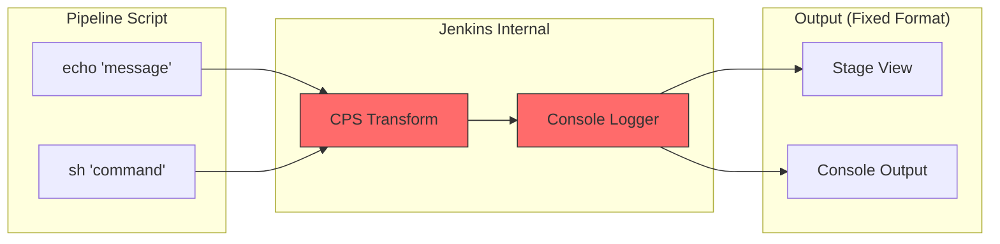
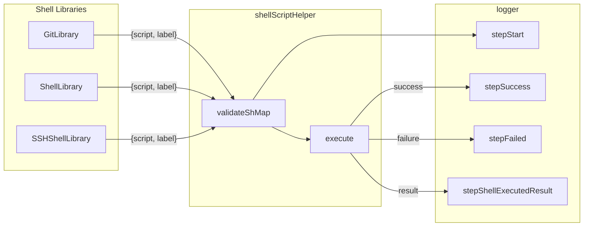
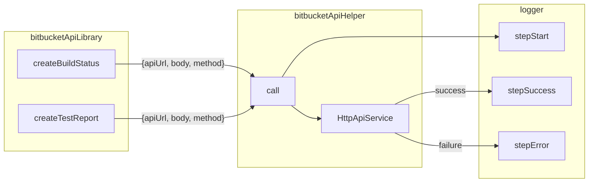
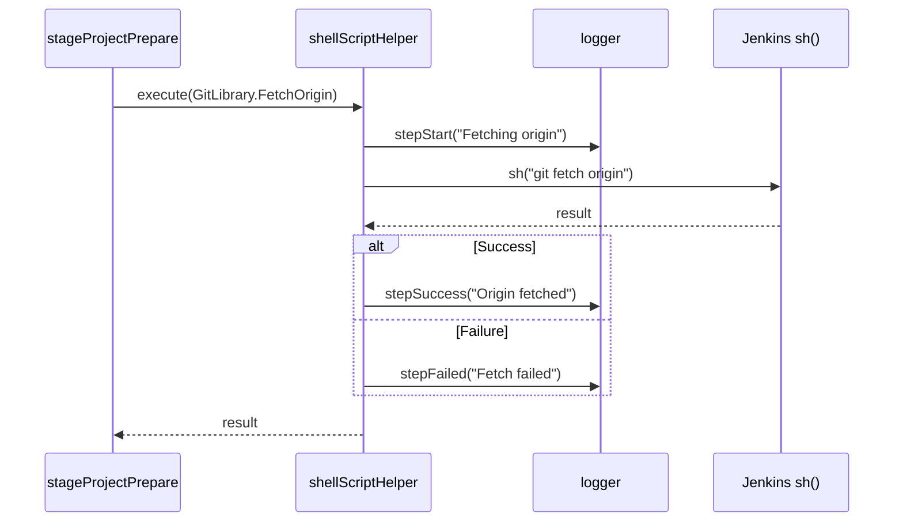

# 3-Level Logger System Design & Integration

> Hierarchical logging system design for consistent logging in Jenkins Pipeline

---

## Table of Contents

1. [Design Background](#1-design-background)
   - 1.1 [Problem: Issues with Existing Logging](#11-problem-issues-with-existing-logging)
     - 1.1.1 [Problem Summary](#111-problem-summary)
     - 1.1.2 [Lack of Consistency](#112-lack-of-consistency)
     - 1.1.3 [Lack of Structure: Cognitive Chunking Impossible](#113-lack-of-structure-cognitive-chunking-impossible)
     - 1.1.4 [Jenkins Logging System Limitations](#114-jenkins-logging-system-limitations)
       - 1.1.4.1 [Same echo Call → Simultaneous Output to Two Places](#1141-same-echo-call--simultaneous-output-to-two-places)
       - 1.1.4.2 [Output Flow](#1142-output-flow)
       - 1.1.4.3 [Constraints](#1143-constraints)
       - 1.1.4.4 [Jenkins Content Security Policy Constraints (Reference)](#1144-jenkins-content-security-policy-constraints-reference)
     - 1.1.5 [Code Duplication (DRY Violation)](#115-code-duplication-dry-violation)
   - 1.2 [Solution: Discovering Chunking Units (Steps Group)](#12-solution-discovering-chunking-units-steps-group)
     - 1.2.1 [What is Steps Group?](#121-what-is-steps-group)
     - 1.2.2 [3-Level Logger Design](#122-3-level-logger-design)
     - 1.2.3 [Design Result: Logging Responsibility Distribution by Layer](#123-design-result-logging-responsibility-distribution-by-layer)
2. [Architecture Integration](#2-architecture-integration)
   - 2.1 [Position within 4-Layer Architecture](#21-position-within-4-layer-architecture)
   - 2.2 [Library-Helper Auto Logging Integration](#22-library-helper-auto-logging-integration)
     - 2.2.1 [Embedding Logging Metadata in Library](#221-embedding-logging-metadata-in-library)
     - 2.2.2 [Helper Auto Logging with Metadata](#222-helper-auto-logging-with-metadata)
   - 2.3 [Integration with shellScriptHelper](#23-integration-with-shellscripthelper)
3. [Before/After Comparison](#3-beforeafter-comparison)

---

## 1. Design Background

### 1.1 Problem: Issues with Existing Logging

#### 1.1.1 Problem Summary

| # | Problem | Description |
|---|---------|-------------|
| 1 | **Lack of Consistency** | Different logging formats in each file |
| 2 | **Lack of Structure** | No cognitive chunking unit besides Stage |
| 3 | **Jenkins Output Constraints** | Format customization impossible due to CPS/Sandbox |
| 4 | **Code Duplication** | `logMessage()` function copied across multiple files |

---

#### 1.1.2 Lack of Consistency

Different logging methods in each file:

| File | Logging Method | Problem |
|------|----------------|---------|
| `generalHelper.groovy` | `logMessage()` function | Self-implemented |
| `jsHelper.groovy` | `logMessage()` function | Same copy as generalHelper (DRY violation) |
| `Jenkinsfile` | Direct `echo` call | No format |

---

#### 1.1.3 Lack of Structure: Cognitive Chunking Impossible

**Problem**: In the entire Pipeline, except for `Stage`, **there is no conceptual distinction useful for human recognition**

> In cognitive psychology, **Chunking** is a strategy for processing information by grouping it into meaningful units. The clearer the boundary, the faster and easier it is to receive information.

| Current State | Problem |
|---------------|---------|
| Stage → (all logs listed flat) | Dozens of lines of logs without intermediate units |
| Individual Steps listed | Cannot distinguish logical task groups |
| When error occurs | Difficult to trace "where did the error occur?" |

---

#### 1.1.4 Jenkins Logging System Limitations

##### 1.1.4.1 Same echo Call → Simultaneous Output to Two Places

| Stage View (actual screenshot) | Console Output (example) |
|:-----------------------------:|:------------------------:|
|  |  |
| Log visible in Pipeline Stage UI | Same log example visible in Console Log |

> **Core Problem**: A single `echo` call outputs to **both** Stage View and Console Output, and **neither can customize the format**

##### 1.1.4.2 Output Flow



##### 1.1.4.3 Constraints

| Constraint | Description |
|------------|-------------|
| Fixed format | Timestamp + `[Pipeline]` marker + message mixed |
| Flat structure | All `echo`, `sh` commands listed at the same level |
| No customization | Jenkins Content Security Policy enforces UI output format |
| No hierarchy | Difficult to find specific tasks in long logs |

##### 1.1.4.4 Jenkins Content Security Policy Constraints (Reference)

Jenkins applies a **restrictive Content Security Policy** by default to prevent XSS attacks:

> Do not use inline JavaScript (JS) in the Jenkins GUI, i.e., JS embedded in HTML output.
>
> — [Jenkins Developer: Content-Security-Policy Compatibility](https://www.jenkins.io/doc/developer/security/csp/)

- Default CSP: `default-src 'none'` - blocks scripts, fonts, iframes, etc.
- Cannot customize Console Output UI (requires system property modification with admin privileges)
- `echo` and `println` are processed identically internally by Jenkins ([reference](https://groups.google.com/g/jenkinsci-users/c/Bing10GEyhs))

---

#### 1.1.5 Code Duplication (DRY Violation)

```groovy
// generalHelper.groovy line 35-44
void logMessage(String message) { ... }

// jsHelper.groovy line 7-16 (exact same copy)
void logMessage(String message) { ... }
```

---

### 1.2 Solution: Discovering Chunking Units (Steps Group)

#### 1.2.1 What is Steps Group?

A group where multiple Steps come together to form a **meaningful unit of work** (Task).

```
Stage: Jenkins Initialization
│
├── Steps Group: "Set Up Environment Variables"  ← Meaningful unit of work
│   ├── Step: Configure Report Directory
│   ├── Step: Extract ticket number
│   └── Step: Set build parameters
│
└── Steps Group: "Send Build Status"             ← Meaningful unit of work
    ├── Step: Prepare API request
    └── Step: POST to Bitbucket API
```

#### 1.2.2 3-Level Logger Design

**Jenkins Provides vs What's Needed:**

| Jenkins Default | Actually Needed |
|-----------------|-----------------|
| Stage Level: `stage('name') { ... }` | Stage Level |
| (None) | **Steps Group Level** ← Newly introduced |
| Step Level: `sh`, `echo`, `withCredentials`, etc. | Step Level |

**Conclusion**: **Steps Group** level is needed between Stage and Step

**3-Level Structure:**

```
┌─────────────────────────────────────────────────────────────┐
│ Level 1: Stage                                              │
│ ===== STAGE Starting: [ Jenkins Initialization ] =====      │
├─────────────────────────────────────────────────────────────┤
│ Level 2: Steps Group                                        │
│ --- STEPS Starting Group: [ Set Up Environment ] ---        │
├─────────────────────────────────────────────────────────────┤
│ Level 3: Step (by status)                                   │
│ ➡️ Step Starting: [ Configure Report Directory ]...         │
│ 💬 Step Info: [ REPORT_DIR: /workspace/PRJob ]              │
│ 🏃 Step Processing: [ Fetching origin branches ]            │
│ ✅ Step Completed: [ Configure Report Directory ]           │
│ ⚠️ Step Warning: [ Branch not found, using default ]        │
│ ❌ Step Failed: [ Git fetch failed ]                        │
│ 🔥 Step Error: [ Exception occurred ]                       │
└─────────────────────────────────────────────────────────────┘
```

**Step Status Classification:**

| Status | Emoji | Usage |
|--------|-------|-------|
| Starting | ➡️ | Task start notification |
| Info | 💬 | Informational message (variable values, settings, etc.) |
| Processing | 🏃 | Task in progress |
| Success | ✅ | Task completed successfully |
| Warning | ⚠️ | Warning (can continue) |
| Failed | ❌ | Task failed (recoverable) |
| Error | 🔥 | Serious error (pipeline stops) |

**Logger API:**

```groovy
// Level 1: Stage
logger.stageStart(stageName)
logger.stageEnd(stageName)

// Level 2: Steps Group
logger.stepsGroupStart(groupName)
logger.stepsGroupEnd(groupName)

// Level 3: Step (by status)
logger.stepStart(description)
logger.stepInfo(description)
logger.stepProcessing(description)
logger.stepSuccess(description)
logger.stepWarning(description)
logger.stepFailed(description)
logger.stepError(description)
logger.stepError(description, Throwable)  // Including stack trace
```

#### 1.2.3 Design Result: Logging Responsibility Distribution by Layer

Introduced a **3-Level chunking-based logging system** to the Pipeline domain and integrated with the existing 4-Layer Architecture to implement a systematic solution where **each layer only handles logging responsibility appropriate to its role**.

| Component | Role | Logging Responsibility |
|-----------|------|------------------------|
| **Logger** | 3-Level chunking system (Stage/Steps Group/Step) | Output format, hierarchy structure definition |
| **Library** | Cognitive classification unit for specific functions within domain | Define `label` appropriate for that function |
| **Helper** | Domain logic orchestration | Call logger according to orchestration flow |
| **Stage** | Business workflow | Define Steps Group boundaries |

> See [Section 2: Architecture Integration](#2-architecture-integration) for detailed implementation

---

## 2. Architecture Integration

### 2.1 Position within 4-Layer Architecture

```
┌─────────────────────────────────────────────────────────────┐
│ Layer 1: Entry Point (Jenkinsfile)                          │
├─────────────────────────────────────────────────────────────┤
│ Layer 2: Orchestration (vars/stage*.groovy)                 │
│          ↓ uses                                             │
├─────────────────────────────────────────────────────────────┤
│ Layer 3: Business Logic (src/service/)                      │
│          ↓ uses                                             │
├─────────────────────────────────────────────────────────────┤
│ Layer 4: Infrastructure                                     │
│  ┌─────────────────┬─────────────────┬─────────────────┐   │
│  │ src/utils/      │ src/resource/   │ vars/ (Cross)   │   │
│  │ *Library.groovy │ Status.groovy   │ ┌─────────────┐ │   │
│  │                 │                 │ │ logger      │ │   │
│  │                 │                 │ │ bitbucket   │ │   │
│  │                 │                 │ │ ApiLibrary  │ │   │
│  │                 │                 │ └─────────────┘ │   │
│  └─────────────────┴─────────────────┴─────────────────┘   │
└─────────────────────────────────────────────────────────────┘
```

**Logger's Position**: Layer 4 (Infrastructure) - Cross-Cutting Concerns

---

### 2.2 Library-Helper Auto Logging Integration

Logger is used system-wide as a **Cross-Cutting Concern**:
- Used by all Stage modules
- shellScriptHelper, bitbucketApiHelper internally use logger (auto logging)
- Single entry point for unified logging format

#### 2.2.1 Embedding Logging Metadata in Library

##### (a) Shell Script Logging Integration



**Core Design**: Each Library's closure includes `label` metadata for Helper to auto-log

```groovy
// GitLibrary.groovy - Each closure includes script + label
static final Closure FetchOriginReturnStatus = {
    [
        script: 'git fetch origin',
        label: 'Fetch all remote branches from origin',  // ← Logging metadata
        returnStatus: true
    ]
}

static final Closure CheckoutBranch = { String branchName ->
    [
        script: "git checkout ${branchName}",
        label: "Checkout branch '${branchName}'",  // ← Parameterized label
        returnStdout: true
    ]
}
```

##### (b) Bitbucket API Logging Integration



##### Same Pattern Applied

| Library | Metadata | Usage |
|---------|----------|-------|
| GitLibrary | `script`, `label` | Shell command + log message |
| ShellLibrary | `script`, `label` | Shell command + log message |
| SSHShellLibrary | `script`, `label` | SSH command + log message |
| bitbucketApiLibrary | `apiUrlString`, `requestBody`, `method` | API request info |

#### 2.2.2 Helper Auto Logging with Metadata

**shellScriptHelper**: Reads `label` from Library and automatically calls logger

```groovy
// shellScriptHelper.groovy
def call(Closure shellScriptClosure, List args = []) {
    Map shMap = shellScriptClosure(*args)
    Map validatedShMap = validateShMap(shMap)

    // Read label for auto logging
    logger.stepStart("'${validatedShMap.script}' '${validatedShMap.label}' (Execute)")

    if (validatedShMap.returnStatus) {
        return executeReturnStatus(validatedShMap)  // Success/failure logging inside
    } else if (validatedShMap.returnStdout) {
        return executeReturnStdout(validatedShMap)  // Result logging inside
    }
    // ...
}
```

**bitbucketApiHelper**: Same pattern for API execution + auto logging

```groovy
// bitbucketApiHelper.groovy
def call(Map bitbucketApiMap) {
    logger.stepStart("bitbucketApiHelper execution started")

    // Execute API with Map received from bitbucketApiLibrary
    if (bitbucketApiMap.method == 'POST') {
        return bitbucketApiService.post(
            bitbucketApiMap.apiUrlString,
            bitbucketApiMap.requestBody,
            bitbucketAccessToken
        )
    }

    logger.stepSuccess("bitbucketApiHelper execution completed")
}
```

---

### 2.3 Integration with shellScriptHelper

shellScriptHelper uses logger internally for auto logging:



**Integration Benefits:**
- No need to write logging code every time in Stage module
- Auto start/success/failure logging when executing Shell commands
- Consistent format guaranteed

---

## 3. Before/After Comparison

### Stage Log (Blue Ocean UI)

| Before | After |
|--------|-------|
|  |  |

---

### Console Log

> **Note**: Console screenshot could not be captured, substituting with text.

#### Before (scattered echo)

```
[Pipeline] echo
2025-03-20T10:23:45.123Z Fetching origin...
[Pipeline] sh
2025-03-20T10:23:45.456Z + git fetch origin
[Pipeline] echo
2025-03-20T10:23:46.789Z REPORT_DIR: /workspace/PRJob/feature-branch
[Pipeline] echo
2025-03-20T10:23:47.012Z Sending build status to Bitbucket
```

**Problems**: All messages at same level, no structure, difficult to trace errors

#### After (3-Level Logger)

```
===== STAGE Starting: [ Jenkins Initialization ] =====
--- STEPS Starting Group: [ Set Up Environment Variables ] ---
➡️ Step Starting: [ Configure Report Directory ]...
💬 Step Info: [ REPORT_DIR: /workspace/PRJob/feature-branch ]
✅ Step Completed: [ Configure Report Directory ]
--- STEPS Completed Group: [ Set Up Environment Variables ] ---
===== STAGE Completed: [ Jenkins Initialization ] =====
```

---

### Change Summary

| Item | Before | After |
|------|--------|-------|
| Logging function location | generalHelper, jsHelper (copied) | logger.groovy (single) |
| Format consistency | None | 100% |
| Error traceability | Difficult | Immediate identification |

---

## Reference

- [Leg 2 Changelog](legs/leg-2-3-level-logger-system-implementation/changelog.md) - Detailed implementation process record
- [highlights.md](highlights.md) - Logger System Integration section
- [refactoring-result-snapshot.md](legs/refactoring-result-snapshot.md) - Facade Pattern explanation
