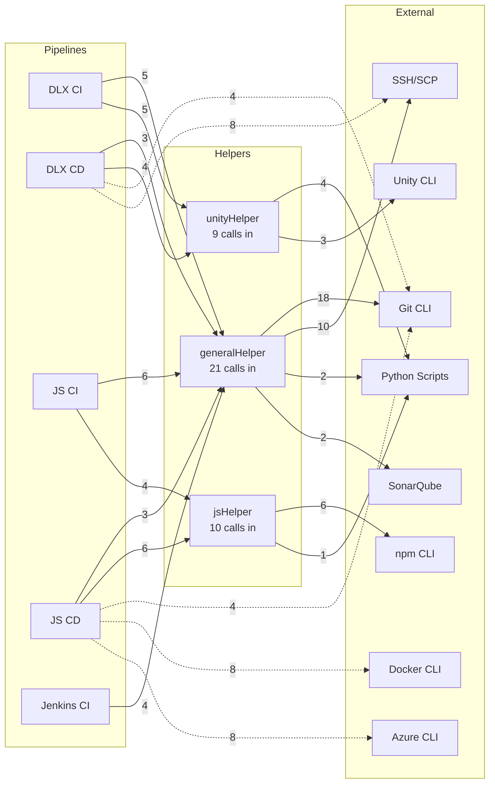

# Architecture Smells Analysis

> **Source:** Garcia et al., Lippert & Roock, Sharma
>
> **Context:** System-level structural issues affecting maintainability, evolution, and deployment.

---

## 1. Considered Architecture Smells

### 1.1 Garcia et al. (Connector/Component Perspective)

| Type | Issue Type | Description | Applicable | Reason |
|------|------------|-------------|:----------:|--------|
| Connector Envy | Structure | Components handle communication logic that should be in a dedicated connector | ✗ | No connector concept in Jenkins Pipeline |
| Extraneous Connector | Structure | Two components communicate through a connector when direct call suffices | ✗ | Same as above |
| Ambiguous Interface | Structure | Interface offers only single, overly general entry point | ✗ | Weak interface concept in Helper functions |

### 1.2 Lippert & Roock (Symptom-Based)

| Type | Issue Type | Description | Applicable | Reason |
|------|------------|-------------|:----------:|--------|
| Cyclic Dependency | Dependency | Components/Packages form a dependency cycle | ✓ | Sequence diagram analysis confirms unidirectional dependencies only |
| Unstable Dependency | Dependency | Stable component depends on less stable component | ✗ | No change frequency data available |

> **Cyclic Dependency Analysis Method:** Jenkins Pipeline is procedural code, so call flow was traced via sequence diagrams. Analysis confirms `Jenkinsfile → Helper → External (Python/CLI)` unidirectional dependencies only. No inter-Helper dependencies found.
>
> See: [pipeline-sequence-diagrams/domain-mapping.md](./pipeline-sequence-diagrams/domain-mapping.md)

### 1.3 Sharma (Dependency Perspective)

| Type | Issue Type | Description | Applicable | Reason |
|------|------------|-------------|:----------:|--------|
| Hub-like Dependency | Dependency | Component with too many incoming/outgoing dependencies | ✓ | generalHelper → all 5 pipelines depend on it |
| Scattered Functionality | Structure | Single concern implemented across multiple components | ✓ | Same functionality scattered across helper and inline |
| Dense Structure | Structure | Dependency graph is too dense | ✗ | Density measurement meaningless with only 8 files |
| Implicit Cross-module Dependency | Dependency | Hidden dependencies not visible in architecture | ✓ | Python scripts, env vars, Jenkins APIs |

> **Note:** Hub-like Dependency is classified as Design Smell (class level) in Sharma's taxonomy. However, in Jenkins Pipeline context, Helper files serve as core system components, so it is included in Architecture level analysis.

---

## 2. Applied Architecture Smells Analysis

### 2.1 Hub-like Dependency

**Data Sources:**

| Component | Source | Extracted Data |
|-----------|--------|----------------|
| Pipelines | Pipeline Sequence Diagrams | Call counts extracted from Delegation Pattern tables |
| generalHelper | Software Smells Analysis (Hub-like Modularization) | Existing count data used |
| jsHelper | jsHelper.groovy source code | External calls counted directly |
| unityHelper | unityHelper.groovy source code | External calls counted directly |

**Incoming Dependencies (Pipeline → Helper):**

| Pipeline | generalHelper | jsHelper | unityHelper | Total |
|----------|:-------------:|:--------:|:-----------:|:-----:|
| DLX CI | 5 | - | 5 | 10 |
| DLX CD | 3 | - | 4 | 7 |
| JS CI | 6 | 4 | - | 10 |
| JS CD | 3 | 6 | - | 9 |
| Jenkins CI | 4 | - | - | 4 |
| **Total** | **21** | **10** | **9** | **40** |

**Outgoing Dependencies (Helper → External):**

| External Type | generalHelper | jsHelper | unityHelper |
|---------------|:-------------:|:--------:|:-----------:|
| Git CLI | 18 | - | - |
| Linux CLI | 11 | 3 | 1 |
| SSH | 6 | - | - |
| SCP | 4 | - | - |
| Python | 2 | 1 | 4 |
| SonarQube API | 2 | - | - |
| Node.js CLI | - | 2 | - |
| npm CLI | - | 6 | - |
| Unity CLI | - | - | 1 |
| Unity Hub CLI | - | - | 2 |
| **Total Calls** | **43** | **12** | **8** |
| **Total Types** | **6** | **4** | **4** |

**Dependency Diagram:**

> Numbers on edges represent call counts. Solid lines (→) indicate calls through Helper, dashed lines (⇢) indicate direct External calls.

**Analysis:**
- `generalHelper`: All 5 pipelines depend on it (100%), 43 outgoing calls to 6 external types → **Hub**
- `jsHelper`, `unityHelper`: Only 2 pipelines each depend on them, 12/8 outgoing calls to 4 types
- Dashed lines: Pipeline → External direct calls (Helper bypass) → **inconsistent abstraction**

---

### 2.2 Scattered Functionality

**Data Sources:**

| Source | Extracted Data |
|--------|----------------|
| Pipeline Sequence Diagrams | Pipeline Comparison tables |

**Evidence:**

| Concern | Implementation Location | Issue |
|---------|------------------------|-------|
| Git operations | generalHelper (CI) vs Jenkinsfile direct calls (CD) | Same functionality, different implementation |
| Build status sending | Via `initializeEnvironment` (CI) vs direct `sendBuildStatus` call (CD) | Same functionality, different call pattern |
| Bitbucket reporting | unityHelper (`sendTestReport`), Jenkinsfile direct Python calls | Same domain, scattered across multiple locations |
| Web Server deployment | generalHelper (CI) vs Jenkinsfile direct SSH/SCP (CD) | Same functionality, different implementation |

**Analysis:**
- Same concern implemented differently depending on CI/CD pipeline type
- Changes require modifications in multiple locations → triggers Shotgun Surgery

---

### 2.3 Implicit Cross-module Dependency

**Data Sources:**

| Source | Extracted Data |
|--------|----------------|
| 2.1 Hub-like Dependency | Dependency Diagram, Outgoing Dependencies table |
| Pipeline Sequence Diagrams | Delegation Pattern tables (direct External calls) |
| Helper source code | Environment variable usage list |

**Hidden Dependencies via `sh` calls:**

> All External calls are made through `sh` command. Dependencies only revealed at runtime without `import` in Groovy code.

| Source | External Types | Total Calls |
|--------|:--------------:|:-----------:|
| Helpers | 10 | 63 |
| Pipelines (direct) | 10 | 50 |
| **Total** | - | **113** |

**Hidden Dependencies via Environment Variables:**

| Environment Variable | Used In | Set In |
|---------------------|---------|--------|
| `WORKSPACE` | jsHelper | Jenkins (automatic) |
| `COMMIT_HASH` | jsHelper | Jenkinsfile |
| `PR_BRANCH` | unityHelper | Jenkinsfile |
| `CI_PIPELINE` | unityHelper | Jenkinsfile |
| `SSH_KEY` | generalHelper | Jenkins credentials |
| `DLX_WEB_HOST_URL` | generalHelper | Jenkins configuration |
| `UNITY_EXECUTABLE` | unityHelper | Jenkinsfile |
| `PROJECT_DIR` | unityHelper | Jenkinsfile |
| `REPORT_DIR` | unityHelper | Jenkinsfile |
| `BUILD_URL` | unityHelper | Jenkins (automatic) |

**Analysis:**
- All 113 external calls are implicit dependencies via `sh`
- Cannot determine required external tools by reading Helper code alone
- Tracing environment variable origins requires examining Jenkinsfile

---

## References

- [Architecture Smells (T. Sharma Preprint)](https://www.tusharma.in/preprints/architecture_smells.pdf)
- [Does your Architecture Smell? (Designite)](https://www.designite-tools.com/blog/does-your-architecture-smell)