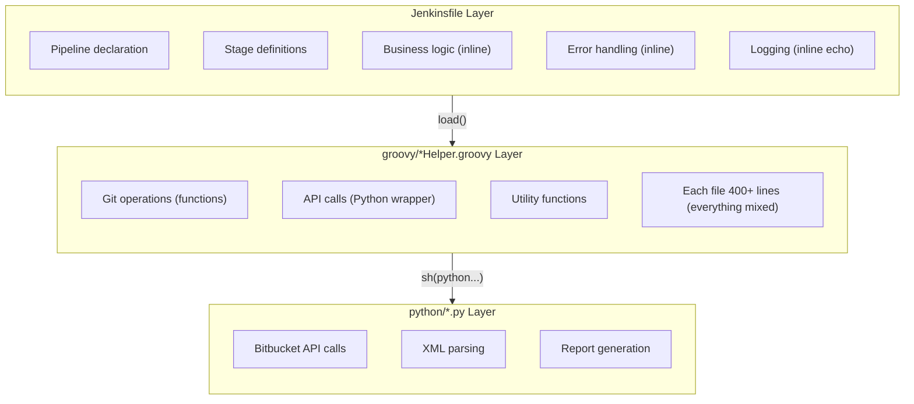
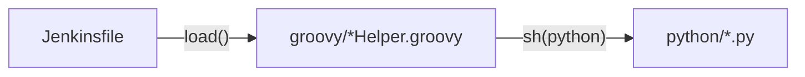
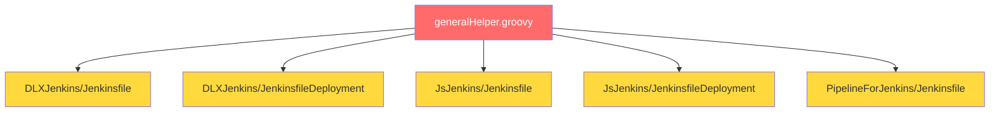
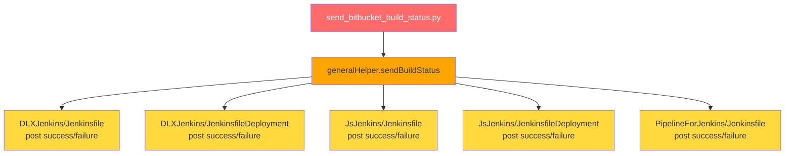
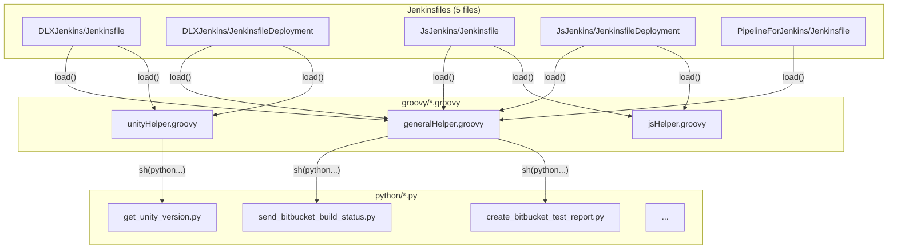

# Baseline Technical Snapshot

> **Note**: This document was analyzed based on commit `54479b2`.
>
> Other documents in `problem-analysis/` use commit `74fc356` as the baseline.
>
> **Difference in analysis direction**:
> - **This document**: Focused on code statistics, file structure, technical state
> - **problem-analysis/**: Problem analysis based on Software Smells classification system

---

**Commit**: `54479b2` (2025-02-21) - "emergency fixed"

This document provides a comprehensive analysis of the codebase state before the architectural refactoring.

---

## Table of Contents

1. [Code Statistics](#1-code-statistics)
2. [File Structure](#2-file-structure-27-files)
3. [Domain Analysis](#3-domain-analysis)
4. [Architecture Analysis](#4-architecture-analysis)
5. [Folder-by-Folder Analysis](#5-folder-by-folder-analysis)
6. [Critical Problems](#6-critical-problems)
7. [Code Duplication Analysis (Detailed)](#7-code-duplication-analysis-detailed)
8. [Dependency Graph](#8-dependency-graph)
9. [Technical Debt Summary](#9-technical-debt-summary)
10. [Summary Table](#10-summary-table)
11. [Key Issues for Refactoring](#11-key-issues-for-refactoring)

---

## 1. Code Statistics

### 1.1 Total Lines by Category

| Category | Files | Lines | Percentage |
|----------|-------|-------|------------|
| **Jenkinsfiles** | 5 | 1,239 | 33.1% |
| **Groovy Helpers** | 3 | 1,148 | 30.6% |
| **Python Scripts** | 9 | 749 | 20.0% |
| **Bash Scripts** | 2 | 330 | 8.8% |
| **Tests** | 2 | 84 | 2.2% |
| **Config/Other** | 6 | 195 | 5.2% |
| **TOTAL** | **27** | **3,745** | 100% |

### 1.2 Detailed Line Counts

#### Jenkinsfiles (1,239 lines)

| File | Lines |
|------|-------|
| DLXJenkins/Jenkinsfile | 249 |
| DLXJenkins/JenkinsfileDeployment | 242 |
| JsJenkins/Jenkinsfile | 198 |
| JsJenkins/JenkinsfileDeployment | 372 |
| PipelineForJenkins/Jenkinsfile | 178 |

#### Groovy Helpers (1,148 lines)

| File | Lines |
|------|-------|
| groovy/generalHelper.groovy | 403 |
| groovy/jsHelper.groovy | 408 |
| groovy/unityHelper.groovy | 337 |

#### Python Scripts (749 lines)

| File | Lines |
|------|-------|
| python/linting_error_report.py | 203 |
| python/create_bitbucket_test_report.py | 152 |
| python/npm_audit.py | 137 |
| python/send_bitbucket_build_status.py | 64 |
| python/create_log_report.py | 56 |
| python/get_bitbucket_commit_hash.py | 38 |
| python/get_unity_version.py | 34 |
| python/get_unity_failure.py | 26 |
| python/log-template/logs.html | 39 |

#### Tests (84 lines)

| File | Lines |
|------|-------|
| tests/JsHelperSpec.groovy | 66 |
| tests/GeneralHelperSpec.groovy | 18 |

#### Other Files (525 lines)

| File | Lines |
|------|-------|
| Bash/.editorconfig | 264 |
| Bash/Linting.bash | 66 |
| PipelineForJenkins/.groovylintrc.groovy.json | 43 |
| PipelineForJenkins/.groovylintrc.jenkins.json | 19 |
| .gitignore | 51 |
| build.gradle | 42 |
| Builder.cs | 36 |
| logErrors.txt | 4 |

---

## 2. File Structure (27 files)

```
54479b2/
├── .gitignore
├── build.gradle                          # Gradle build configuration
├── Builder.cs                            # Unity WebGL build script
├── logErrors.txt                         # Error log file
│
├── DLXJenkins/                           # Unity Project Pipeline
│   ├── Jenkinsfile                       # PR Pipeline (249 lines)
│   └── JenkinsfileDeployment             # Deployment Pipeline (242 lines)
│
├── JsJenkins/                            # JavaScript Project Pipeline
│   ├── Jenkinsfile                       # PR Pipeline (198 lines)
│   └── JenkinsfileDeployment             # Deployment Pipeline (372 lines)
│
├── PipelineForJenkins/                   # Jenkins Self Pipeline
│   ├── Jenkinsfile                       # (178 lines)
│   ├── .groovylintrc.groovy.json         # Groovy lint config
│   └── .groovylintrc.jenkins.json        # Jenkins lint config
│
├── groovy/                               # Helper Scripts
│   ├── generalHelper.groovy              # Common utilities (403 lines)
│   ├── unityHelper.groovy                # Unity-specific (337 lines)
│   └── jsHelper.groovy                   # JavaScript-specific (408 lines)
│
├── Bash/
│   ├── .editorconfig                     # Editor configuration
│   └── Linting.bash                      # dotnet format linting script
│
├── python/                               # Python Scripts
│   ├── send_bitbucket_build_status.py    # Send build status
│   ├── create_bitbucket_test_report.py   # Send test report
│   ├── create_log_report.py              # Generate log report
│   ├── get_bitbucket_commit_hash.py      # Get commit hash
│   ├── get_unity_failure.py              # Analyze Unity failures
│   ├── get_unity_version.py              # Get Unity version
│   ├── linting_error_report.py           # Linting error report
│   ├── npm_audit.py                      # npm security audit
│   └── log-template/logs.html            # Log HTML template
│
└── tests/                                # Tests
    ├── GeneralHelperSpec.groovy          # generalHelper tests
    └── JsHelperSpec.groovy               # jsHelper tests
```

---

## 3. Domain Analysis

### 3.1 Project Types

| Domain | Pipeline Files | Helper |
|--------|---------------|--------|
| **Unity Project** | DLXJenkins/Jenkinsfile, JenkinsfileDeployment | unityHelper.groovy |
| **JavaScript Project** | JsJenkins/Jenkinsfile, JenkinsfileDeployment | jsHelper.groovy |
| **Jenkins Pipeline Project** | PipelineForJenkins/Jenkinsfile | generalHelper.groovy |

### 3.2 Pipeline Types

| Type | Trigger | Purpose |
|------|---------|---------|
| **PR Pipeline** | `PR_STATE = 'OPEN'` | Pull Request validation (tests, linting, static analysis) |
| **Deployment Pipeline** | `PR_STATE = 'MERGED'` | Deployment (branch cleanup, build, server deployment) |

---

## 4. Architecture Analysis

### 4.1 Current Architecture: Flat/Monolithic



### 4.2 Layer Analysis

**Only 2 effective layers exist:**

1. **Jenkinsfile Layer**: Pipeline definition + business logic mixed
2. **Helper Layer**: groovy/*.groovy + python/*.py (Flat structure)

**Inter-layer dependencies:**



---

## 5. Folder-by-Folder Analysis

### 5.1 DLXJenkins/ (Unity Pipeline)

#### Jenkinsfile (249 lines)

```groovy
// Problem 1: All logic inline
stage('Prepare WORKSPACE') {
    steps {
        dir ("${PROJECT_DIR}") {
            script {
                sh 'env'
                try {
                    generalUtil = load("${env.WORKSPACE}/groovy/generalHelper.groovy")
                    unityUtil = load("${env.WORKSPACE}/groovy/unityHelper.groovy")
                } catch (Exception e) {
                    error "Failed to load Groovy scripts: ${e.message}"
                }
                // ... 30+ lines of logic
            }
        }
    }
}

// Problem 2: Duplicated patterns repeated in every stage
stage('Linting') {
    steps {
        dir("${REPORT_DIR}") {
            sh 'mkdir -p linting_results'
        }
        script {
            sh "cp -f '${env.WORKSPACE}/Bash/.editorconfig' '${PROJECT_DIR}'"
            def exitCode = sh script: "sh '${env.WORKSPACE}/Bash/Linting.bash'...", returnStatus: true
            // ... 20+ lines of error handling
        }
    }
}
```

**Problems:**
- Stage logic written inline in Jenkinsfile
- Same patterns duplicated in JenkinsfileDeployment
- Structure not amenable to testing

#### JenkinsfileDeployment (242 lines)
- 70%+ code duplication with Jenkinsfile
- Only deployment-specific logic added

---

### 5.2 JsJenkins/ (JavaScript Pipeline)

#### Characteristics
- Same structure as DLXJenkins but uses jsHelper
- Includes Azure Container Registry deployment logic
- Includes SonarQube static analysis

#### Problems
```groovy
// Almost identical code repeated from DLXJenkins
stage('Prepare WORKSPACE') {
    steps {
        dir("${PROJECT_DIR}") {
            script {
                sh 'env'
                generalUtil = load("${env.WORKSPACE}/groovy/generalHelper.groovy")
                jsUtil = load("${env.WORKSPACE}/groovy/jsHelper.groovy")
                // ... same pattern
            }
        }
    }
}
```

---

### 5.3 groovy/ (Helper Scripts)

#### generalHelper.groovy (403 lines)

**Functions included (mixed):**
1. **Git operations**: cloneOrUpdateRepo, checkoutBranch, mergeBranchIfNeeded, isBranchUpToDateWithRemote
2. **Environment setup**: initializeEnvironment, parseTicketNumber
3. **API calls**: sendBuildStatus (Python wrapper)
4. **Server deployment**: publishTestResultsHtmlToWebServer, cleanMergedBranchReportsFromWebServer
5. **File cleanup**: cleanUpPRBranch, closeLogfiles

**Problems:**

```groovy
// Problem 1: All functionality mixed in one file
def cloneOrUpdateRepo(...) {
    // Git logic
}
def sendBuildStatus(...) {
    // Python script call
    sh "python '${workspace}/python/send_bitbucket_build_status.py'..."
}
def publishTestResultsHtmlToWebServer(...) {
    // SSH/SCP commands
}

// Problem 2: Duplicated shell commands
sh 'git reset --hard'
sh 'git clean -fd'
sh "git checkout ${targetBranch}"
// Repeated in multiple functions

// Problem 3: Inconsistent error handling
catch (Exception e) {
    echo "An error occurred: ${e.getMessage()}"
    error('Merge process failed.')
}
// vs
catch (Exception e) {
    error("Failed to execute: ${e.message}")
}
```

#### unityHelper.groovy (337 lines)

**Functions included:**
- Unity Batch Mode execution
- Test report generation
- Code Coverage configuration

**Problems:**
```groovy
// Problem: Giant functions (100+ lines)
int runUnityBatchMode(String unityExecutable, String projectDirectory, String reportDirectory, String stageName) {
    // Closure definitions
    Closure setLogFilePathAndUrl = { ... }
    Closure<String> getTestRunArgs = { ... }
    Closure<String> getAdditionalArgs = { ... }

    // All stages handled in one function
    if (['EditMode', 'PlayMode'].contains(stageName)) { ... }
    else if (stageName == 'Coverage') { ... }
    else if (['Webgl', 'Rider'].contains(stageName)) { ... }
    // ... 100+ lines
}
```

#### jsHelper.groovy (408 lines)

**Functions included:**
- npm command execution
- SonarQube integration
- Azure Container deployment

**Problems:**
- Same issues as generalHelper.groovy
- Duplicated OS branching logic (isUnix() checks)

---

### 5.4 python/ (API Scripts)

#### Role
Handles HTTP API calls that are difficult to do directly in Groovy

#### File List

| File | Purpose |
|------|---------|
| send_bitbucket_build_status.py | Send build status to Bitbucket |
| create_bitbucket_test_report.py | Send test report |
| get_bitbucket_commit_hash.py | Get commit hash |
| linting_error_report.py | Linting error report |
| npm_audit.py | npm security audit |
| get_unity_failure.py | Analyze Unity failures |
| get_unity_version.py | Get Unity version |

**Problems:**
```python
# Problem 1: Groovy calling Python → complex dependency
def sendBuildStatus(workspace, state, commitHash, deployment = false, javascript = false) {
    def pythonCommand = "python '${workspace}/python/send_bitbucket_build_status.py' '${commitHash}' '${state}'"
    sh(script: pythonCommand, returnStatus: true)
}

# Problem 2: Debugging difficult on errors
# - Only exit code returned
# - Detailed error messages lost
```

---

### 5.5 Bash/ (Shell Scripts)

#### Linting.bash
```bash
# Script for C# project linting
dotnet format "$SOLUTION_FILE" --verify-no-changes
```

**Problems:**
- Called directly from Jenkinsfile → difficult to test
- Error code interpretation done in Jenkinsfile

---

### 5.6 tests/ (Test Files)

```groovy
// GeneralHelperSpec.groovy
class GeneralHelperSpec extends Specification {
    def "parseTicketNumber should extract ticket numbers"() {
        // Only one function tested
    }
}
```

**Problems:**
- Extremely low test coverage (only parseTicketNumber function)
- Most functions depend on Jenkins environment, cannot be tested

---

## 6. Critical Problems

### 6.1 Impact of File Changes

#### When generalHelper.groovy is modified:



**→ All 5 pipelines affected!**
**→ Risk of system-wide failure when deployed without testing**

#### When python/send_bitbucket_build_status.py is modified:



**→ Affects Bitbucket status updates for all pipelines!**

### 6.2 Code Duplication Overview

```groovy
// Patterns repeated across 5 Jenkinsfiles

// Pattern 1: Helper loading (~10 lines × 5)
generalUtil = load("${env.WORKSPACE}/groovy/generalHelper.groovy")

// Pattern 2: Branch check (~15 lines × 5)
if (generalUtil.isBranchUpToDateWithRemote(PR_BRANCH)...) {
    currentBuild.result = 'ABORTED'
    error('Branch is up to date...')
}

// Pattern 3: Post actions (~20 lines × 5)
post {
    success { generalUtil.sendBuildStatus(..., 'SUCCESSFUL'...) }
    failure { generalUtil.sendBuildStatus(..., 'FAILED'...) }
    aborted { generalUtil.sendBuildStatus(..., 'STOPPED'...) }
}
```

### 6.3 Testability Issues

| Component | Testable? | Reason |
|-----------|-----------|--------|
| Jenkinsfile | No | Requires Jenkins environment |
| generalHelper.groovy | Partial (1 function only) | Depends on Jenkins APIs (sh, withCredentials, etc.) |
| unityHelper.groovy | No | Requires Jenkins + Unity environment |
| jsHelper.groovy | No | Requires Jenkins + Node.js environment |
| python/*.py | Partial | Requires environment variables + API tokens |

### 6.4 Logging Problems

```groovy
// Inconsistent echo usage
echo 'Identifying Unity version...'
echo "Parameters for bash: ${env.WORKSPACE}/Linting.bash..."
echo "After bash call, exit code: ${exitCode}"
echo 'Error linting calling report'

// Problems:
// 1. No Stage/Step distinction
// 2. Inconsistent format
// 3. Difficult to identify error location
```

### 6.5 Inconsistent Error Handling

```groovy
// Method 1: catch + echo + error
catch (Exception e) {
    echo "An error occurred: ${e.getMessage()}"
    error('Process failed.')
}

// Method 2: catch + error directly
catch (Exception e) {
    error "Failed: ${e.message}"
}

// Method 3: catchError
catchError(buildResult: 'SUCCESS', stageResult: 'FAILURE') {
    error("Failed with exit code: ${exitCode}")
}

// Problems:
// - Stack trace lost
// - Difficult to trace where error occurred
```

---

## 7. Code Duplication Analysis (Detailed)

This section provides a comprehensive analysis of duplicated code patterns found across the codebase in commit 54479b2.

### Duplication Definition

**What IS counted as duplication:**
- Structural patterns appearing in multiple files with similar/identical code
- Boilerplate code that could be extracted to shared modules
- Copy-paste patterns where same logic exists in different locations

**What is NOT counted:**
- Project-specific configuration values (different env vars per project)
- Intentional variations (OPEN vs MERGED triggers)
- Single occurrences of any pattern

### 7.1 Duplication Summary

| Category | Duplicated Lines | Base Lines | Percentage |
|----------|-----------------|------------|------------|
| Jenkinsfile Patterns | 463 | 1,239 | 37.4% |
| Groovy Helper Patterns | 106 | 1,148 | 9.2% |
| **Total** | **569** | **3,136*** | **18.1%** |

*\*Base = Jenkinsfiles (1,239) + Groovy Helpers (1,148) + Python (749), excluding Tests (84) and Config (525)*

### 7.2 Jenkinsfile Duplication Patterns

#### Pattern 1: Parameters Block (47 lines total)

| File | Lines |
|------|-------|
| DLXJenkins/Jenkinsfile | 10 |
| DLXJenkins/JenkinsfileDeployment | 9 |
| JsJenkins/Jenkinsfile | 10 |
| JsJenkins/JenkinsfileDeployment | 8 |
| PipelineForJenkins/Jenkinsfile | 10 |

```groovy
parameters {
    string(name: 'PR_BRANCH', defaultValue: '', description: '')
    string(name: 'PR_DESTINATION_BRANCH', defaultValue: '', description: '')
    string(name: 'PR_REPO_HTML', defaultValue: '', description: '')
    string(name: 'PR_REPO_NAME', defaultValue: '', description: '')
    string(name: 'PR_COMMIT', defaultValue: '', description: '')
    string(name: 'PR_PROJECT', defaultValue: '', description: '')
    string(name: 'PR_STATE', defaultValue: '', description: '')
    string(name: 'TEST_RUN', defaultValue: '', description: '...')
}
```

#### Pattern 2: Triggers Block (83 lines total)

| File | Lines |
|------|-------|
| DLXJenkins/Jenkinsfile | 17 |
| DLXJenkins/JenkinsfileDeployment | 17 |
| JsJenkins/Jenkinsfile | 17 |
| JsJenkins/JenkinsfileDeployment | 16 |
| PipelineForJenkins/Jenkinsfile | 16 |

```groovy
triggers {
    GenericTrigger(
        genericVariables: [
            [key: 'PR_BRANCH', value: '$.pullrequest.source.branch.name'],
            [key: 'PR_DESTINATION_BRANCH', value: '$.pullrequest.destination.branch.name'],
            [key: 'PR_REPO_HTML', value: '$.repository.links.self.href'],
            [key: 'PR_REPO_NAME', value: '$.repository.name'],
            [key: 'PR_COMMIT', value: '$.pullrequest.source.commit.hash'],
            [key: 'PR_PROJECT', value: '$.repository.full_name'],
            [key: 'PR_STATE', value: '$.pullrequest.state']
        ],
        tokenCredentialId: 'trigger-token',
        regexpFilterText: '$PR_STATE',
        regexpFilterExpression: 'OPEN'  // or 'MERGED' for deployment
    )
}
```

#### Pattern 3: Environment Block (63 lines total)

| File | Lines |
|------|-------|
| DLXJenkins/Jenkinsfile | 11 |
| DLXJenkins/JenkinsfileDeployment | 10 |
| JsJenkins/Jenkinsfile | 16 |
| JsJenkins/JenkinsfileDeployment | 14 |
| PipelineForJenkins/Jenkinsfile | 12 |

```groovy
environment {
    CI_PIPELINE = 'true'
    PROJECT_TYPE = 'Unity_Project'
    PROJECT_DIR = "${env.WORKSPACE}/${PROJECT_TYPE}"
    REPORT_DIR = "${env.WORKSPACE}/PRJob/${PR_BRANCH}"
    JOB_REPO = "${PR_REPO_HTML}"
    BITBUCKET_ACCESS_TOKEN = credentials('bitbucket-access-token')
    REPO_SSH = "git@bitbucket.org:${PR_PROJECT}.git"
    DESTINATION_BRANCH = "${PR_DESTINATION_BRANCH}"
}
```

#### Pattern 4: Post Actions Block (119 lines total)

| File | Lines |
|------|-------|
| DLXJenkins/Jenkinsfile | 24 |
| DLXJenkins/JenkinsfileDeployment | 24 |
| JsJenkins/Jenkinsfile | 23 |
| JsJenkins/JenkinsfileDeployment | 23 |
| PipelineForJenkins/Jenkinsfile | 25 |

```groovy
post {
    always {
        script {
            echo 'Returning to the main branch...'
            generalUtil.checkoutBranch(PROJECT_DIR, DESTINATION_BRANCH)
        }
    }
    success {
        script {
            generalUtil.sendBuildStatus(env.WORKSPACE, 'SUCCESSFUL', env.COMMIT_HASH)
        }
    }
    failure {
        script {
            generalUtil.sendBuildStatus(env.WORKSPACE, 'FAILED', env.COMMIT_HASH)
        }
    }
    aborted {
        script {
            generalUtil.sendBuildStatus(env.WORKSPACE, 'STOPPED', env.COMMIT_HASH)
        }
    }
}
```

#### Pattern 5: Prepare WORKSPACE Stage (151 lines total)

Each Jenkinsfile has a similar 'Prepare WORKSPACE' stage that includes helper loading, branch checks, environment initialization, and repository setup:

| File | Lines |
|------|-------|
| DLXJenkins/Jenkinsfile | 35 |
| DLXJenkins/JenkinsfileDeployment | 28 |
| JsJenkins/Jenkinsfile | 33 |
| JsJenkins/JenkinsfileDeployment | 30 |
| PipelineForJenkins/Jenkinsfile | 25 |

```groovy
stage('Prepare WORKSPACE') {
    steps {
        dir("${PROJECT_DIR}") {
            script {
                sh 'env'
                try {
                    generalUtil = load("${env.WORKSPACE}/groovy/generalHelper.groovy")
                    unityUtil = load("${env.WORKSPACE}/groovy/unityHelper.groovy")
                } catch (Exception e) {
                    error "Failed to load Groovy scripts: ${e.message}"
                }

                if (generalUtil.isBranchUpToDateWithRemote(PR_BRANCH) && !TEST_RUN.equals('Y')) {
                    echo 'Local branch commit is up to date with remote branch, no changes. Aborting pipeline.'
                    currentBuild.result = 'ABORTED'
                    error('Branch is up to date, no changes.')
                }

                env.COMMIT_HASH = generalUtil.getFullCommitHash(env.WORKSPACE, PR_COMMIT)
                generalUtil.initializeEnvironment(env.WORKSPACE, env.COMMIT_HASH, PR_BRANCH)
                generalUtil.cloneOrUpdateRepo(PROJECT_TYPE, env.WORKSPACE, PROJECT_DIR, REPO_SSH, PR_BRANCH)
                generalUtil.mergeBranchIfNeeded()
            }
        }
    }
}
```

**Jenkinsfile Total: 47 + 83 + 63 + 119 + 151 = 463 lines**

### 7.3 Groovy Helper Duplication Patterns

#### Pattern 6: Git Command Sequences (24 lines in generalHelper.groovy)

12 git shell commands repeated across multiple functions:

```groovy
// Found in generalHelper.groovy - repeated in cloneOrUpdateRepo(), checkoutBranch(), mergeBranchIfNeeded()
sh 'git reset --hard'
sh 'git clean -fd'
sh "git checkout ${targetBranch}"
sh 'git pull origin'
sh 'git fetch origin'
sh 'git branch --show-current'
```

#### Pattern 7: Python Script Wrapper Calls (16 lines in generalHelper.groovy)

8 Python wrapper calls using same pattern:

```groovy
def sendBuildStatus(workspace, state, commitHash) {
    def pythonCommand = "python '${workspace}/python/send_bitbucket_build_status.py' '${commitHash}' '${state}'"
    sh(script: pythonCommand, returnStatus: true)
}
// Similar calls for: create_bitbucket_test_report.py, get_unity_version.py, linting_error_report.py, etc.
```

#### Pattern 8: Error Handling Patterns (24 lines in generalHelper.groovy)

8 inconsistent error handling blocks:

```groovy
// Version 1
catch (Exception e) {
    echo "An error occurred: ${e.getMessage()}"
    error('Process failed.')
}

// Version 2
catch (Exception e) {
    error "Failed: ${e.message}"
}
```

#### Pattern 9: isUnix() Branching (12 lines in jsHelper.groovy)

2 OS branching blocks:

```groovy
if (isUnix()) {
    sh "command for unix"
} else {
    bat "command for windows"
}
```

#### Pattern 10: Error Handling in jsHelper/unityHelper (30 lines)

- jsHelper.groovy: 6 occurrences (18 lines)
- unityHelper.groovy: 4 occurrences (12 lines)

**Groovy Helper Total: 24 + 16 + 24 + 12 + 30 = 106 lines**

### 7.4 Cross-File Duplication Matrix

| Pattern | DLX/JF | DLX/JFD | JS/JF | JS/JFD | Pipe/JF | generalH | unityH | jsH |
|---------|--------|---------|-------|--------|---------|----------|--------|-----|
| Parameters Block | ✓ | ✓ | ✓ | ✓ | ✓ | - | - | - |
| Triggers Block | ✓ | ✓ | ✓ | ✓ | ✓ | - | - | - |
| Environment Block | ✓ | ✓ | ✓ | ✓ | ✓ | - | - | - |
| Post Actions | ✓ | ✓ | ✓ | ✓ | ✓ | - | - | - |
| Prepare WORKSPACE | ✓ | ✓ | ✓ | ✓ | ✓ | - | - | - |
| Git Commands | - | - | - | - | - | ✓ | ✓ | ✓ |
| isUnix() Branch | - | - | - | - | - | ✓ | ✓ | ✓ |
| Python Wrapper | - | - | - | - | - | ✓ | ✓ | - |
| Error Handling | ✓ | ✓ | ✓ | ✓ | ✓ | ✓ | ✓ | ✓ |

*Legend: JF=Jenkinsfile, JFD=JenkinsfileDeployment, H=Helper*

### 7.5 Impact of Duplication

| Issue | Impact |
|-------|--------|
| **Maintenance Overhead** | Changes must be made in 5+ locations for common patterns |
| **Bug Propagation Risk** | Fixing a bug in one place doesn't fix copies elsewhere |
| **Inconsistent Behavior** | Small variations in copied code cause different behavior |
| **Testing Difficulty** | Same logic must be tested multiple times |
| **Code Review Burden** | Reviewers must verify consistency across all copies |

### 7.6 Deduplication Opportunities

| Pattern | Current | After Refactoring | Reduction |
|---------|---------|-------------------|-----------|
| Parameters Block | 47 lines | 10 lines (1 shared) | 37 lines |
| Triggers Block | 83 lines | 17 lines (1 shared) | 66 lines |
| Environment Block | 63 lines | 12 lines (1 shared) | 51 lines |
| Post Actions Block | 119 lines | 25 lines (1 shared) | 94 lines |
| Prepare WORKSPACE | 151 lines | 30 lines (1 shared) | 121 lines |
| Git Commands | 24 lines | 6 lines (closures) | 18 lines |
| Python Wrappers | 16 lines | 0 lines (HttpApiService) | 16 lines |
| Error Handling | 66 lines | 10 lines (centralized) | 56 lines |

**Total Potential Reduction: 459 lines (81% of duplicated code)**

### 7.7 Pipeline-Specific Duplication Analysis

This section analyzes file-level duplication between pipelines, revealing cross-project code sharing patterns.

#### File Sizes (4 Main Jenkinsfiles)

| File | Lines |
|------|-------|
| DLXJenkins/Jenkinsfile | 249 |
| DLXJenkins/JenkinsfileDeployment | 242 |
| JsJenkins/Jenkinsfile | 198 |
| JsJenkins/JenkinsfileDeployment | 372 |
| **Total** | **1,061** |

#### Within-Project Duplication (PR vs Deployment)

**DLX Pipeline (Unity)**

| Metric | Value |
|--------|-------|
| Total lines (both files) | 491 |
| Identical lines | 146 |
| **Duplication rate** | **29.7%** |

**JS Pipeline (JavaScript)**

| Metric | Value |
|--------|-------|
| Total lines (both files) | 570 |
| Identical lines | 156 |
| **Duplication rate** | **27.4%** |

#### Cross-Project Duplication (DLX vs JS)

**PR Pipelines (DLX Jenkinsfile vs JS Jenkinsfile)**

| Metric | Value |
|--------|-------|
| DLX Jenkinsfile | 249 lines |
| JS Jenkinsfile | 198 lines |
| **Identical lines** | **135** |
| **Duplication rate** | **54.2%** (of smaller file) |

**Deployment Pipelines (DLX vs JS JenkinsfileDeployment)**

| Metric | Value |
|--------|-------|
| DLX JenkinsfileDeployment | 242 lines |
| JS JenkinsfileDeployment | 372 lines |
| **Identical lines** | **167** |
| **Duplication rate** | **69.0%** (of smaller file) |

#### Summary

| Comparison | Identical Lines | Rate |
|------------|-----------------|------|
| DLX: PR vs Deployment | 146 | 29.7% |
| JS: PR vs Deployment | 156 | 27.4% |
| **DLX PR vs JS PR** | **135** | **54.2%** |
| **DLX Deploy vs JS Deploy** | **167** | **69.0%** |

#### Key Insight

**Cross-project duplication (54-69%) is significantly higher than within-project duplication (27-30%)**

This reveals that:
1. DLX and JS pipelines share enormous amounts of identical code
2. Deployment pipelines are even more similar than PR pipelines
3. Refactoring to a Global Shared Library would eliminate this massive redundancy
4. The 569 lines (18.1%) from pattern-based analysis is a **conservative estimate**

---

## 8. Dependency Graph



---

## 9. Technical Debt Summary

### 9.1 Code Metrics

| Metric | Value |
|--------|-------|
| Total Files | 27 |
| Total Lines | 3,745 |
| Jenkinsfile Lines | 1,239 lines (5 files) |
| Groovy Helper Lines | 1,148 lines (3 files) |
| Python Scripts | 749 lines (9 files) |
| Test Lines | 84 lines (2 files) |
| Test Coverage | ~1 function testable |

### 9.2 Duplication Analysis

| Duplicated Pattern | Occurrences | Lines |
|-------------------|-------------|-------|
| Parameters block | 5 files | 47 |
| Triggers block | 5 files | 83 |
| Environment block | 5 files | 63 |
| Post actions block | 5 files | 119 |
| Prepare WORKSPACE stage | 5 files | 151 |
| Git commands (generalHelper) | 12 calls | 24 |
| Python wrappers (generalHelper) | 8 calls | 16 |
| Error handling (all helpers) | 18 blocks | 66 |

**Total Duplication: 569 lines (18.1% of active codebase*)**

*\*Active codebase = Jenkinsfiles (1,239) + Groovy Helpers (1,148) + Python (749) = 3,136 lines*

---

## 10. Summary Table

| Aspect | Status | Problem |
|--------|--------|---------|
| **Architecture** | Flat/Monolithic | No layer separation |
| **Code Reuse** | Poor | Duplicated code across 5 Jenkinsfiles |
| **Testability** | Very Low | Only 1 function testable |
| **Maintainability** | Poor | 1 file modification → affects everything |
| **Logging** | Inconsistent | No format consistency, no hierarchy |
| **Error Handling** | Inconsistent | Stack trace lost |
| **API Communication** | Python dependent | Not possible directly in Groovy |
| **Documentation** | Partial | Some JSDoc present |

---

## 11. Key Issues for Refactoring

1. **Separate concerns**: Extract stage logic from Jenkinsfile into reusable modules
2. **Eliminate Python dependency**: Implement HTTP communication directly in Groovy
3. **Standardize logging**: Create centralized logging system with hierarchy
4. **Unify error handling**: Create consistent error handling with stack trace preservation
5. **Enable testing**: Structure code to allow unit testing
6. **Reduce duplication**: Extract common patterns into reusable components
7. **Create layer architecture**: Establish clear separation between layers
