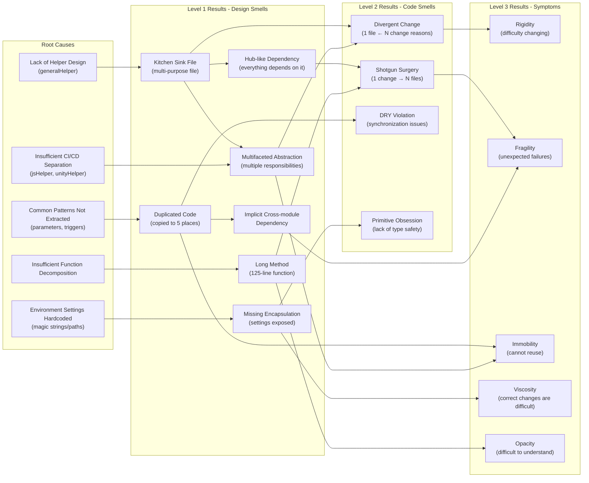

# Problem Analysis

Problem analysis document for the **pre-refactoring** Jenkins Pipeline codebase (Baseline: `74fc356`).

---

## 1. Analysis Overview

### 1.1. Background

> This document is the problem analysis document for the pre-refactoring Baseline codebase.
>
> During the VARLab Co-op period, 5 monolithic pipelines (37% duplication, untestable) with 14 months of accumulated Technical Debt were refactored into a 4-Layer Architecture.

#### 1.1.1. Project Context

- As an R&D project, rapid feature addition for value validation was the priority
- The Jenkins Global Trusted Shared Library feature itself was poorly documented and difficult to discover/apply
- This feature was discovered at month 13 of the project

#### 1.1.2. Refactoring Trigger

- At month 14, a project break term of approximately 3 weeks occurred, and with permission from the software architect, full refactoring began
- Problems felt intuitively at the time:
  - Modifying one thing caused problems elsewhere
  - Continuous situation where all places had to be considered when making modifications or adding features
  - Due to Jenkins characteristics, creating classes for Import/Export was not possible

#### 1.1.3. Refactoring Approach

- Started without completing problem identification or planning specific design pattern application
- Progressed naturally and emergently during the Tech Debt resolution process
- Design patterns naturally emerged by utilizing the Jenkins Global Trusted Shared Library feature

### 1.2. Analysis Purpose

- At the time of refactoring, it was done intuitively without clear criteria.
- To lead from experience-based understanding to systematic theory acquisition, classification and definition using Industry Convention criteria:

1. Learn how the problems I felt are classified and named in practice
2. Check if there are any missed problems
3. Understand the analysis methodology itself

### 1.3. Analysis Target

#### 1.3.1. Helper Files (Reusable Logic)

| File | Domain |
|------|----------|
| `generalHelper.groovy` | Pipeline utilities (Git, Bitbucket, Logging) |
| `jsHelper.groovy` | Web Pipeline utilities |
| `unityHelper.groovy` | Unity Pipeline utilities |

#### 1.3.2. Jenkinsfile (Pipeline Orchestration)

| File | Domain |
|------|----------|
| `DLXJenkins/Jenkinsfile` | Unity Project CI |
| `DLXJenkins/JenkinsfileDeployment` | Unity Project CD |
| `JsJenkins/Jenkinsfile` | Node.js Project CI |
| `JsJenkins/JenkinsfileDeployment` | Node.js Project CD |
| `PipelineForJenkins/Jenkinsfile` | Pipeline Library Self CI |

### 1.4. Analysis Methodology

Analyze problems **by level** using the Software Smells classification system.

**Reason for methodology selection**: To learn how intuitively felt problems ("modifying one thing causes problems elsewhere", "all places must be considered") are classified and named in the industry, the most widely known classification systems were utilized.

#### 1.4.1. Function Level

| Analysis Type | Source | Description |
|----------|------|------|
| Code Smells | Fowler/Beck (1999) | Method/function level problems |
| SRP Violation Analysis | Martin (2006, 2010) | Single Responsibility Principle violation - change reason analysis |

> **Note**: SRP is a SOLID principle for OOP languages, but it is a generally applicable principle regardless of programming paradigm and is suitable as a baseline analysis criterion. Cases where two or more functional domains or logic units are mixed within a function are investigated.

#### 1.4.2. Module Level (Module/File Level)

| Analysis Type | Source | Description |
|----------|------|------|
| Design Smells - Symptoms | Martin (2000) | 7 symptoms (Rigidity, Fragility, Immobility, etc.) |
| Design Smells - Principles | Suryanarayana et al. (2014) | OO principle violations (Abstraction, Encapsulation, Modularization) |
| SRP Violation Analysis | Martin (2006, 2010) | Single Responsibility Principle violation - change reason analysis |

> **Note**: Applying OO or OOP principles to Procedural code (Jenkins Pipeline) to understand which concepts are applicable/inapplicable.
> - **SRP Violation Analysis**: Sequence diagrams are created per stage for each pipeline to identify functional domains.
>   - **Jenkinsfile**: SRP violation analysis based on the number of domains requiring changes due to actual logic existing rather than orchestration
>   - **Helper files**: Verify through cohesion whether they are being used as designed (originally the helper file design itself contains multiple domains and is not suitable for SRP, but verify if it's being used according to the original design purpose)
>
> - **Design Smells - Principles**: Hierarchy Smells are not applicable as they presuppose inheritance structure, Abstraction/Modularization are interpreted at file/function level for application

#### 1.4.3. System Level

| Analysis Type | Source | Description |
|----------|------|------|
| Architecture Smells | Garcia et al. (2009), Sharma | System-level structural problems |
| DRY Violation Analysis | Hunt & Thomas (1999) | Duplication pattern identification |

> **Note**: DRY violation analysis identifies duplication patterns using a top-down comparison approach.
> - All pipelines (5) → CI vs CD → Between CIs / Between CDs → Within single pipeline → Between Helpers
> - Grouped for analysis based on ranges where identical logic can exist

---

## 2. Detailed Document Structure

```
problem-analysis/
├── README.md                           # This document
├── baseline-technical-snapshot.md      # Baseline technical snapshot (code statistics, file structure)
├── DRY-violation-analysis.md           # System-wide DRY violation analysis
│
├── 01-generalHelper/                   # Per-file analysis folder (example)
│   ├── 01-srp-violation-analysis.md    # SRP violation analysis
│   ├── 02-software-smells-analysis.md  # Code/Design/Architecture Smells
│   └── 03-design-smells-symptoms.md    # Martin's 7 Symptoms detail
├── 02-jsHelper/                        # (Same structure)
├── ...
├── 08-PipelineForJenkins-Jenkinsfile/  # (Same structure)
│
├── pipeline-sequence-diagrams/         # Pipeline sequence diagrams
└── reference/                          # Smells Taxonomy reference documents
```

---

## 3. Analysis Results Summary

### 3.1. System Level

#### 3.1.1. DRY Violation Analysis

Grouped for analysis based on ranges where identical logic can exist:
- All Jenkinsfiles (5)
- CI vs CD (same project type)
- Between CI pipelines
- Between CD pipelines
- Between Helper files

Details: [DRY-violation-analysis.md](DRY-violation-analysis.md)

#### 3.1.2. Architecture Smells Summary

| File | Hub-like Dependency | Implicit Cross-module Dependency |
|------|:-------------------:|:--------------------------------:|
| 01-generalHelper | High | High |
| 02-jsHelper | - | Medium |
| 03-unityHelper | - | Medium |
| 04-DLXJenkins-Jenkinsfile | - | High |
| 05-DLXJenkins-JenkinsfileDeployment | - | High |
| 06-JsJenkins-Jenkinsfile | - | High |
| 07-JsJenkins-JenkinsfileDeployment | - | High |
| 08-PipelineForJenkins-Jenkinsfile | - | High |

> Detailed analysis: `{folder}/software-smells-analysis.md` > `## 3. Architecture Smells (System Level)`

### 3.2. Module Level (Module/File Level)

#### 3.2.1. SRP Violation Analysis Summary

| File | Analysis Criteria | SRP Violation Summary |
|------|----------|--------------|
| 01-generalHelper | Cohesion (Design Intent) | Kitchen Sink - 19% cohesion (4/21 functions with 100% reuse) |
| 02-jsHelper | Cohesion (Design Intent) | CI/CD-specific functions mixed - 50% cohesion |
| 03-unityHelper | Cohesion (Design Intent) | CI-specific functions mixed - 50% cohesion |
| 04-DLXJenkins-Jenkinsfile | Logic Existence | Logic exists in 6 domains, Prepare WORKSPACE has 5 change reasons |
| 05-DLXJenkins-JenkinsfileDeployment | Logic Existence | Logic exists in 7 domains, deployment pattern repeated 2 times |
| 06-JsJenkins-Jenkinsfile | Logic Existence | Logic exists in 5 domains, Server/Client pattern 80 lines repeated |
| 07-JsJenkins-JenkinsfileDeployment | Logic Existence | Logic exists in 5 domains, Server/Client deployment 150 lines repeated |
| 08-PipelineForJenkins-Jenkinsfile | Logic Existence | Logic exists in 5 domains, Groovy/Jenkinsfile lint 60 lines repeated |

> Detailed analysis: `{folder}/srp-violation-analysis.md` > `## Conclusion`

#### 3.2.2. Design Smells - Principles Summary (Suryanarayana 2014)

| File | Abstraction | Encapsulation | Modularization |
|------|-------------|---------------|----------------|
| 01-generalHelper | Multifaceted, Missing | Missing | Insufficient, Hub-like |
| 02-jsHelper | Multifaceted, Missing | Missing | Insufficient |
| 03-unityHelper | Multifaceted | Missing | - |
| 04-DLXJenkins-Jenkinsfile | Multifaceted, Missing, Imperative | Missing | - |
| 05-DLXJenkins-JenkinsfileDeployment | Multifaceted, Missing, Imperative | Missing | - |
| 06-JsJenkins-Jenkinsfile | Multifaceted, Missing, Imperative | Missing | Insufficient |
| 07-JsJenkins-JenkinsfileDeployment | Multifaceted, Missing, Imperative | Missing | Insufficient |
| 08-PipelineForJenkins-Jenkinsfile | Multifaceted, Missing, Imperative | Missing | - |

> Detailed analysis: `{folder}/software-smells-analysis.md` > `## 2. Design Smells (Module/File Level)`

#### 3.2.3. Design Smells - Symptoms Summary (Martin 2000)

> **Note**: 7 symptoms inferred based on Code Smells, Design Principles, Architecture Smells analysis results + direct code review

| File | Rigidity | Fragility | Immobility | Viscosity | Complexity | Repetition | Opacity |
|------|:--------:|:---------:|:----------:|:---------:|:----------:|:----------:|:-------:|
| 01-generalHelper | High | Medium-High | High | Medium | Low | High | High |
| 02-jsHelper | Medium | Medium | Medium | Medium | Low | Medium | Medium |
| 03-unityHelper | High | Medium | Medium | High | Low | High | Medium |
| 04-DLXJenkins-Jenkinsfile | High | High | High | Medium | Low | High | High |
| 05-DLXJenkins-JenkinsfileDeployment | High | High | High | High | Low | High | Medium |
| 06-JsJenkins-Jenkinsfile | High | High | High | High | Low | High | High |
| 07-JsJenkins-JenkinsfileDeployment | High | High | High | High | Low | High | High |
| 08-PipelineForJenkins-Jenkinsfile | Medium | High | High | Medium | Low | High | Low |

> Detailed analysis: `{folder}/design-smells-symptoms.md`

### 3.3. Function Level

#### 3.3.1. SRP Violation Analysis Summary (Function Level)

> **Note**: Function-level SRP analysis performed only on Helper files. Jenkinsfiles are covered at module level (3.2.1) with stage-unit analysis.

| File | Functions with Multiple Change Reasons |
|------|-------------------|
| 01-generalHelper | `initializeEnvironment`(2), `cleanUpPRBranch`(2), `checkQualityGateStatus`(5) |
| 02-jsHelper | `installNpmInTestingDirs`(3) |
| 03-unityHelper | `getUnityExecutable`(2), `runUnityBatchMode`(7) |

> Detailed analysis: `{folder}/srp-violation-analysis.md` > `## 4. Function Level SRP Violation Analysis`

#### 3.3.2. Code Smells Summary (Fowler 1999)

| File | Change Preventers | Dispensables | Bloaters | Couplers |
|------|:-----------------:|:------------:|:--------:|:--------:|
| 01-generalHelper | Divergent Change(High), Shotgun Surgery(High) | - | - | - |
| 02-jsHelper | Divergent Change(Medium), Shotgun Surgery(Medium) | Duplicated Code(Medium) | Long Method(Low), Primitive Obsession(Low) | - |
| 03-unityHelper | Divergent Change(Medium), Shotgun Surgery(High) | - | Long Method(High), Switch Statements(Medium) | - |
| 04-DLXJenkins-Jenkinsfile | Divergent Change(High), Shotgun Surgery(Medium) | Duplicated Code(Medium) | Primitive Obsession(Low) | - |
| 05-DLXJenkins-JenkinsfileDeployment | Divergent Change(High), Shotgun Surgery(Medium) | Duplicated Code(High) | Primitive Obsession(Low) | - |
| 06-JsJenkins-Jenkinsfile | Divergent Change(High), Shotgun Surgery(High) | Duplicated Code(High), Dead Code(Low) | Long Method(High), Primitive Obsession(Low) | Feature Envy(High) |
| 07-JsJenkins-JenkinsfileDeployment | Divergent Change(High), Shotgun Surgery(High) | Duplicated Code(High) | Long Method(High), Primitive Obsession(Low) | - |
| 08-PipelineForJenkins-Jenkinsfile | Divergent Change(High), Shotgun Surgery(Medium) | Duplicated Code(High) | Primitive Obsession(Low) | - |

> Detailed analysis: `{folder}/software-smells-analysis.md` > `## 1. Code Smells (Method/Function Level)`

---

## 4. Comprehensive Analysis Results

### 4.1. Core Problem Patterns

Core problems appearing commonly across all 8 files:

| Pattern | Impact Scope | Occurrence Frequency | Severity |
|------|----------|----------|:------:|
| **Divergent Change** | All files | 8/8 | High |
| **Shotgun Surgery** | All files | 8/8 | High |
| **Duplicated Code** | 5 Jenkinsfiles + jsHelper | 6/8 | High |
| **Implicit Cross-module Dependency** | All files | 8/8 | High |
| **Missing Encapsulation** | All files | 8/8 | Medium |
| **Multifaceted Abstraction** | All files | 8/8 | Medium |

### 4.2. Priority by Severity

> **51 issues** derived from all analysis documents (20 High, 23 Medium, 8 Low)

#### High (Immediate Resolution Required) - 20 items

| # | Issue | Type | File | Impact |
|---|------|------|------|------|
| 1 | Hub-like Dependency | Architecture | generalHelper | 5 pipelines depend on single file |
| 2 | DRY Violation - parameters block | DRY | 5 Jenkinsfiles | Parameter changes require 5 modifications |
| 3 | DRY Violation - triggers.GenericTrigger | DRY | 5 Jenkinsfiles | Trigger changes require 5 modifications |
| 4 | DRY Violation - post block | DRY | 5 Jenkinsfiles | Build status handling changes require 5 modifications |
| 5 | DRY Violation - Prepare WORKSPACE logic | DRY | 3 CI Jenkinsfiles | Initialization logic changes require 3 modifications |
| 6 | Server/Client deployment duplication (150 lines) | Code - Duplicated | JS CD | Deployment logic changes require 2 modifications |
| 7 | Server/Client report duplication (80 lines) | Code - Duplicated | JS CI | Python script argument changes require 2 modifications |
| 8 | Kitchen Sink file (19% cohesion) | Design - Modularization | generalHelper | Unclear change reasons, 21 functions/8 domains |
| 9 | Divergent Change (8 domains) | Code - Change Preventers | generalHelper | 8 change reasons mixed |
| 10 | Shotgun Surgery (7 triggers) | Code - Change Preventers | generalHelper | Path/command changes require 10+ modifications |
| 11 | Shotgun Surgery (7 places when adding new Stage) | Code - Change Preventers | unityHelper | Stage addition requires 7 simultaneous modifications |
| 12 | Implicit Cross-module Dependency | Architecture | All files | Runtime error when external system changes |
| 13 | Long Method (126 lines) | Code - Bloaters | unityHelper `runUnityBatchMode` | 7 responsibilities mixed |
| 14 | Long Method (112 lines) | Code - Bloaters | JS CI `Unit Testing` | 7 responsibilities mixed |
| 15 | Long Method (75 lines × 2) | Code - Bloaters | JS CD `Server/Client Deploy` | 5 responsibilities each mixed |
| 16 | Feature Envy | Code - Couplers | JS CI `Unit Testing` | Excessive dependency on external module |
| 17 | Insufficient Modularization | Design - Modularization | JS CI, JS CD | Stage is too large and complex |
| 18 | Missing Encapsulation (Stage conditions in 7 places) | Design - Encapsulation | unityHelper | Stage-specific conditional branching scattered |
| 19 | Missing Encapsulation (deployment patterns) | Design - Encapsulation | DLX CD, JS CD | SSH/SCP, Docker patterns repeated |
| 20 | Multifaceted Abstraction | Design - Abstraction | All files | Multiple domains mixed in one file |

#### Medium (Planned Resolution) - 23 items

| # | Issue | Type | File | Impact |
|---|------|------|------|------|
| 21 | CI/CD-specific functions mixed (50% cohesion) | SRP Violation | jsHelper, unityHelper | Unnecessary dependencies |
| 22 | DRY Violation - environment block | DRY | 5 Jenkinsfiles | Environment variable pattern changes require 5 modifications |
| 23 | DRY Violation - buildResults/stageResults | DRY | 5 Jenkinsfiles | Status value changes require 5 modifications |
| 24 | DRY Violation - Static Analysis pattern | DRY | JS CI, JS CD, Jenkins CI | SonarQube setting changes require 3 modifications |
| 25 | DRY Violation - logMessage() copy | DRY | generalHelper, jsHelper | Logging changes require 2 modifications |
| 26 | Shotgun Surgery (Unity Stage name 5 places) | Code - Change Preventers | DLX CI | Stage name changes require 5 modifications |
| 27 | Shotgun Surgery (6 places when adding report type) | Code - Change Preventers | JS CI | New report type addition requires 6 modifications |
| 28 | Shotgun Surgery (4 places when adding deployment target) | Code - Change Preventers | JS CD | New deployment target addition requires 4 modifications |
| 29 | Shotgun Surgery (4 places when adding lint type) | Code - Change Preventers | Jenkins CI | New lint type addition requires 4 modifications |
| 30 | Duplicated Code (stageName/errorMsg 5 times) | Code - Dispensables | DLX CI | Error message format changes require 5 modifications |
| 31 | Duplicated Code (deployment pattern 2 times) | Code - Dispensables | DLX CD | SSH option changes require 2 modifications |
| 32 | Duplicated Code (lint pattern 60 lines) | Code - Dispensables | Jenkins CI | Lint option changes require 2 modifications |
| 33 | Switch Statements (same branching 7 places) | Code - Bloaters | unityHelper | Stage-specific conditional branching repeated |
| 34 | Missing Abstraction (magic strings/paths) | Design - Abstraction | All files | Environment changes require multiple modifications |
| 35 | Imperative Abstraction | Design - Abstraction | 5 Jenkinsfiles | Procedural script structure |
| 36 | Hub-like Modularization | Design - Modularization | generalHelper | Many places depend on it |
| 37 | Viscosity (copying is easier) | Design Symptom | generalHelper, unityHelper | Hacking is easier than correct changes |
| 38 | Fragility (unexpected impact) | Design Symptom | generalHelper, DLX CI/CD | No domain boundaries |
| 39 | Opacity (complex nested conditions) | Design Symptom | unityHelper, DLX CI | 3-4 level nesting, difficult to trace |
| 40 | Opacity (undefined variable usage) | Design Symptom | DLX CI | FOLDER_NAME, TICKET_NUMBER definition location unclear |
| 41 | Deeply Nested Code (3 levels) | Implementation | JS CI | Server/Client report processing |
| 42 | Magic String (SonarQube URL) | Implementation | JS CI, JS CD, Jenkins CI | Hardcoded URL |
| 43 | Magic String (Docker image) | Implementation | Jenkins CI | Hardcoded image name |

#### Low (Gradual Improvement) - 8 items

| # | Issue | Type | File | Impact |
|---|------|------|------|------|
| 44 | DRY Violation - mainBranches constant | DRY | DLX CD, JS CD | Branch policy changes require 2 modifications |
| 45 | Primitive Obsession | Code - Bloaters | All Jenkinsfiles | Lack of type safety |
| 46 | Dead Code (2 functions) | Code - Dispensables | generalHelper | Unused code exists |
| 47 | Dead Code (commented code) | Code - Dispensables | JS CI | JENKINS_API_KEY comment |
| 48 | Needless Complexity (Low) | Design Symptom | All files | No excessive design beyond Dead Code |
| 49 | Opacity (counter-intuitive variable name) | Design Symptom | generalHelper | 0=exists in projectExists |
| 50 | Opacity (function name mismatch) | Design Symptom | generalHelper | parseJson, isBranchUpToDateWithMain |
| 51 | Opacity (complex Map/JSON structure) | Design Symptom | unityHelper | logConfig, loadPathsToExclude |

### 4.3. Causal Relationships Between Issues



### 4.4. Refactoring Direction Implications

Refactoring directions derived from analysis results:

| # | Problem Group | Refactoring Direction | Expected Effect |
|---|----------|--------------|----------|
| 1 | Hub-like Dependency + Kitchen Sink | **Helper File Separation**: Separate Helpers by functional domain | Reduce Divergent Change, Shotgun Surgery |
| 2 | DRY Violation (parameters/triggers) | **Utilize Shared Library**: Extract common blocks to Shared Library | 5 places → 1 place change |
| 3 | Server/Client duplication | **Abstraction**: Extract deployment pattern as function | Remove 150 lines of duplication |
| 4 | Implicit Cross-module Dependency | **Explicit Dependencies**: Constantize environment variables/script paths | Reduce Fragility |
| 5 | CI/CD-specific functions mixed | **Cohesion-based Separation**: Separate into CI-only / CD-only / Common | Remove unnecessary dependencies |

> **Note**: This direction was naturally derived from analysis results, and actual refactoring was performed in `leg-4-full-pipeline-refactoring-and-stage-modularization`.

---

## 5. Per-File Analysis Documents

| # | Analysis Target | SRP Analysis | Software Smells | Design Symptoms |
|---|----------|----------|-----------------|-----------------|
| 01 | generalHelper.groovy | [01-srp-violation-analysis.md](01-generalHelper/01-srp-violation-analysis.md) | [02-software-smells-analysis.md](01-generalHelper/02-software-smells-analysis.md) | [03-design-smells-symptoms.md](01-generalHelper/03-design-smells-symptoms.md) |
| 02 | jsHelper.groovy | [01-srp-violation-analysis.md](02-jsHelper/01-srp-violation-analysis.md) | [02-software-smells-analysis.md](02-jsHelper/02-software-smells-analysis.md) | [03-design-smells-symptoms.md](02-jsHelper/03-design-smells-symptoms.md) |
| 03 | unityHelper.groovy | [01-srp-violation-analysis.md](03-unityHelper/01-srp-violation-analysis.md) | [02-software-smells-analysis.md](03-unityHelper/02-software-smells-analysis.md) | [03-design-smells-symptoms.md](03-unityHelper/03-design-smells-symptoms.md) |
| 04 | DLXJenkins/Jenkinsfile | [01-srp-violation-analysis.md](04-DLXJenkins-Jenkinsfile/01-srp-violation-analysis.md) | [02-software-smells-analysis.md](04-DLXJenkins-Jenkinsfile/02-software-smells-analysis.md) | [03-design-smells-symptoms.md](04-DLXJenkins-Jenkinsfile/03-design-smells-symptoms.md) |
| 05 | DLXJenkins/JenkinsfileDeployment | [01-srp-violation-analysis.md](05-DLXJenkins-JenkinsfileDeployment/01-srp-violation-analysis.md) | [02-software-smells-analysis.md](05-DLXJenkins-JenkinsfileDeployment/02-software-smells-analysis.md) | [03-design-smells-symptoms.md](05-DLXJenkins-JenkinsfileDeployment/03-design-smells-symptoms.md) |
| 06 | JsJenkins/Jenkinsfile | [01-srp-violation-analysis.md](06-JsJenkins-Jenkinsfile/01-srp-violation-analysis.md) | [02-software-smells-analysis.md](06-JsJenkins-Jenkinsfile/02-software-smells-analysis.md) | [03-design-smells-symptoms.md](06-JsJenkins-Jenkinsfile/03-design-smells-symptoms.md) |
| 07 | JsJenkins/JenkinsfileDeployment | [01-srp-violation-analysis.md](07-JsJenkins-JenkinsfileDeployment/01-srp-violation-analysis.md) | [02-software-smells-analysis.md](07-JsJenkins-JenkinsfileDeployment/02-software-smells-analysis.md) | [03-design-smells-symptoms.md](07-JsJenkins-JenkinsfileDeployment/03-design-smells-symptoms.md) |
| 08 | PipelineForJenkins/Jenkinsfile | [01-srp-violation-analysis.md](08-PipelineForJenkins-Jenkinsfile/01-srp-violation-analysis.md) | [02-software-smells-analysis.md](08-PipelineForJenkins-Jenkinsfile/02-software-smells-analysis.md) | [03-design-smells-symptoms.md](08-PipelineForJenkins-Jenkinsfile/03-design-smells-symptoms.md) |

---

## 6. Related Documents

| Document | Description | Analysis Criteria |
|------|------|----------|
| [baseline-technical-snapshot.md](baseline-technical-snapshot.md) | Code statistics, file structure, technical state | Commit `54479b2` |

> **Note**: `baseline-technical-snapshot.md` was analyzed based on commit `54479b2`, which differs from the baseline of other documents in this folder (commit `74fc356`). The analysis direction is also different, and that document is a technical snapshot focused on code statistics and file structure.

---

## 7. References

- [Software Smells & Anti-Patterns Taxonomy](reference/README.md)
- [Pipeline Sequence Diagrams](pipeline-sequence-diagrams/)
