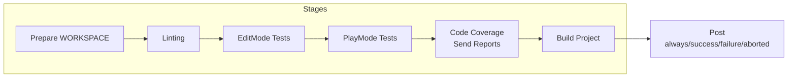
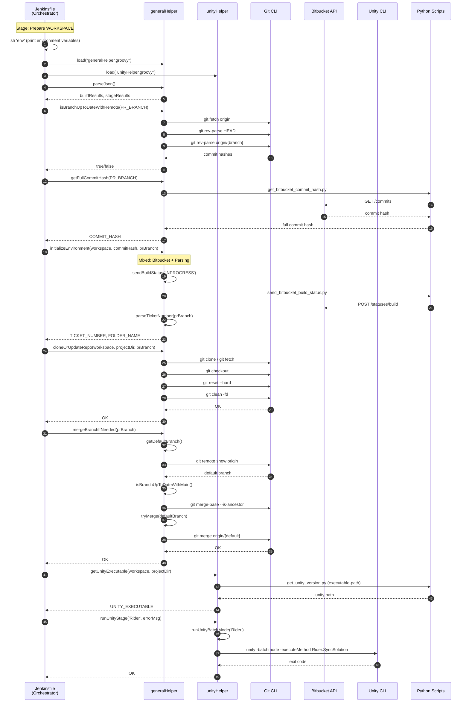
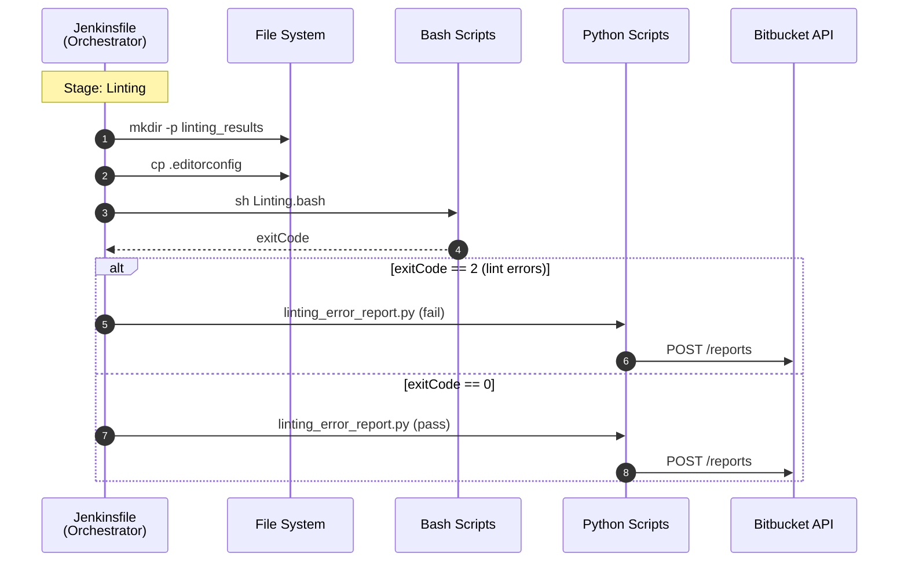
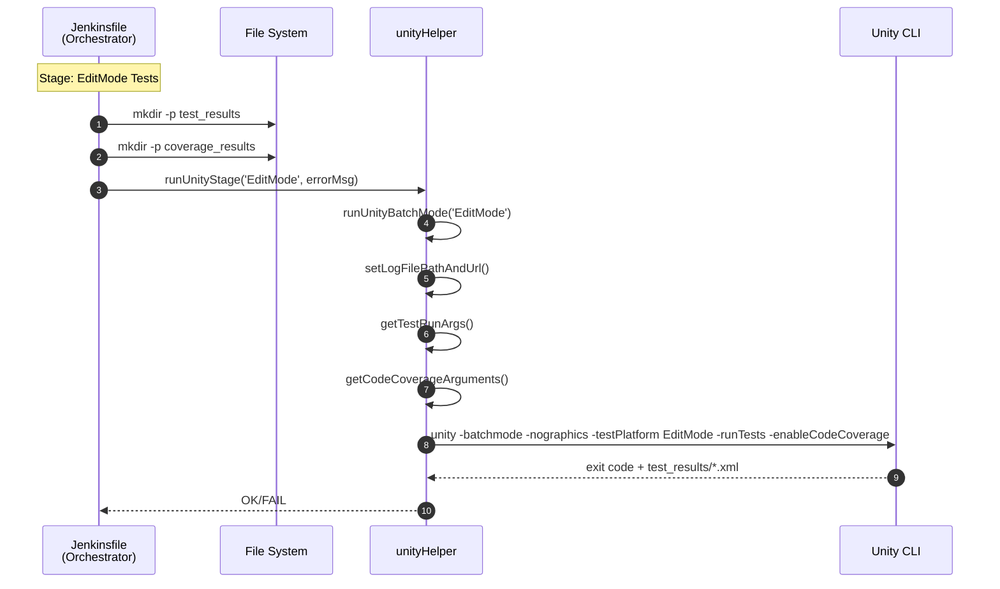
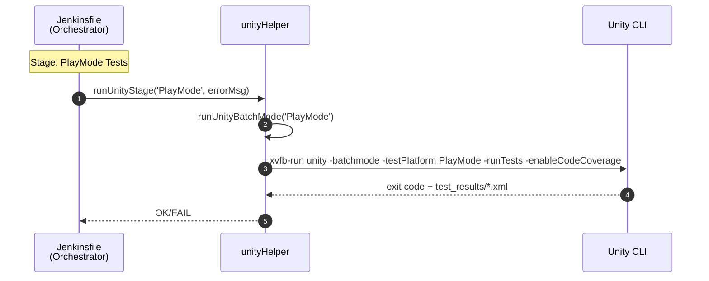
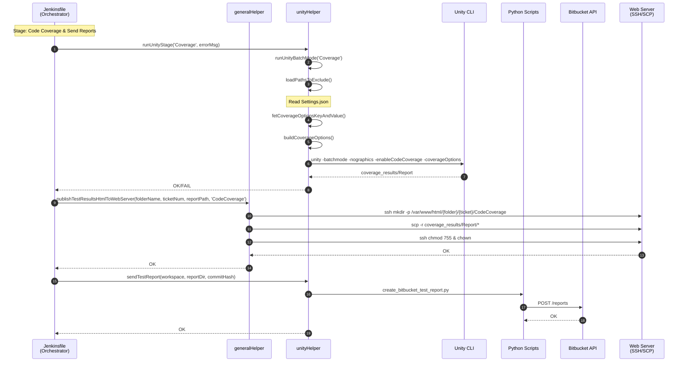
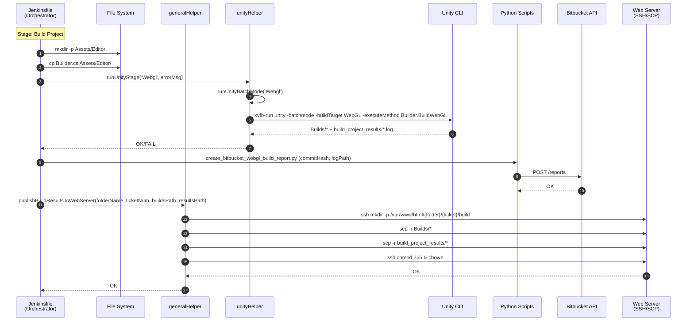
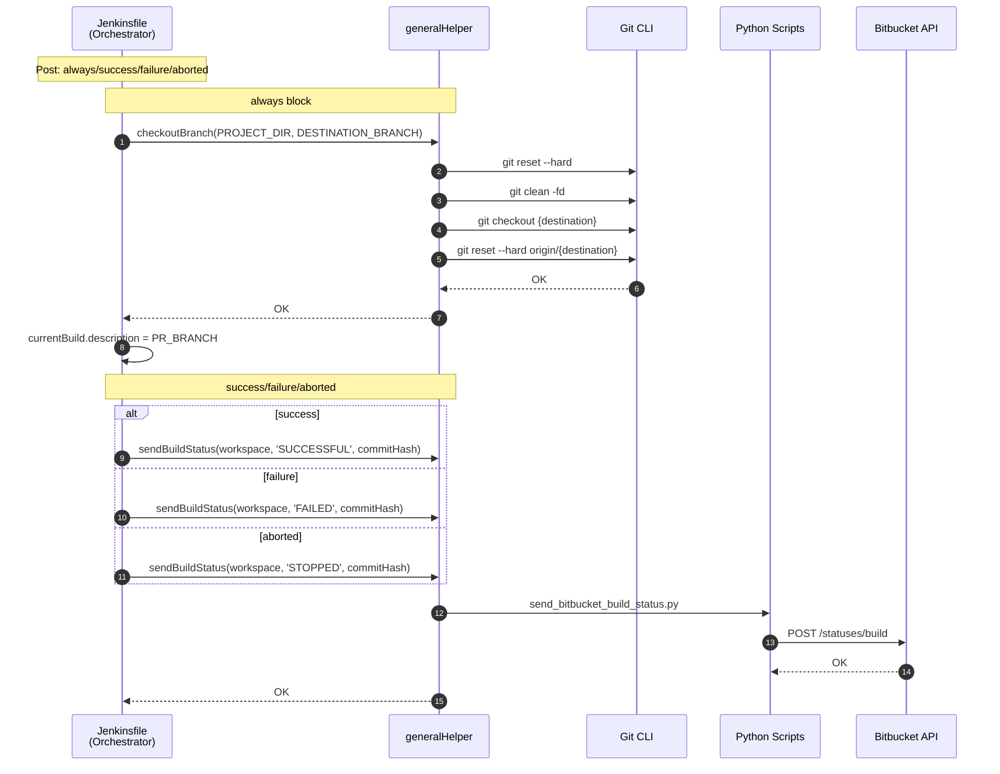

# DLX CI Pipeline Sequence Diagrams

> **Analysis Target**: `DLXJenkins/Jenkinsfile` (DLX Unity CI Pipeline)
>
> **Related**: [Domain Mapping Summary](domain-mapping.md)

---

## Why Sequence Diagrams?

> **Q: Why use Sequence Diagrams for Jenkins Pipeline analysis?**
>
> A: Jenkins Pipeline is **procedural code**. Unlike OOP where classes naturally define domain boundaries, procedural code mixes multiple domains within sequential execution flow. Sequence Diagrams visualize the **call flow** between components, making it easier to identify which domains are involved at each stage.

> **Q: What is the goal of this analysis?**
>
> A: To **identify domains by function**. By tracing "who calls what", I can classify each function into its domain (Git, Bitbucket, Unity, etc.) and detect where domain boundaries are violated (e.g., one function mixing multiple domains).

---

## Domain Summary

### Helper Domains Used

| Helper | Domain | Functions Called | Used Stage |
|--------|--------|------------------|------------|
| generalHelper | Git | `cloneOrUpdateRepo`, `mergeBranchIfNeeded`, `isBranchUpToDateWithRemote`, `checkoutBranch` | Prepare WORKSPACE, Post |
| generalHelper | Bitbucket | `getFullCommitHash`, `sendBuildStatus` | Prepare WORKSPACE, Post |
| generalHelper | Web Server | `publishTestResultsHtmlToWebServer`, `publishBuildResultsToWebServer` | Code Coverage, Build Project |
| generalHelper | Parsing | `parseJson` | Prepare WORKSPACE |
| generalHelper | Mixed (Bitbucket + Parsing) | `initializeEnvironment` | Prepare WORKSPACE |
| unityHelper | Unity CLI | `runUnityStage` | Prepare WORKSPACE, EditMode, PlayMode, Code Coverage, Build Project |
| unityHelper | Unity Installation | `getUnityExecutable` | Prepare WORKSPACE |
| unityHelper | Bitbucket | `sendTestReport` | Code Coverage |

### Jenkinsfile Direct Calls

| Domain | Direct Call | Used Stage |
|--------|-------------|------------|
| Jenkins Pipeline DSL | `pipeline`, `stages`, `post`, `script`, `dir`, `credentials` | All |
| File System | `mkdir -p`, `cp` | Linting, EditMode, Build Project |
| Linting (Bash) | `sh Linting.bash` | Linting |
| Bitbucket (Python) | `linting_error_report.py`, `create_bitbucket_webgl_build_report.py` | Linting, Build Project |

### Domain Mapping by Stage

| Stage | Git | Bitbucket | Unity CLI | Unity Install | Web Server | Parsing | File System | Linting |
|-------|:---:|:---------:|:---------:|:-------------:|:----------:|:-------:|:-----------:|:-------:|
| Prepare WORKSPACE | ✓ | ✓ | ✓ | ✓ | | ✓ | | |
| Linting | | ✓ | | | | | ✓ | ✓ |
| EditMode Tests | | | ✓ | | | | ✓ | |
| PlayMode Tests | | | ✓ | | | | | |
| Code Coverage | | ✓ | ✓ | | ✓ | | | |
| Build Project | | ✓ | ✓ | | ✓ | | ✓ | |
| Post | ✓ | ✓ | | | | | | |

---

## Overall Pipeline Overview

---

## Stage 1: Prepare WORKSPACE

---

## Stage 2: Linting

---

## Stage 3: EditMode Tests

---

## Stage 4: PlayMode Tests

---

## Stage 5: Code Coverage & Send Reports

---

## Stage 6: Build Project

---

## Post: always/success/failure/aborted

---

## Observations

### Delegation Pattern

| Pattern | Example | Count |
|---------|---------|:-----:|
| Jenkinsfile → generalHelper → External | `sendBuildStatus` → Python → Bitbucket API | 5 |
| Jenkinsfile → unityHelper → External | `runUnityStage` → Unity CLI | 5 |
| Jenkinsfile → Python direct | `linting_error_report.py` | 2 |
| Jenkinsfile → Bash direct | `Linting.bash` | 1 |

### Inconsistencies

| Issue | Description |
|-------|-------------|
| Direct Python calls | `linting_error_report.py`, `create_bitbucket_webgl_build_report.py` bypass Helper |
| Mixed domain function | `initializeEnvironment` combines Bitbucket + Parsing (SRP violation) |
| Inconsistent Bitbucket reporting | `sendTestReport` in unityHelper, but linting/build reports called directly |

---

[← Domain Mapping Summary](domain-mapping.md)