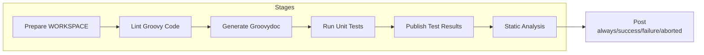
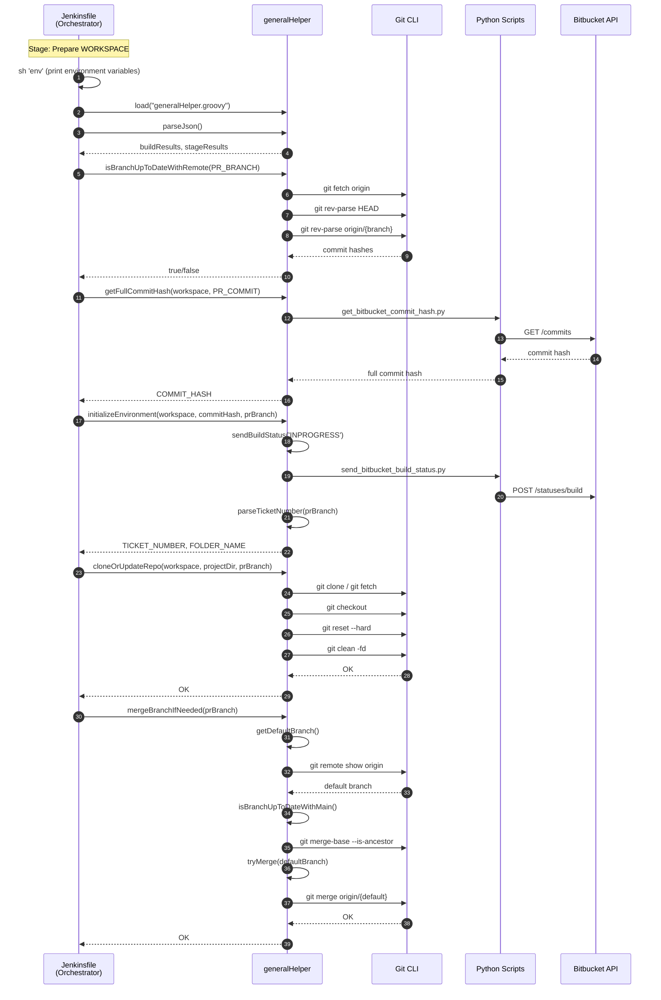
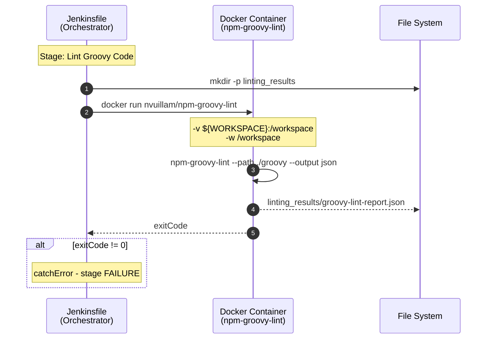
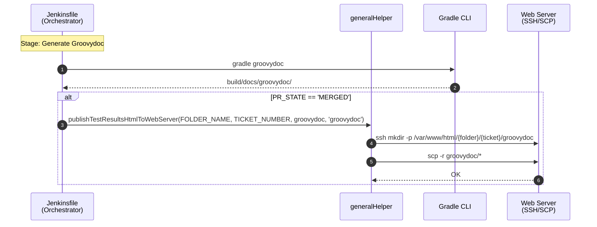
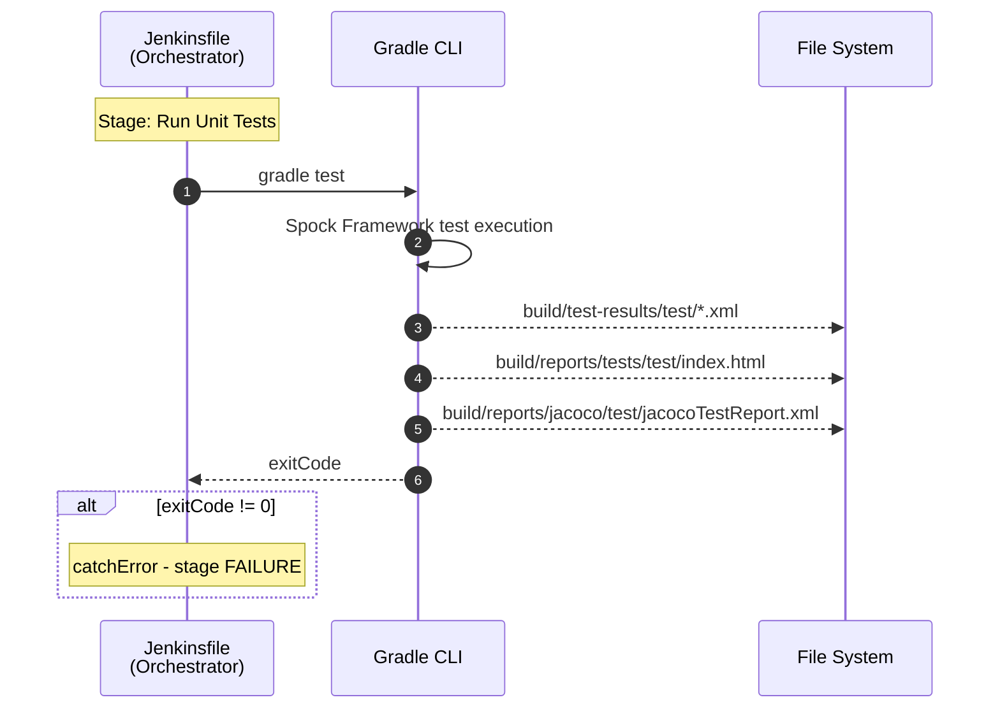
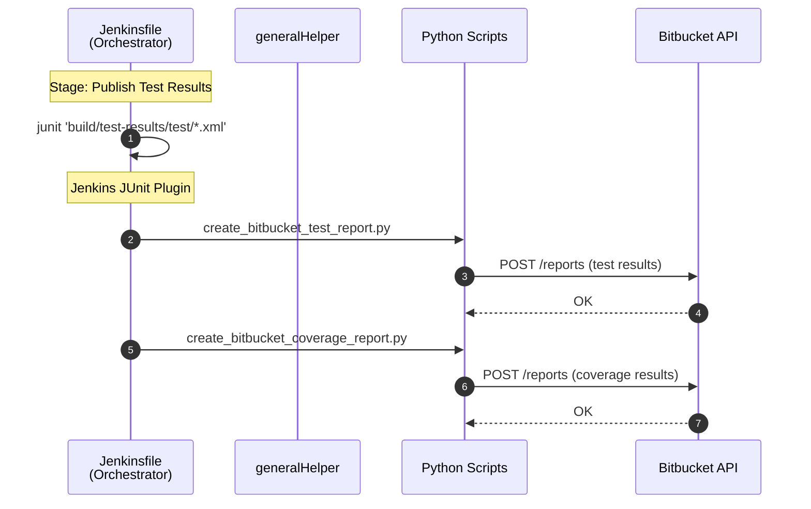
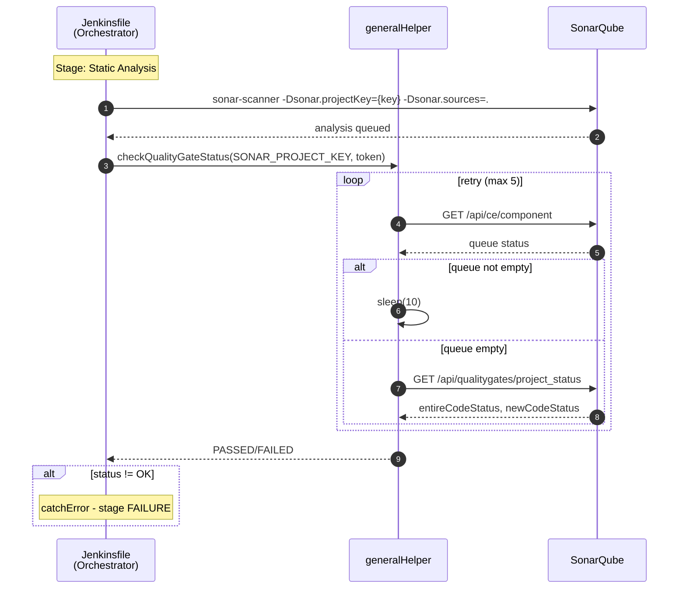
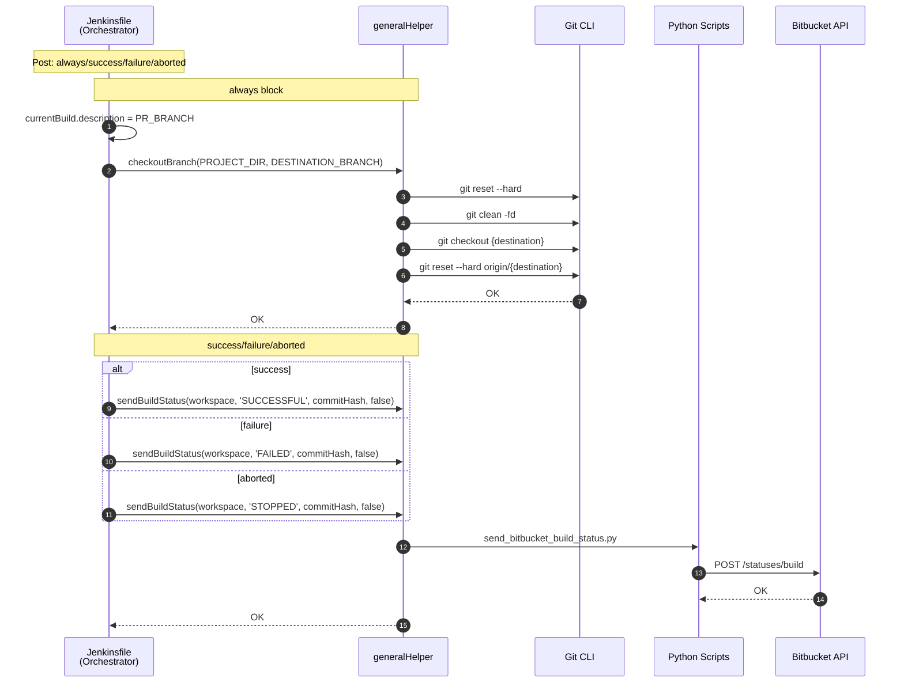

# Jenkins CI Pipeline Sequence Diagrams

> **Analysis Target**: `PipelineForJenkins/Jenkinsfile` (Jenkins Groovy CI Pipeline)
>
> **Trigger**: Runs when PR is `OPEN` or `MERGED` (differs from other pipelines)

---

## Domain Summary by Function

| Domain | Function | Used Stage | Helper Location |
|--------|----------|------------|-----------------|
| **Git Management** | clone, fetch, checkout, reset, clean, merge | Prepare WORKSPACE, Post | generalHelper |
| **Bitbucket API** | send build status, get commit hash | Prepare WORKSPACE, Post | generalHelper + Python |
| **Docker** | run npm-groovy-lint container | Lint Groovy Code | Jenkinsfile direct |
| **Gradle** | run tests (gradle test) | Run Unit Tests | Jenkinsfile direct |
| **Groovydoc** | generate API documentation (gradle groovydoc) | Generate Groovydoc | Jenkinsfile direct |
| **Web Server (SSH/SCP)** | deploy Groovydoc HTML (MERGED only) | Generate Groovydoc | generalHelper |
| **SonarQube** | static code analysis, Quality Gate check | Static Analysis | generalHelper + sonar-scanner |
| **Environment Setup** | parseJson, parseTicketNumber | Prepare WORKSPACE | generalHelper |

### Domain Mapping by Stage

| Stage | Git | Bitbucket | Docker | Gradle | Groovydoc | Web Server | SonarQube | Environment Setup |
|-------|:---:|:---------:|:------:|:------:|:---------:|:----------:|:---------:|:-----------------:|
| Prepare WORKSPACE | ✓ | ✓ | | | | | | ✓ |
| Lint Groovy Code | | | ✓ | | | | | |
| Generate Groovydoc | | | | ✓ | ✓ | ✓* | | |
| Run Unit Tests | | | | ✓ | | | | |
| Publish Test Results | | ✓ | | | | | | |
| Static Analysis | | | | | | | ✓ | |
| Post | ✓ | ✓ | | | | | | |

> *Web Server: Groovydoc deployed only when MERGED

### CI Pipeline Comparison (DLX CI vs JS CI vs Jenkins CI)

| Item | DLX CI | JS CI | Jenkins CI |
|------|--------|-------|------------|
| Tool | Unity CLI | Node.js (npm) | Gradle + Docker |
| Helper | unityHelper | jsHelper | (none - direct calls) |
| Trigger | OPEN | OPEN | **OPEN + MERGED** |
| Install Dependencies | No | Yes (npm install) | No |
| Linting | Bash Script (C#) | jsHelper (ESLint) | Docker (npm-groovy-lint) |
| Test Type | EditMode/PlayMode | Unit Testing (Jest) | Gradle Test (Spock) |
| Code Coverage | Unity Code Coverage | lcov-report | JaCoCo |
| Static Analysis | No | Yes (SonarQube) | Yes (SonarQube) |
| Build Project | Yes (WebGL) | No | No |
| Documentation | No | No | Yes (Groovydoc) |

---

## Overall Pipeline Overview

---

## Stage 1: Prepare WORKSPACE

---

## Stage 2: Lint Groovy Code

---

## Stage 3: Generate Groovydoc

---

## Stage 4: Run Unit Tests

---

## Stage 5: Publish Test Results

---

## Stage 6: Static Analysis

---

## Post: always/success/failure/aborted

