# JS CD Pipeline Sequence Diagrams

> **Analysis Target**: `JsJenkins/JenkinsfileDeployment` (JavaScript CD Pipeline)
>
> **Trigger**: Runs when PR is `MERGED`

---

## Domain Summary by Function

| Domain | Function | Used Stage | Helper Location |
|--------|----------|------------|-----------------|
| **Git Management** | clone, checkout, reset, pull | Prepare WORKSPACE, Post | generalHelper + Jenkinsfile direct |
| **Bitbucket API** | send build status, get commit hash | Prepare WORKSPACE, Post | generalHelper + Python |
| **Node.js (npm)** | version check, npm install, linting, tests, version compare | Install Dependencies, Linting, Unit Testing, Server/Client Deploy | jsHelper |
| **SonarQube** | static code analysis, Quality Gate check | Static Analysis | generalHelper + sonar-scanner |
| **Docker** | build container, push image, cleanup | Check Condition, Server/Client Deploy | Jenkinsfile direct |
| **Azure** | ACR login, update Container App, get version | Check Condition, Server/Client Deploy | Jenkinsfile direct (az CLI) |
| **Environment Setup** | parseJson, findTestingDirs, mainBranches check | Delete Merged Branch, Prepare WORKSPACE | generalHelper + jsHelper |
| **PR Cleanup** | find & rm -rf PR directories | Delete Merged Branch | Jenkinsfile direct |

### Domain Mapping by Stage

| Stage | Git | Bitbucket | Node.js | SonarQube | Docker | Azure | Environment Setup | PR Cleanup |
|-------|:---:|:---------:|:-------:|:---------:|:------:|:-----:|:-----------------:|:----------:|
| Delete Merged Branch | | | | | | | ✓ | ✓ |
| Prepare WORKSPACE | ✓ | ✓ | | | | | ✓ | |
| Install Dependencies | | | ✓ | | | | | |
| Linting | | | ✓ | | | | | |
| Unit Testing | | | ✓ | | | | | |
| Static Analysis | | | | ✓ | | | | |
| Check Build Condition | | | | | ✓ | ✓ | | |
| Server Build & Deploy | | | ✓ | | ✓ | ✓ | | |
| Client Build & Deploy | | | ✓ | | ✓ | ✓ | | |
| Post | ✓ | ✓ | | | | | | |

### JS CI vs JS CD Comparison

| Item | JS CI | JS CD |
|------|-------|-------|
| Trigger | `OPEN` (PR created) | `MERGED` (PR merged) |
| `CI_PIPELINE` | `true` | `false` |
| Coverage Report Send | Yes | No |
| Web Server Deploy | Yes (lcov-report) | No |
| Docker Build | No | Yes |
| Azure Deploy | No | Yes (Container App) |
| Delete Merged Branch | No | Yes |

### DLX CD vs JS CD Comparison

| Item | DLX CD | JS CD |
|------|--------|-------|
| Deploy Target | LTI Web Server, eConestoga | Azure Container App |
| Build Tool | Unity (WebGL) | Docker |
| Deploy Method | SSH/SCP | Docker push + az containerapp |
| Version Management | None | package.json version compare |
| Conditional Deploy | DLX_PROJECT_LIST | Version compare result |

---

## Overall Pipeline Overview

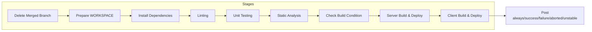

---

## Stage 1: Delete Merged Branch

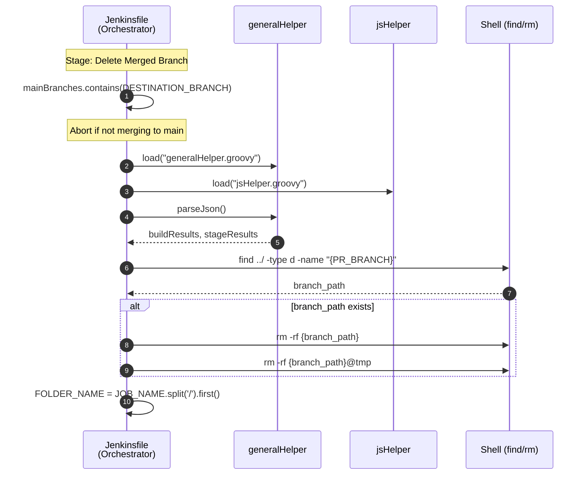

---

## Stage 2: Prepare WORKSPACE

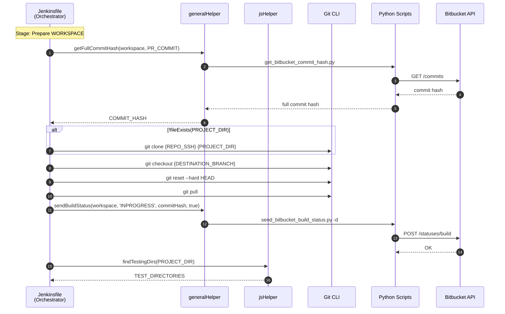

---

## Stage 3: Install Dependencies

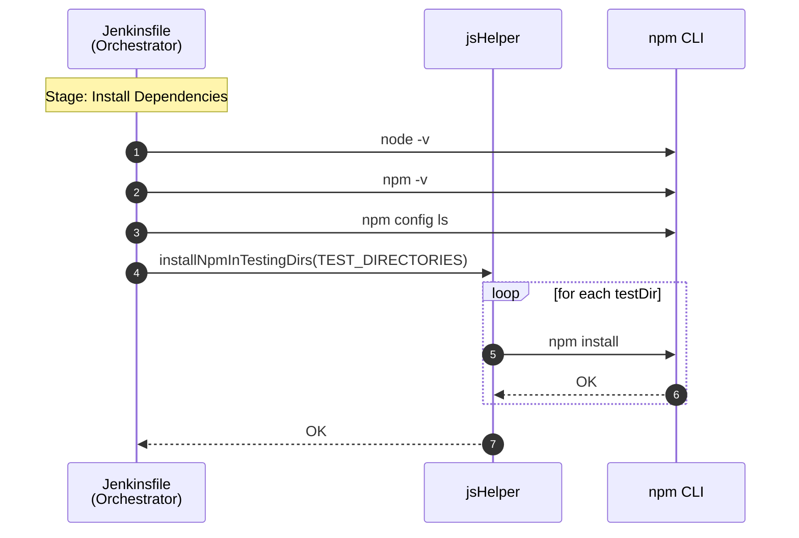

---

## Stage 4: Linting

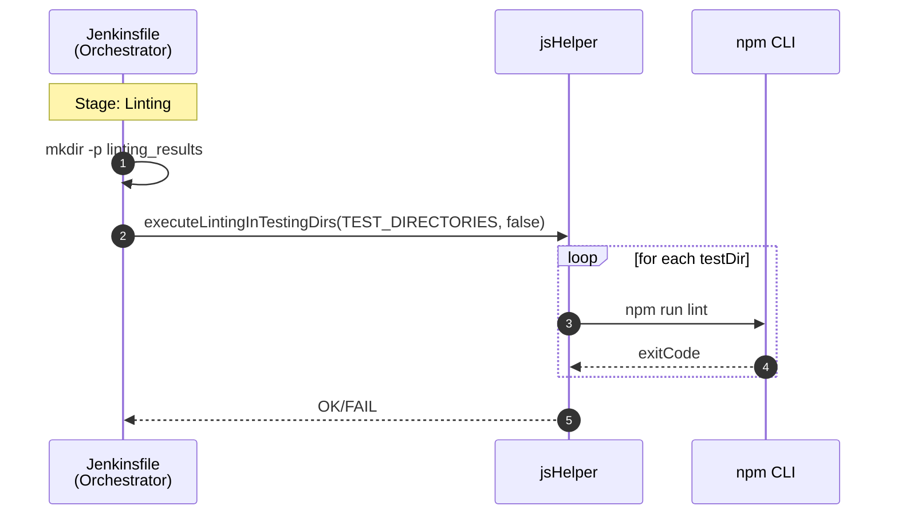

---

## Stage 5: Unit Testing

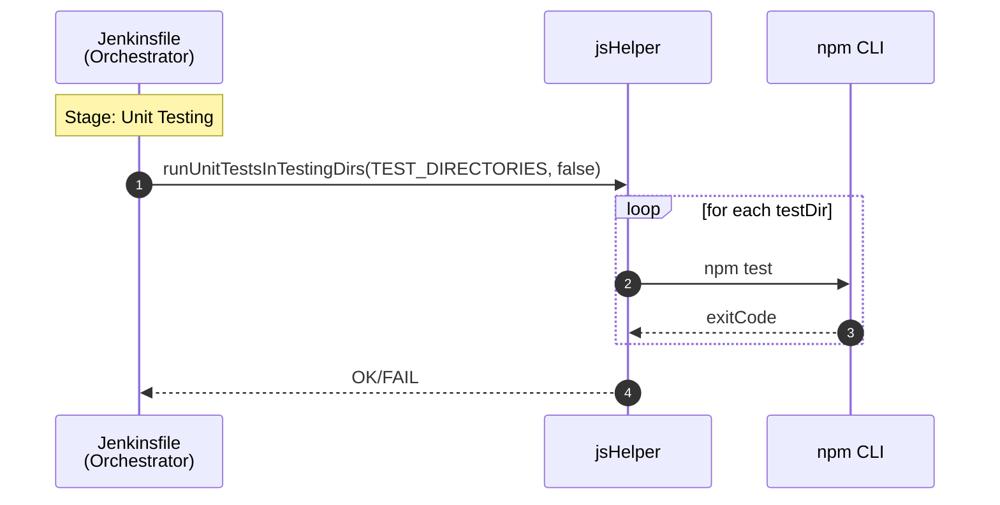

> **Note**: In JS CD, Coverage Report is not sent to Bitbucket (differs from CI)

---

## Stage 6: Static Analysis

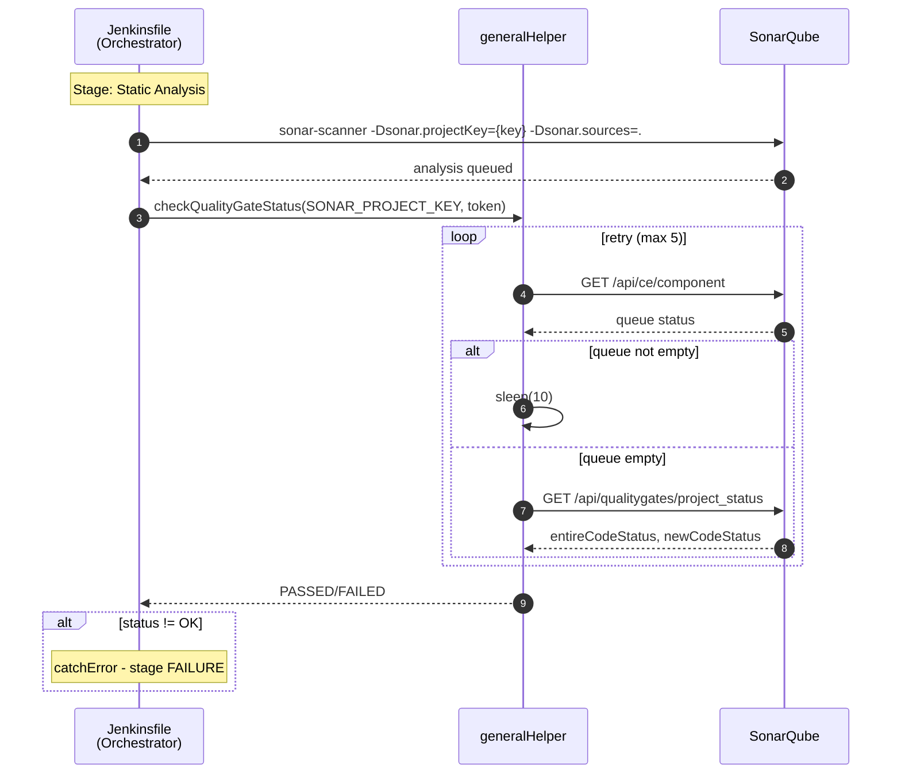

---

## Stage 7: Check Build and Deploy Condition

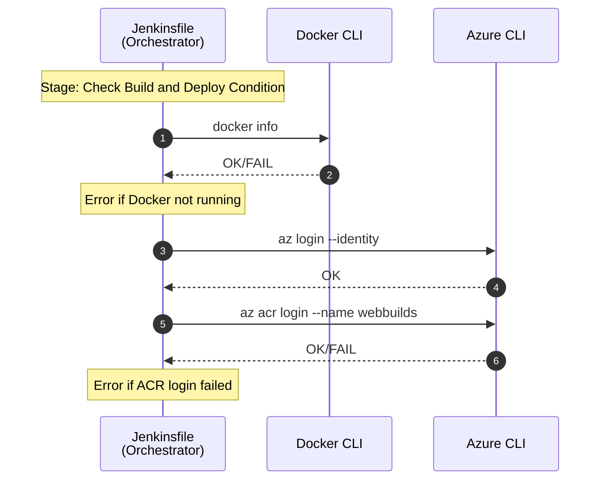

---

## Stage 8: Server Build and Deploy

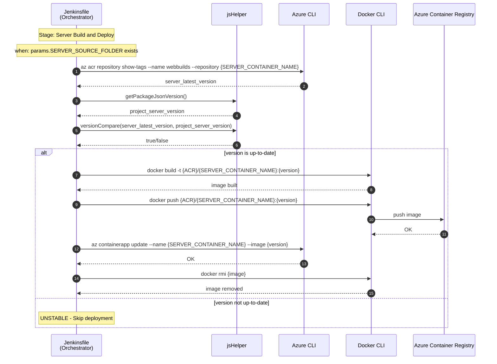

---

## Stage 9: Client Build and Deploy

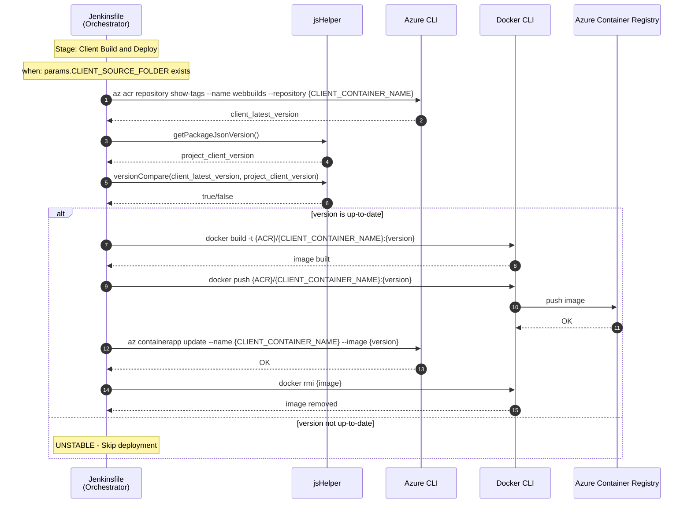

---

## Post: always/success/failure/aborted/unstable

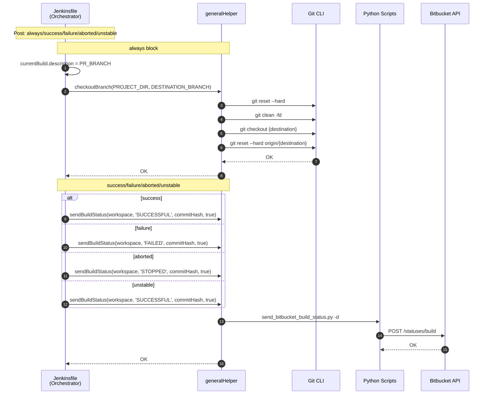
