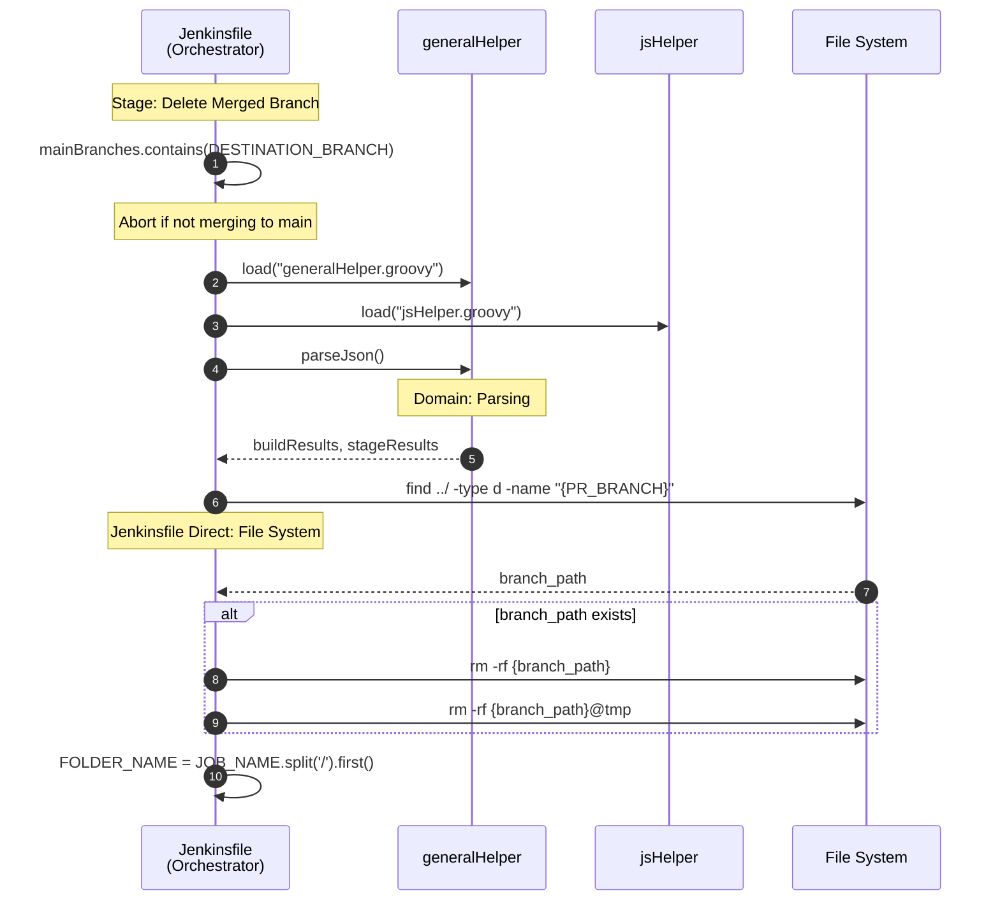
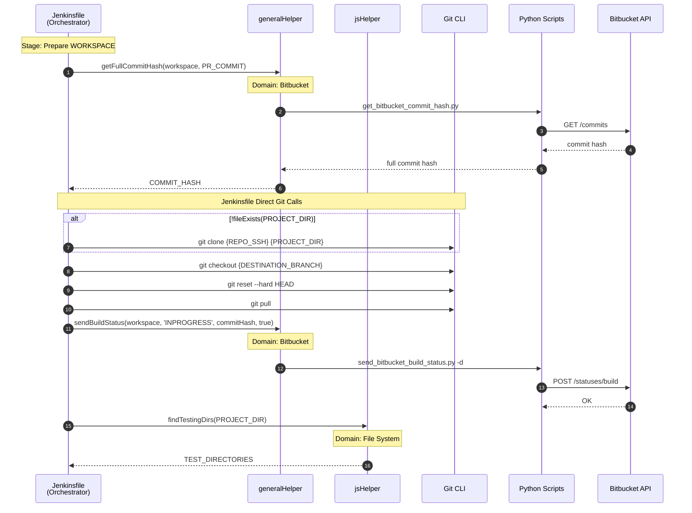
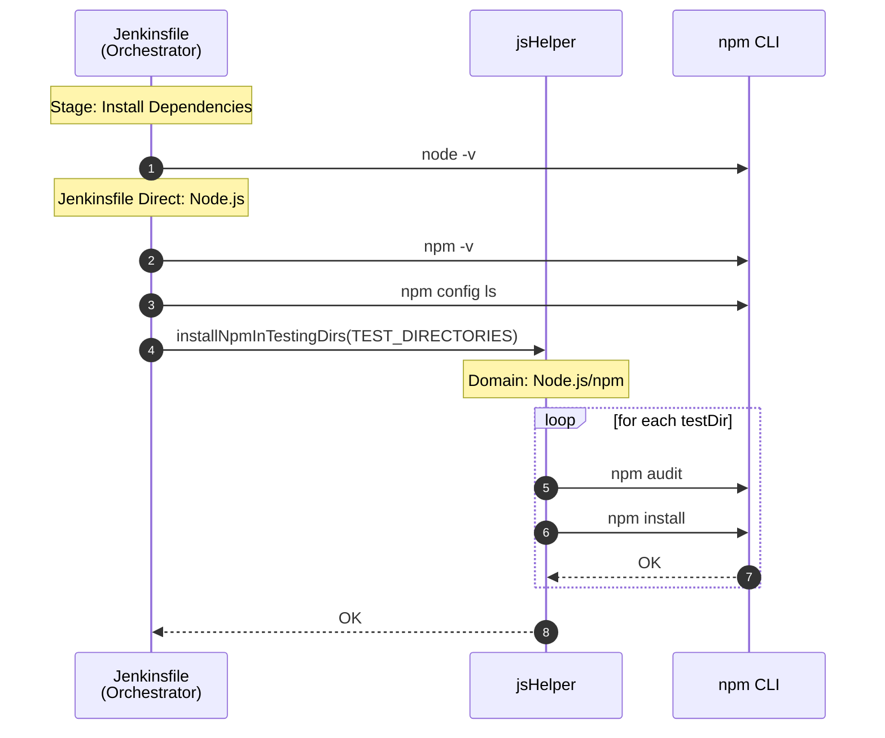
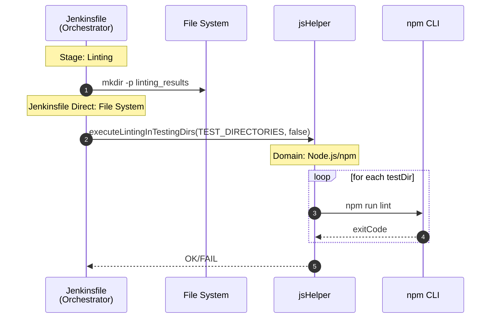
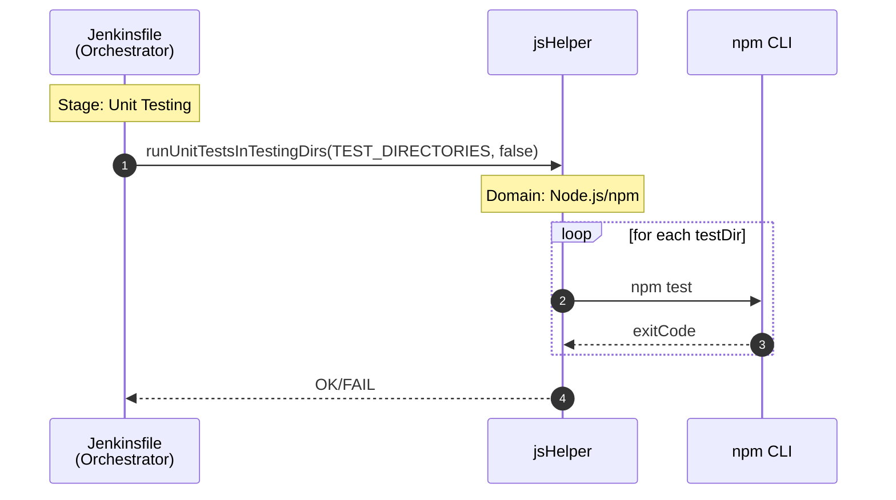
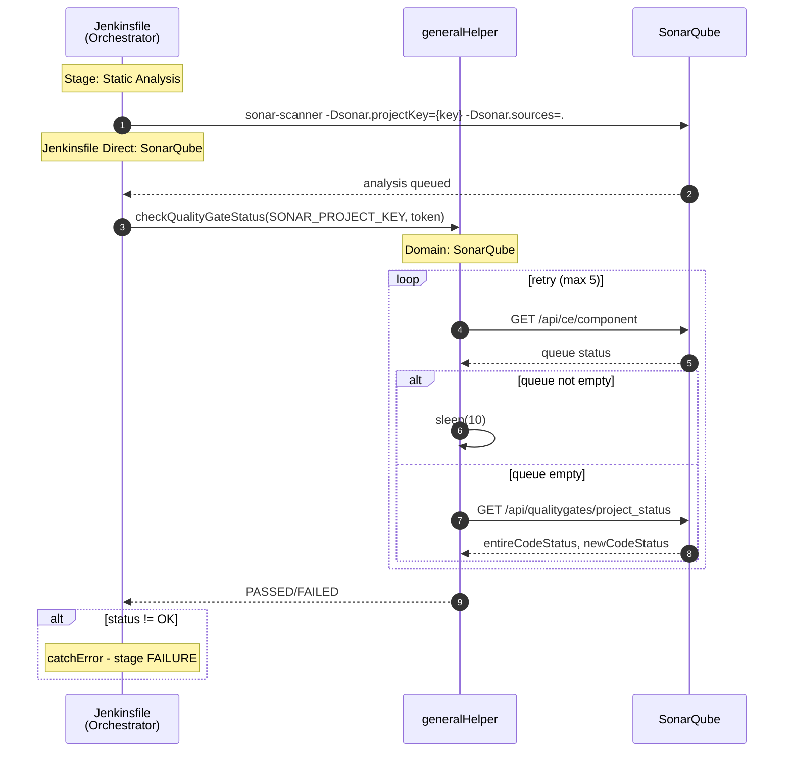
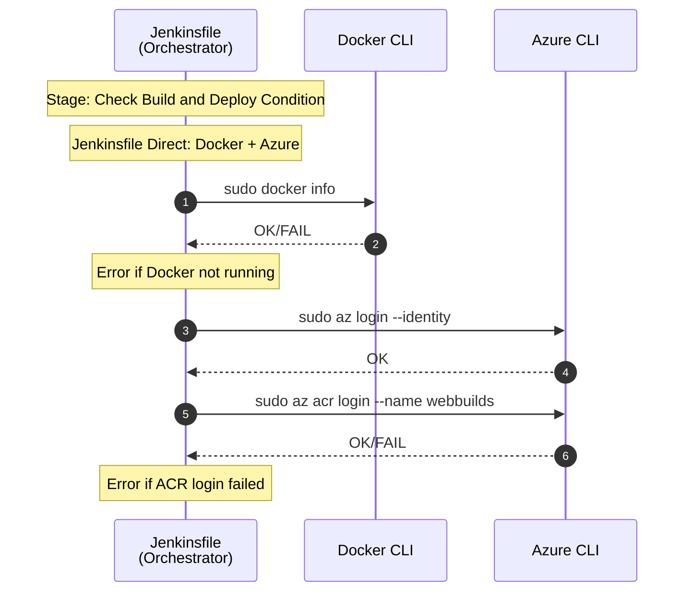
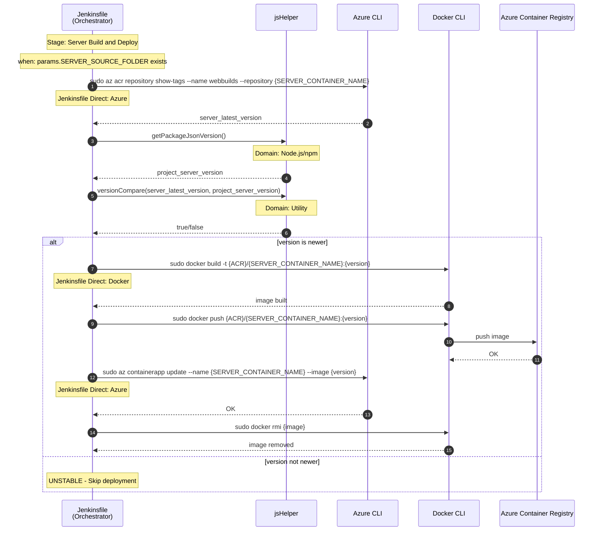
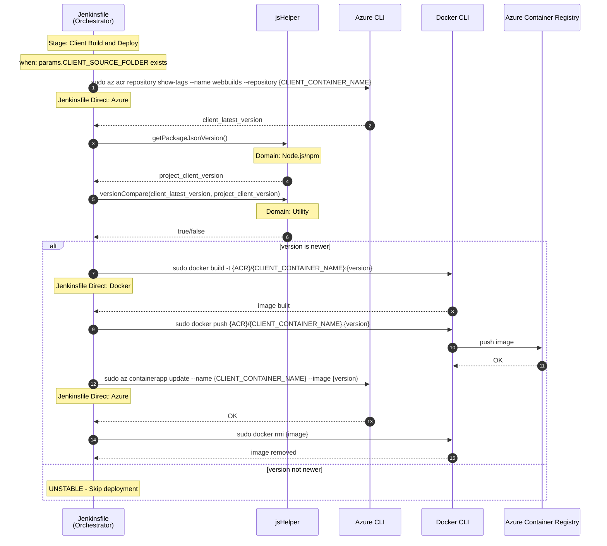
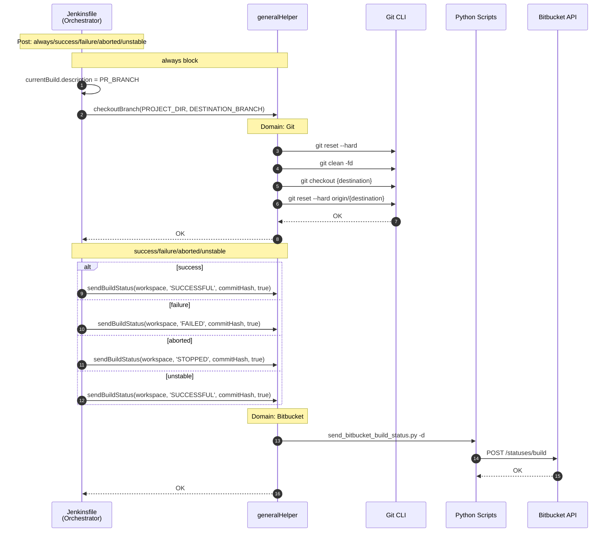

# JS CD Pipeline Sequence Diagrams

> **Analysis Target**: `JsJenkins/JenkinsfileDeployment` (JavaScript CD Pipeline)
>
> **Trigger**: Runs when PR is `MERGED`
>
> **Related**: [Domain Mapping Summary](domain-mapping.md)

---

## Why Sequence Diagrams?

> **Q: Why use Sequence Diagrams for Jenkins Pipeline analysis?**
>
> A: Jenkins Pipeline is **procedural code**. Unlike OOP where classes naturally define domain boundaries, procedural code mixes multiple domains within sequential execution flow. Sequence Diagrams visualize the **call flow** between components, making it easier to identify which domains are involved at each stage.

> **Q: What is the goal of this analysis?**
>
> A: To **identify domains by function**. By tracing "who calls what", I can classify each function into its domain (Git, Bitbucket, Unity, etc.) and detect where domain boundaries are violated (e.g., one function mixing multiple domains).

---

## Domain Summary

### Helper Domains Used

| Helper | Domain | Functions Called | Used Stage |
|--------|--------|------------------|------------|
| generalHelper | Git | `checkoutBranch` | Post |
| generalHelper | Bitbucket | `getFullCommitHash`, `sendBuildStatus` | Prepare WORKSPACE, Post |
| generalHelper | SonarQube | `checkQualityGateStatus` | Static Analysis |
| generalHelper | Parsing | `parseJson` | Delete Merged Branch |
| jsHelper | Node.js/npm | `installNpmInTestingDirs`, `executeLintingInTestingDirs`, `runUnitTestsInTestingDirs`, `getPackageJsonVersion` | Install Dependencies, Linting, Unit Testing, Server/Client Deploy |
| jsHelper | File System | `findTestingDirs` | Prepare WORKSPACE |
| jsHelper | Utility | `versionCompare` | Server/Client Deploy |

### Jenkinsfile Direct Calls

| Domain | Direct Call | Used Stage |
|--------|-------------|------------|
| Jenkins Pipeline DSL | `pipeline`, `stages`, `post`, `script`, `dir`, `credentials`, `tool`, `withSonarQubeEnv`, `withCredentials`, `when` | All |
| Git | `git clone`, `git checkout`, `git reset`, `git pull` | Prepare WORKSPACE |
| File System | `find`, `rm -rf`, `mkdir -p` | Delete Merged Branch, Linting |
| Node.js | `node -v`, `npm -v`, `npm config ls` | Install Dependencies |
| SonarQube | `sonar-scanner` | Static Analysis |
| Docker | `docker info`, `docker build`, `docker push`, `docker rmi` | Check Condition, Server/Client Deploy |
| Azure | `az login`, `az acr login`, `az acr repository show-tags`, `az containerapp update` | Check Condition, Server/Client Deploy |

### Domain Mapping by Stage

| Stage | Git | Bitbucket | Node.js | SonarQube | Docker | Azure | Parsing | File System | Utility |
|-------|:---:|:---------:|:-------:|:---------:|:------:|:-----:|:-------:|:-----------:|:-------:|
| Delete Merged Branch | | | | | | | ✓ | ✓ | |
| Prepare WORKSPACE | ✓ | ✓ | | | | | | ✓ | |
| Install Dependencies | | | ✓ | | | | | | |
| Linting | | | ✓ | | | | | ✓ | |
| Unit Testing | | | ✓ | | | | | | |
| Static Analysis | | | | ✓ | | | | | |
| Check Build Condition | | | | | ✓ | ✓ | | | |
| Server Build & Deploy | | | ✓ | | ✓ | ✓ | | | ✓ |
| Client Build & Deploy | | | ✓ | | ✓ | ✓ | | | ✓ |
| Post | ✓ | ✓ | | | | | | | |

---

## Overall Pipeline Overview

---

## Stage 1: Delete Merged Branch

---

## Stage 2: Prepare WORKSPACE

---

## Stage 3: Install Dependencies

---

## Stage 4: Linting

---

## Stage 5: Unit Testing

> **Note**: In JS CD, Coverage Report is **not** sent to Bitbucket (differs from CI)

---

## Stage 6: Static Analysis

---

## Stage 7: Check Build and Deploy Condition

---

## Stage 8: Server Build and Deploy

---

## Stage 9: Client Build and Deploy

---

## Post: always/success/failure/aborted/unstable

---

## Observations

### Delegation Pattern

| Pattern | Example | Count |
|---------|---------|:-----:|
| Jenkinsfile → generalHelper → External | `sendBuildStatus` → Python → Bitbucket API | 3 |
| Jenkinsfile → jsHelper → External | `installNpmInTestingDirs` → npm CLI | 4 |
| Jenkinsfile → jsHelper (Utility) | `versionCompare` | 2 |
| Jenkinsfile → Git direct | `git clone`, `git checkout`, `git pull` | 4 |
| Jenkinsfile → Docker direct | `docker build`, `docker push`, `docker rmi` | 8 |
| Jenkinsfile → Azure direct | `az login`, `az acr`, `az containerapp` | 8 |
| Jenkinsfile → SonarQube direct | `sonar-scanner` | 1 |
| Jenkinsfile → File System direct | `find`, `rm -rf`, `mkdir` | 4 |

### JS CI vs JS CD Comparison

| Item | JS CI | JS CD |
|------|-------|-------|
| Trigger | `OPEN` (PR created) | `MERGED` (PR merged) |
| `CI_PIPELINE` | `true` | `false` |
| `initializeEnvironment` | ✓ | ✗ (직접 호출) |
| Coverage Report Send | Yes | No |
| Web Server Deploy | Yes (lcov-report) | No |
| Docker Build | No | Yes |
| Azure Deploy | No | Yes (Container App) |
| Delete Merged Branch | No | Yes |

### Inconsistencies

| Issue | Description |
|-------|-------------|
| No `initializeEnvironment` | CD calls `sendBuildStatus` directly instead of using mixed function |
| Mixed Git delegation | Post uses `checkoutBranch`, but Prepare WORKSPACE uses direct Git commands |
| Heavy Jenkinsfile direct calls | Docker (8), Azure (8), File System (4) - no Helper abstraction |
| No Web Server Helper usage | Unlike DLX CD, no deployment to web server via generalHelper |

---

[← JS CI](js-ci.md) | [Domain Mapping Summary →](domain-mapping.md)