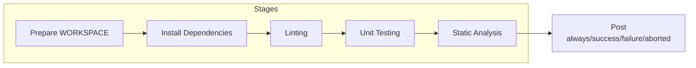
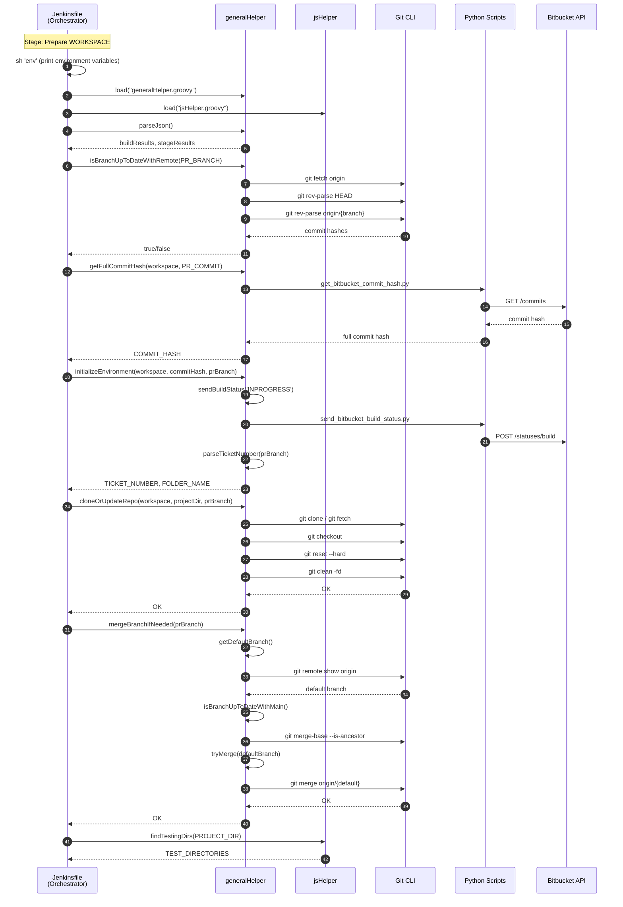
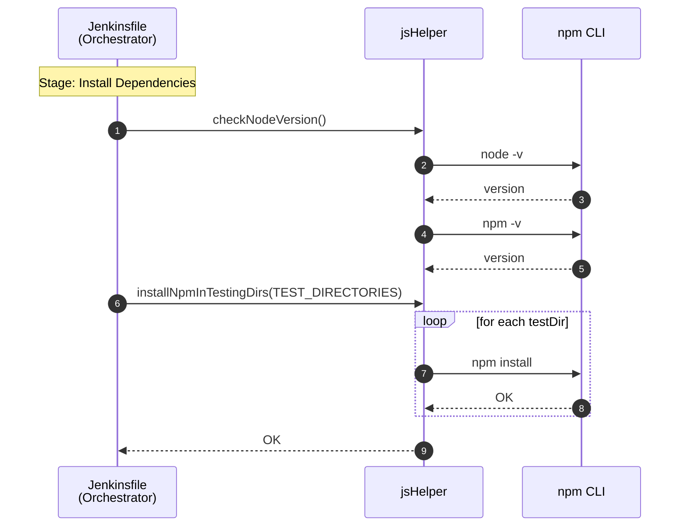
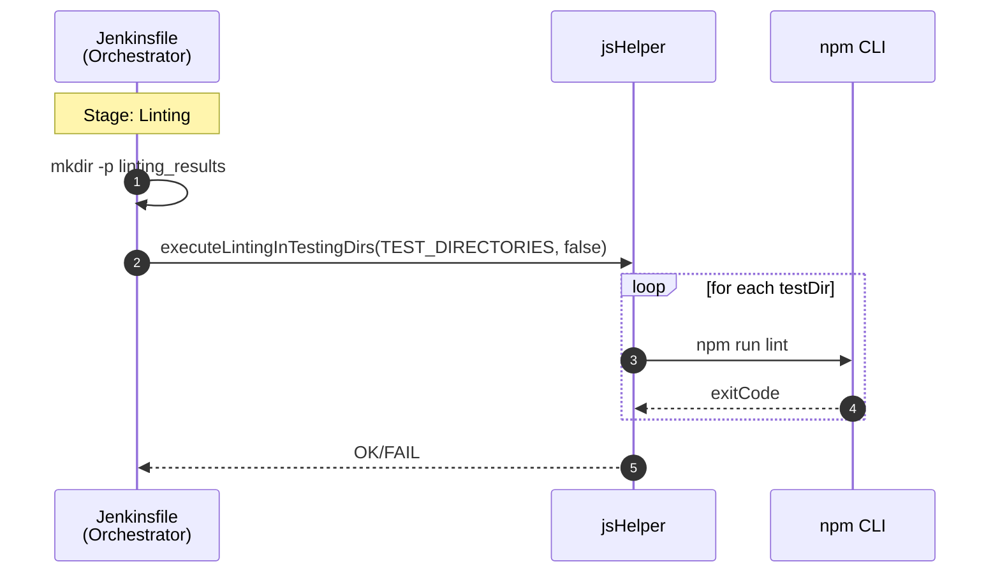
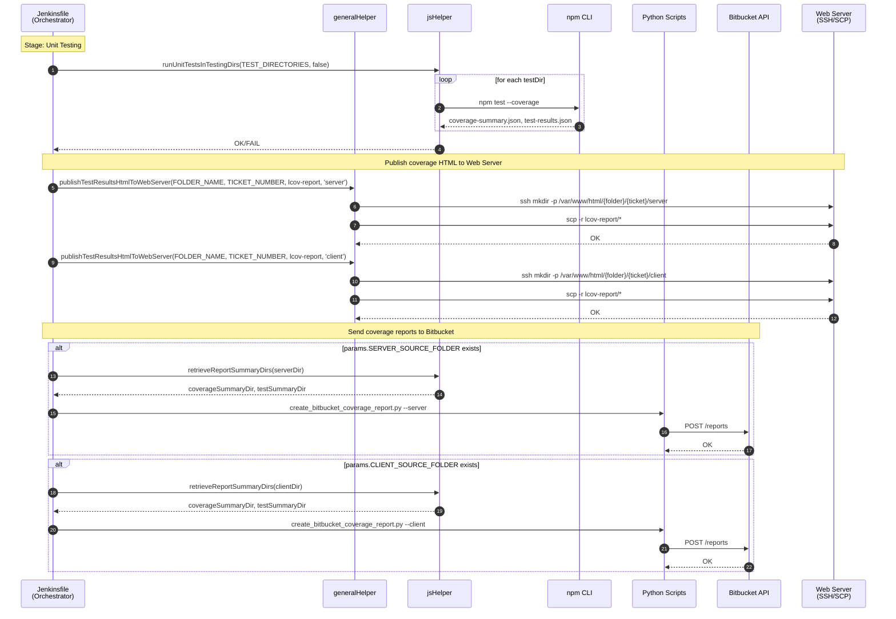
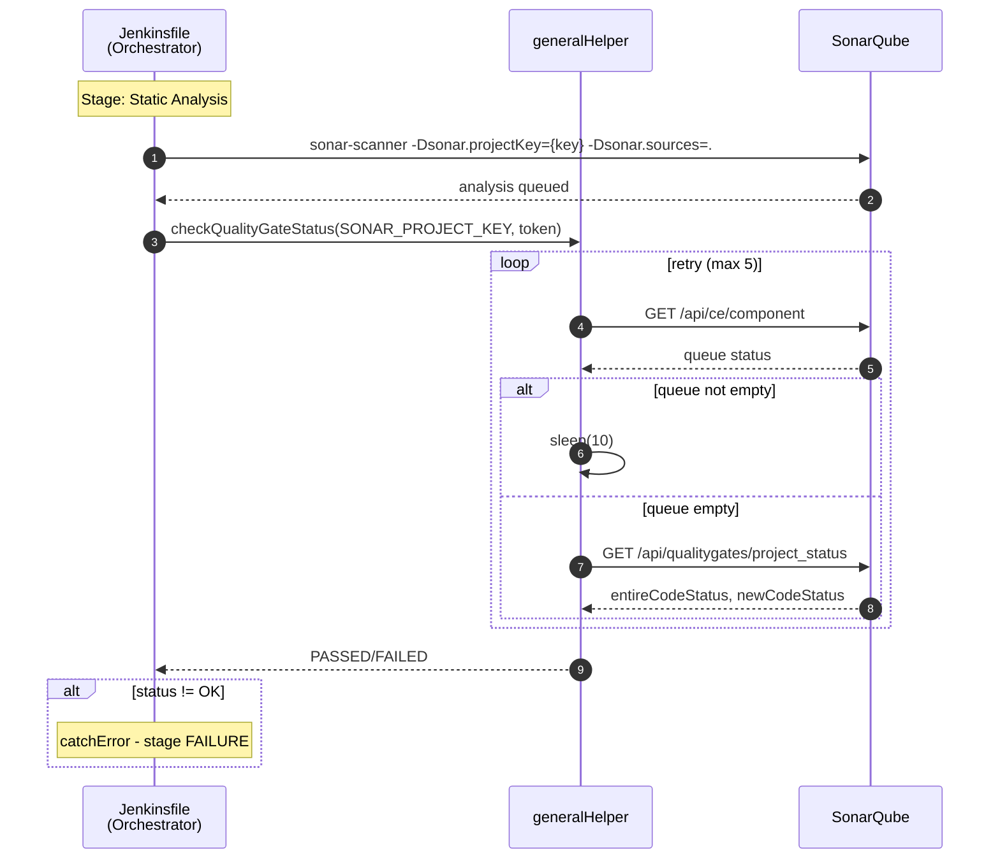
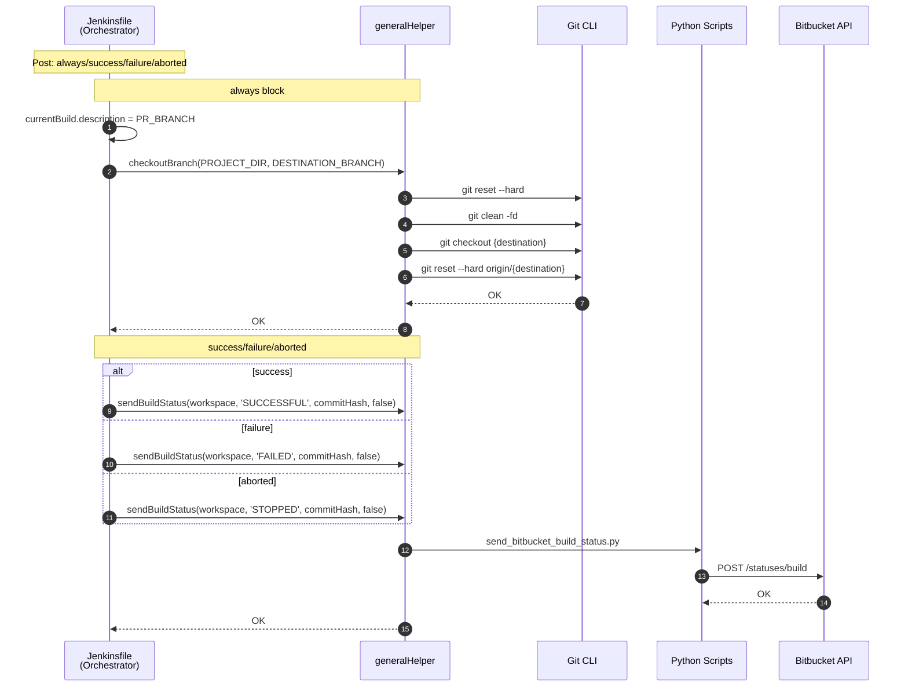

# JS CI Pipeline Sequence Diagrams

> **Analysis Target**: `JsJenkins/Jenkinsfile` (JavaScript CI Pipeline)
>
> **Trigger**: Runs when PR is `OPEN`

---

## Domain Summary by Function

| Domain | Function | Used Stage | Helper Location |
|--------|----------|------------|-----------------|
| **Git Management** | clone, fetch, checkout, reset, clean, merge | Prepare WORKSPACE, Post | generalHelper |
| **Bitbucket API** | send build status, get commit hash, send coverage report | Prepare WORKSPACE, Unit Testing, Post | generalHelper + Python |
| **Node.js (npm)** | version check, npm install, run tests, linting | Install Dependencies, Linting, Unit Testing | jsHelper |
| **Web Server (SSH/SCP)** | deploy coverage report HTML | Unit Testing | generalHelper |
| **SonarQube** | static code analysis, Quality Gate check | Static Analysis | generalHelper + sonar-scanner |
| **Environment Setup** | parseJson, parseTicketNumber, findTestingDirs | Prepare WORKSPACE | generalHelper + jsHelper |

### Domain Mapping by Stage

| Stage | Git | Bitbucket | Node.js | Web Server | SonarQube | Environment Setup |
|-------|:---:|:---------:|:-------:|:----------:|:---------:|:-----------------:|
| Prepare WORKSPACE | ✓ | ✓ | | | | ✓ |
| Install Dependencies | | | ✓ | | | |
| Linting | | | ✓ | | | |
| Unit Testing | | ✓ | ✓ | ✓ | | |
| Static Analysis | | | | | ✓ | |
| Post | ✓ | ✓ | | | | |

### DLX CI vs JS CI Comparison

| Item | DLX CI | JS CI |
|------|--------|-------|
| Tool | Unity CLI | Node.js (npm) |
| Helper | unityHelper | jsHelper |
| Install Dependencies | No | Yes (npm install) |
| Linting | Bash Script (C#) | jsHelper (ESLint) |
| Test Type | EditMode/PlayMode | Unit Testing (Jest) |
| Code Coverage | Unity Code Coverage | lcov-report |
| Static Analysis | No | Yes (SonarQube) |
| Build Project | Yes (WebGL) | No |

---

## Overall Pipeline Overview

---

## Stage 1: Prepare WORKSPACE

---

## Stage 2: Install Dependencies

---

## Stage 3: Linting

---

## Stage 4: Unit Testing

---

## Stage 5: Static Analysis

---

## Post: always/success/failure/aborted

