# Domain-Driven 4-Layer Architecture & Logger System Integration

## Reference Commits

| State | Commit Hash | Date |
|-------|-------------|------|
| **Baseline (Before)** | [`74fc356`](https://github.com/JindoKimKor/devops-jenkins-linux/tree/74fc3563713df593f070f1c418ef9ee68f2682ed) | 2025-03-20 |
| **Final (After)** | [`ff74ac8`](https://github.com/JindoKimKor/devops-jenkins-linux/tree/ff74ac8) | 2025-05-12 |

---

## Table of Contents

1. [Achievement Summary](#1-achievement-summary)
2. [4-Layer Architecture](#2-4-layer-architecture)
    1. [Structure Visualization](#21-structure-visualization)
    2. [Layer Responsibilities](#22-layer-responsibilities)
    3. [Before/After Comparison](#23-beforeafter-comparison)
        1. [Folder Structure](#231-folder-structure)
        2. [Dependency Flow](#232-dependency-flow)
3. [Logger System Integration](#3-logger-system-integration)
    1. [3-Level Structure](#31-3-level-structure)
    2. [Execution Flow](#32-execution-flow)
    3. [Before/After Comparison](#33-beforeafter-comparison)
        1. [Stage Log Output Comparison](#331-stage-log-output-comparison)
        2. [Console Log Output Comparison](#332-console-log-output-comparison)
    4. [Design Decisions](#34-design-decisions)
        1. [Jenkins Platform Constraints](#341-jenkins-platform-constraints)
        2. [Design Decisions](#342-design-decisions)
4. [Key Changes in Detail](#4-key-changes-in-detail)
    1. [Bitbucket API Migration](#41-bitbucket-api-migration)
        1. [Folder Structure Comparison](#411-folder-structure-comparison)
        2. [Before](#412-before-74fc356)
        3. [After](#413-after-ff74ac8)
        4. [Design Decisions](#414-design-decisions)
    2. [Shell Script Libraries](#42-shell-script-libraries)
        1. [File Structure](#421-file-structure)
        2. [Closure Pattern Structure](#422-closure-pattern-structure)
        3. [Before](#423-before-74fc356)
        4. [After](#424-after-ff74ac8)
        5. [Closure List by Library](#425-closure-list-by-library)
        6. [Closure Map Schema](#426-closure-map-schema)
        7. [Design Decisions](#427-design-decisions)
    3. [Stage Modularization](#43-stage-modularization)
        1. [Folder Structure Comparison (Linting Stage Example)](#431-folder-structure-comparison-linting-stage-example)
        2. [Linting Stage Example](#432-linting-stage-example)
        3. [Complete Stage Modularization Design](#433-complete-stage-modularization-design)
    4. [Testability](#44-testability)
        1. [Before: Helper + Python Script Structure](#441-before-helper--python-script-structure)
        2. [After: Library + Service Separation](#442-after-library--service-separation)
        3. [Test Code Examples](#443-test-code-examples)
        4. [Before vs After: API Testability Comparison](#444-before-vs-after-api-testability-comparison)
5. [Reference](#5-reference)

---

## 1. Achievement Summary

- **4-Layer Architecture**: Refactored monolithic pipelines (5 Jenkinsfiles, 37% duplication) into a layered structure, achieving reusability and testability.
- **Logger System Integration**: Unified scattered `echo` calls into a 3-Level hierarchical logging system (Cross-Cutting Infrastructure), establishing a pipeline-wide standard interface.

---

## 2. 4-Layer Architecture

### 2.1 Structure Visualization

```
┌─────────────────────────────────────────────────────────────────────────────┐
│                      Layer 1: Entry Point (Jenkinsfiles)                    │
├─────────────────────────────────────────────────────────────────────────────┤
│  DLXJenkins/Jenkinsfile              JsJenkins/Jenkinsfile                  │
│  DLXJenkins/JenkinsfileDeployment    JsJenkins/JenkinsfileDeployment        │
│  PipelineForJenkins/Jenkinsfile                                             │
└──────────────┬──────────────────────────────────────────────────────────────┘
               │
               ▼
┌─────────────────────────────────────────────────────────────────────────────┐
│                    Layer 2: Orchestration (vars/)                           │
├─────────────────────────────────────────────────────────────────────────────┤
│  Stage Modules (9)                         Helpers                          │
│  ├── stageInitialization.groovy             ├── shellScriptHelper.groovy    │
│  ├── stageProjectPrepare.groovy             └── bitbucketApiHelper.groovy   │
│  ├── stageLintUnity.groovy                                                  │
│  ├── stageLintGroovyJenkinsfile.groovy                                      │
│  ├── stageStaticAnalysis.groovy                                             │
│  ├── stageUnityExecution.groovy                                             │
│  ├── stageDeployBuild.groovy                                                │
│  ├── stageCleanupPRBranchArtifacts.groovy                                   │
│  └── stageSendBuildResults.groovy                                           │
└──────────────┬──────────────────────────────────────────────────────────────┘
               │
               ▼
┌─────────────────────────────────────────────────────────────────────────────┐
│                      Layer 3: Services                                      │
├─────────────────────────────────────────────────────────────────────────────┤
│  Physical: src/service/                                                     │
│  └── HttpApiService.groovy - HTTP communication (Apache HttpClient)         │
│                                                                             │
│  Physical: vars/ (CPS Constraint)                                           │
│  ├── shellScriptHelper.groovy - Library execution + Logger integration     │
│  └── bitbucketApiHelper.groovy - Credentials + API orchestration           │
└──────────────┬──────────────────────────────────────────────────────────────┘
               │
               ▼
┌─────────────────────────────────────────────────────────────────────────────┐
│                      Layer 4: Utilities (src/utils/ + src/resource/)        │
├─────────────────────────────────────────────────────────────────────────────┤
│  Libraries (src/utils/)                     Constants (src/resource/)       │
│  ├── GitLibrary.groovy (23 Closures)        └── Status.groovy               │
│  ├── ShellLibrary.groovy (15 Closures)          (COMMIT_STATUS,             │
│  └── SSHShellLibrary.groovy (8 Closures)         BUILD_STATUS,              │
│                                                  STAGE_STATUS)              │
│  ─────────────────────────────────────────────────────────────────────────  │
│  Cross-Cutting Concerns (vars/ - physical location, CPS constraint)         │
│  ├── logger.groovy - 3-Level logging infrastructure                         │
│  └── bitbucketApiLibrary.groovy - API Closure Library                       │
└─────────────────────────────────────────────────────────────────────────────┘
```

### 2.2 Layer Responsibilities

| Layer | Location | Responsibility | Files |
|-------|----------|----------------|-------|
| **Layer 1** | Each project folder | Pipeline Entry Point | Jenkinsfile (5) |
| **Layer 2** | vars/ | Stage orchestration | stage*.groovy, helpers |
| **Layer 3** | src/service/ | Business logic | *Service.groovy |
| **Layer 4** | src/utils/, src/resource/, vars/ | Utilities, constants, Cross-Cutting | *Library.groovy, Status.groovy, logger, bitbucketApiLibrary |

> **CPS Constraint**: Jenkins Pipeline applies Continuation-Passing Style (CPS) transformation. Classes in `src/` folder cannot use certain Groovy features without `@NonCPS`, so `logger` and `bitbucketApiLibrary` are placed in `vars/` (classified as Cross-Cutting Concerns).

### 2.3 Before/After Comparison

#### 2.3.1 Folder Structure

```
Before (74fc356)                          After (ff74ac8)
─────────────────                         ─────────────────
devops-jenkins-linux/                     devops-jenkins-linux/
├── DLXJenkins/                           ├── DLXJenkins/
│   └── Jenkinsfile                       │   └── Jenkinsfile
├── JsJenkins/                            ├── JsJenkins/
│   └── Jenkinsfile                       │   └── Jenkinsfile
├── groovy/                               └── sharedLibraries/
│   ├── generalHelper.groovy                  ├── vars/ (13 files)
│   └── unityHelper.groovy                    └── src/ (7 files)
└── python/
    └── *.py (9 files)
```

#### 2.3.2 Dependency Flow

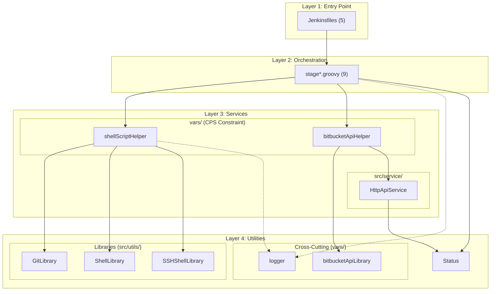

---

## 3. Logger System Integration

### 3.1 3-Level Structure

```
sharedLibraries/
└── vars/
    └── logger.groovy (63 lines)
        │
        ├── Stage Level
        │   ├── stageStart(name)
        │   └── stageEnd(name)
        │
        ├── Steps Group Level
        │   ├── stepsGroupStart(name)
        │   └── stepsGroupEnd(name)
        │
        └── Step Level
            ├── stepStart(desc)
            ├── stepInfo(desc)
            ├── stepProcessing(desc)
            ├── stepSuccess(desc)
            ├── stepWarning(desc)
            ├── stepFailed(desc)
            ├── stepError(desc)
            └── stepShellExecutedResult(desc)
```

### Logger Function List

| Level | Function | Purpose |
|-------|----------|---------|
| Stage | `stageStart(name)` | Mark stage start |
| Stage | `stageEnd(name)` | Mark stage completion |
| Steps Group | `stepsGroupStart(name)` | Mark task group start |
| Steps Group | `stepsGroupEnd(name)` | Mark task group completion |
| Step | `stepStart(desc)` | Individual task start |
| Step | `stepInfo(desc)` | Information output |
| Step | `stepProcessing(desc)` | In-progress status |
| Step | `stepSuccess(desc)` | Successful completion |
| Step | `stepWarning(desc)` | Warning |
| Step | `stepFailed(desc)` | Failure |
| Step | `stepError(desc)` | Error (pipeline abort) |
| Step | `stepShellExecutedResult(desc)` | Shell execution result |

### 3.2 Execution Flow

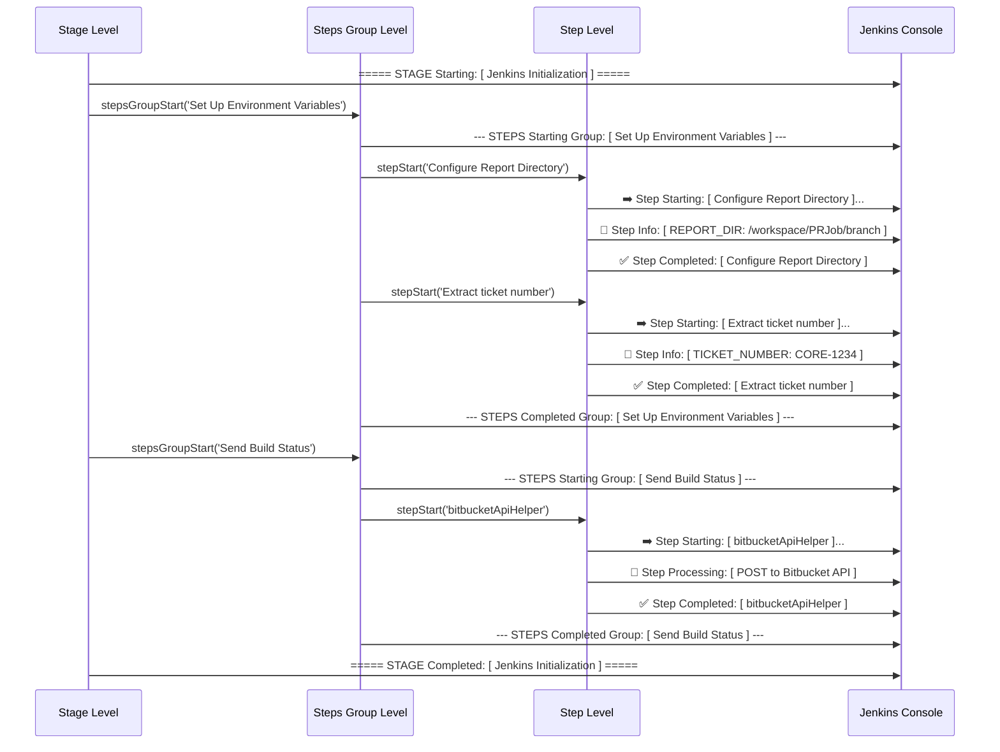

### 3.3 Before/After Comparison

#### 3.3.1 Stage Log Output Comparison

##### Before (`74fc356`)


> **Problems**:
> - No Stage/Step distinction
> - Inconsistent format
> - Difficult to trace error locations

##### After (`ff74ac8`)


> **Improvements**:
> - 3-Level hierarchical structure (Stage → Steps Group → Step)
> - Consistent format with emojis
> - Immediate error location identification

#### 3.3.2 Console Log Output Comparison

Unlike Stage Log, Console Log shows Jenkins-added timestamps and `[Pipeline]` tags:

**Before** - Scattered echo, inconsistent format:

```
[Pipeline] echo
2025-03-20T10:23:45.123Z Fetching origin...
[Pipeline] sh
2025-03-20T10:23:45.456Z + git fetch origin
[Pipeline] echo
2025-03-20T10:23:46.789Z REPORT_DIR: /workspace/PRJob/feature-branch
[Pipeline] echo
2025-03-20T10:23:47.012Z Sending build status to Bitbucket
[Pipeline] sh
2025-03-20T10:23:47.345Z + python send_bitbucket_build_status.py INPROGRESS ...
[Pipeline] echo
2025-03-20T10:23:48.678Z Done.
```

**After** - 3-Level hierarchical logging:

```
[Pipeline] echo
2025-05-12T10:23:45.123Z ===== STAGE Starting: [ Jenkins Initialization ] =====
[Pipeline] echo
2025-05-12T10:23:45.456Z --- STEPS Starting Group: [ Set Up Environment Variables ] ---
[Pipeline] echo
2025-05-12T10:23:45.789Z ➡️ Step Starting:
[ Configure Report Directory ]...
[Pipeline] echo
2025-05-12T10:23:46.012Z 💬 Step Info:
[ REPORT_DIR: /workspace/PRJob/feature-branch ]
[Pipeline] echo
2025-05-12T10:23:46.345Z ✅ Step Completed:
[ Configure Report Directory ]
[Pipeline] echo
2025-05-12T10:23:46.678Z --- STEPS Completed Group: [ Set Up Environment Variables ] ---
[Pipeline] echo
2025-05-12T10:23:47.012Z ===== STAGE Completed: [ Jenkins Initialization ] =====
```

> **Note**: Step-level functions include `\n` within messages, resulting in two-line output in Console Log (e.g., `"➡️ Step Starting: \n[ desc ]..."`). Stage/Steps Group functions output single lines without `\n`.

### 3.4 Design Decisions

#### 3.4.1 Jenkins Platform Constraints

| Constraint | Description |
|------------|-------------|
| **CSP (Content Security Policy)** | Jenkins blocks inline CSS, external stylesheets, and JavaScript by default for XSS prevention. Text color/style customization is limited. |
| **Output Format Control** | When calling `echo()`, Stage Log shows Jenkins auto-grouping/formatting, while Console Log shows raw output with timestamps and `[Pipeline]` tags. Developers cannot control this output format. |

> **Reference**: [Jenkins Security - Configuring Content Security Policy](https://www.jenkins.io/doc/book/security/configuring-content-security-policy/)

#### 3.4.2 Design Decisions

| Constraint | Solution |
|------------|----------|
| Color/style limitations | Visual hierarchy using text-based delimiters (`=====`, `---`) and emojis |
| Output format control | `\n` insertion in step-level functions for Console Log hierarchical readability. Stage Log auto-formatted by Jenkins requires no special handling |

---

## 4. Key Changes in Detail

### 4.1 Bitbucket API Migration

Migrated from Python subprocess to Native Groovy/Java HTTP Client.

#### 4.1.1 Folder Structure Comparison

```
Before (74fc356)                          After (ff74ac8)
─────────────────                         ─────────────────
devops-jenkins-linux/                     devops-jenkins-linux/
├── DLXJenkins/                           ├── DLXJenkins/
│   └── Jenkinsfile ←───────────┐         │   └── Jenkinsfile ←─────────────────────┐
├── groovy/                     │         └── sharedLibraries/                      │
│   └── generalHelper.groovy ←──┤             ├── vars/                             │
└── python/                     │             │   ├── bitbucketApiHelper.groovy ←───┤
    └── send_bitbucket_build_   │             │   └── bitbucketApiLibrary.groovy ←──┘
        status.py ←─────────────┘             └── src/service/general/
                                                  └── BitbucketApiService.groovy
```

#### 4.1.2 Before (`74fc356`)

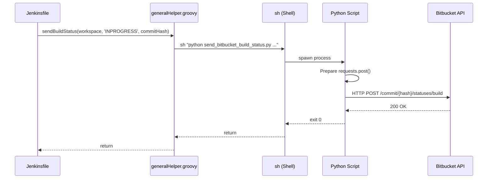

**Code Path**:
- `DLXJenkins/Jenkinsfile` → `groovy/generalHelper.groovy:sendBuildStatus()` → `python/send_bitbucket_build_status.py`

> **Problems**:
> - Python process spawn overhead
> - External dependency (requests library)
> - Distributed error handling

#### 4.1.3 After (`ff74ac8`)

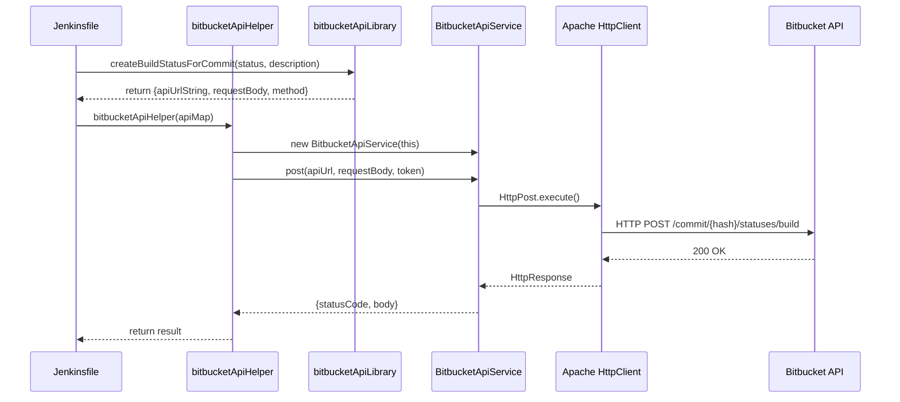

**Code Path**:
- `DLXJenkins/Jenkinsfile`
- → `sharedLibraries/vars/bitbucketApiHelper.groovy`
- → `sharedLibraries/vars/bitbucketApiLibrary.groovy`
- → `sharedLibraries/src/service/general/BitbucketApiService.groovy`

> **Improvements**:
> - HTTP processing within JVM (no process spawn)
> - Structured error handling (Exception hierarchy)
> - Reusable API Service class

#### 4.1.4 Design Decisions

##### Problem Situation

- Time-consuming to diagnose Bitbucket API communication failures when Jenkins service URL's third-party certificate expired
- Inconsistent error handling across Python scripts - some had it, some didn't
- No distinction between network error types - all treated uniformly

##### Solution: Centralized Error Handling

`BitbucketApiService.executeRequest()` classifies all HTTP request errors by type:

| Exception | Cause | Log Message |
|-----------|-------|-------------|
| `UnknownHostException` | DNS/URL issue | "Unable to resolve host" |
| `ConnectException` | TCP connection failure | "Failed to establish TCP connection" |
| `SocketTimeoutException` | Network timeout | "Connection timed out" |
| `SSLHandshakeException` | Certificate error | "TLS Handshake failed - possible certificate error" |
| `ConnectionClosedException` | Premature connection closure | "Connection closed prematurely" |
| `IOException` | General I/O error | "I/O error occurred" |

##### Structure

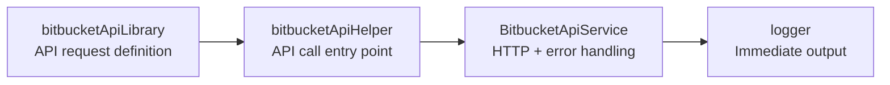

All GET/POST/PUT/DELETE requests execute through `executeRequest()`, centralizing error handling.

---

### 4.2 Shell Script Libraries

Library system abstracting shell commands using Closure pattern. Three domain-specific Libraries: Git, Shell, SSH.

#### 4.2.1 File Structure

```
sharedLibraries/
├── vars/
│   └── shellScriptHelper.groovy      ← Closure execution + logging integration
│       ├── call(Closure, List args)
│       ├── validateShMap(Map)
│       ├── executeReturnStatus(Map)
│       ├── executeReturnStdout(Map)
│       └── executeReturnVoid(Map)
│
└── src/utils/
    ├── GitLibrary.groovy (258 lines)     ← Git command Closures (23)
    ├── ShellLibrary.groovy (210 lines)   ← General shell command Closures (15)
    └── SSHShellLibrary.groovy (99 lines) ← SSH/SCP remote command Closures (8)
```

#### 4.2.2 Closure Pattern Structure

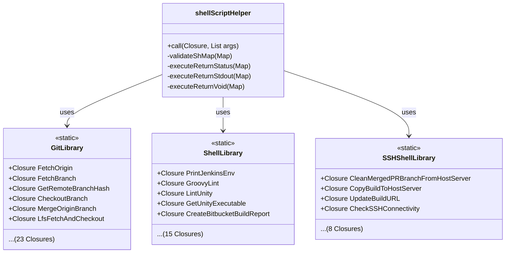

#### 4.2.3 Before (`74fc356`)

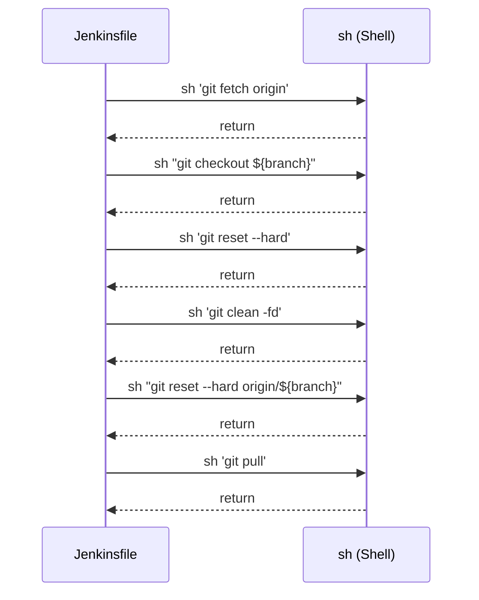

> **Problems**:
> - Same git commands duplicated across multiple pipelines
> - No error handling
> - No logging
> - Untestable

#### 4.2.4 After (`ff74ac8`)

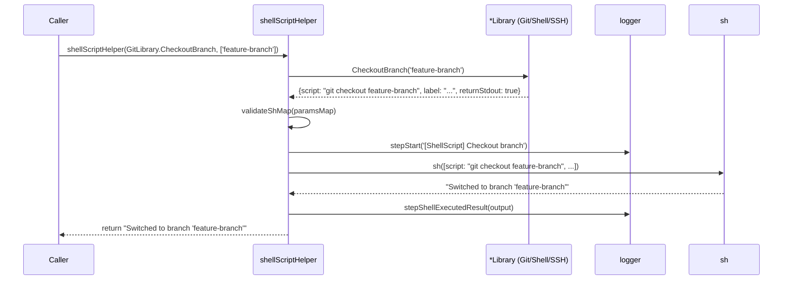

> **Improvements**:
> - Shell command reuse through Closure pattern
> - Automatic logging integration
> - Consistent error handling
> - Centralized validation logic

#### 4.2.5 Closure List by Library

##### GitLibrary (23 Closures) - Git Version Control

| Closure | Parameters | Return Type | Purpose |
|---------|------------|-------------|---------|
| `FetchOrigin` | - | void | Fetch origin |
| `FetchBranch` | branchName | void | Fetch specific branch |
| `GetRemoteBranchHash` | branchName | stdout | Remote branch commit hash |
| `CloneRepository` | gitUrl, projectDir | void | Clone repository |
| `ShowCurrentBranch` | - | stdout | Current branch name |
| `RemoveIndexLock` | - | void | Remove .git/index.lock |
| `ResetHardHead` | - | stdout | Hard reset to HEAD |
| `CleanUntracked` | - | stdout | Delete untracked files |
| `CheckoutBranch` | branchName | stdout | Checkout branch |
| `ResetHardOriginBranch` | branchName | stdout | Reset to origin branch |
| `Pull` | - | stdout | Git pull |
| `GetOriginDefaultBranch` | - | stdout | Default branch name |
| `CheckOriginBranchExists` | branchName | status | Check remote branch exists |
| `CheckBranchExists` | targetBranch | status | Check local branch exists |
| `CheckUpToDateWithRemote` | branchName | status | Check sync with remote |
| `CheckIsRemoteBranchAncestor` | remoteBranchName | status | Check ancestor branch |
| `MergeOriginBranch` | branchToMerge | status | Merge remote branch |
| `LfsFetchAndCheckout` | - | status | LFS file fetch & checkout |

##### ShellLibrary (15 Closures) - General Shell Commands

| Closure | Parameters | Return Type | Purpose |
|---------|------------|-------------|---------|
| `PrintJenkinsEnv` | - | stdout | Print environment variables |
| `FindPRJobDirectory` | workingDir, prBranch | stdout | Search PR Job directory |
| `FindProjectDirectory` | workingDir, projectType | status | Search project directory |
| `DockerInfo` | - | stdout | Print Docker info |
| `GroovyLint` | reportFile, configFile, targetDir, desc | status | Groovy linting |
| `GetUnityExecutable` | workspace, projectDir | stdout | Unity executable path |
| `CreateLintingResultsDir` | workingDir | status | Create linting results directory |
| `CopyWebGLBuilder` | projectDir | status | Copy WebGL Builder |
| `CopyLintConfig` | workingDir, projectDir | status | Copy .editorconfig |
| `LintUnity` | workingDir, projectDir, reportDir | status | Unity project linting |
| `ExecutePythonStatusReport` | workingDir, projectDir, reportDir, status, commit | stdout | Python status report |
| `CreateBitbucketBuildReport` | workspace, commit, logPath, debugMode | status | Bitbucket build report |
| `CreateBitbucketTestReport` | workspace, commitHash, reportDir | status | Bitbucket test report |

##### SSHShellLibrary (8 Closures) - SSH/SCP Remote Commands

| Closure | Parameters | Return Type | Purpose |
|---------|------------|-------------|---------|
| `CleanMergedPRBranchFromHostServer` | folderName, ticketNumber, sshKey, hostUrl | stdout | Clean PR branch artifacts |
| `CreateDirectoryAndSetPermission` | folderName, sshKey, hostUrl | status | Create remote directory |
| `CopyBuildToHostServer` | folderName, sshKey, hostUrl, projectDir | status | SCP build transfer |
| `UpdateBuildURL` | folderName, sshKey, hostUrl | status | Update build URL |
| `CreateDirectoryAndSetPermissionForEconestogaDlxServer` | folderName, sshKey, econestogaUrl | status | Econestoga server directory creation |
| `CopyBuildToEconestogaDlxServer` | folderName, sshKey, econestogaUrl, projectDir | status | Econestoga server SCP transfer |
| `UpdateBuildURLForEconestogaDlxServer` | folderName, sshKey, econestogaUrl | status | Econestoga URL update |
| `CheckSSHConnectivity` | sshKey, hostUrl | stdout | SSH connection test |

#### 4.2.6 Closure Map Schema

```groovy
[
    script: String,        // (Required) Shell script to execute
    label: String,         // (Required) Description shown in Jenkins build log
    returnStdout: Boolean, // (Optional) Return stdout
    returnStatus: Boolean, // (Optional) Return exit code
    returnStderr: Boolean, // (Optional) Return stderr
    encoding: String       // (Optional) Encoding (default: UTF-8)
]
```

**Constraint**: Only one of `returnStdout`, `returnStatus`, `returnStderr` can be true

#### 4.2.7 Design Decisions

##### Pattern Identification

Analysis of all `sh` calls across pipelines revealed three domains:

| Domain | Library | Purpose |
|--------|---------|---------|
| **Git** | GitLibrary | Version control commands (fetch, checkout, merge, etc.) |
| **Shell** | ShellLibrary | General system commands (lint, copy, mkdir, etc.) |
| **SSH** | SSHShellLibrary | Remote server commands (scp, ssh, etc.) |

##### Leveraging Jenkins sh() Characteristics

Jenkins Pipeline's `sh()` step can directly accept Map-type parameters:

```groovy
// Groovy Map can be directly passed to sh()
sh([script: "git fetch origin", label: "Fetch origin", returnStatus: true])
```

##### Return Type Processing Patterns

| Return Type | Purpose | Result Handling |
|-------------|---------|-----------------|
| **void** | Execution only (side effect) | Check success/failure only |
| **stdout** | Output value needed | Parse returned string |
| **status** | Exit code needed | 0=success, non-zero=failure/warning |

##### Logger System Integration

Clear return type rules enable automatic logging in `shellScriptHelper`:

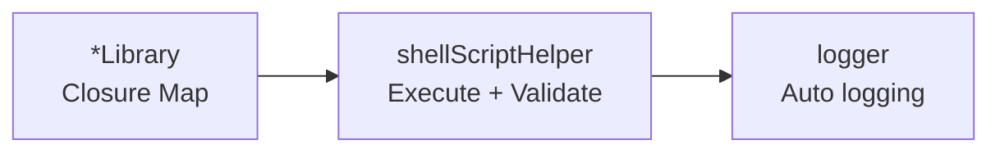

- **Success**: Call `stepSuccess()`
- **Failure**: Call `stepError()` (pipeline abort)
- **Warning**: Call `stepWarning()` (specific status codes)

---

### 4.3 Stage Modularization

#### 4.3.1 Folder Structure Comparison (Linting Stage Example)

```
Before (74fc356)                                    After (ff74ac8)
─────────────────                                   ─────────────────
devops-jenkins-linux/                               devops-jenkins-linux/
├── DLXJenkins/                                     ├── DLXJenkins/
│   ├── Jenkinsfile                                 │   ├── Jenkinsfile
│   │   stage('Linting') {Inline/Duplicated}        │   │   stage('Linting') { stageLintUnity() }
│   └── JenkinsfileDeployment                       │   └── JenkinsfileDeployment
│       stage('Linting') {Inline/Duplicated}        │       stage('Linting') { stageLintUnity() }
├── JsJenkins/                                      ├── JsJenkins/
│   ├── Jenkinsfile                                 │   ├── Jenkinsfile
│   │   stage('Linting') {Inline/Duplicated}        │   │   stage('Linting') { stageLintJs() } *
│   └── JenkinsfileDeployment                       │   └── JenkinsfileDeployment
│       stage('Linting') {Inline/Duplicated}        │       stage('Linting') { stageLintJs() } *
├── PipelineForJenkins/                             ├── PipelineForJenkins/
│   └── Jenkinsfile                                 │   └── Jenkinsfile
│       stage('Lint Groovy Code') {                 │       stage('Lint Groovy Code') {
│           Inline/Duplicated }                     │           stageLintGroovyJenkinsfile() }
│                                                   │
└── groovy/                                         └── sharedLibraries/vars/
    ├── generalHelper.groovy                            ├── stageLintUnity.groovy
    └── unityHelper.groovy                              ├── stageLintJs.groovy *
                                                        └── stageLintGroovyJenkinsfile.groovy
```

> *stageLintJs is not yet developed

#### 4.3.2 Linting Stage Example

##### Before (`74fc356`) - ~50 lines

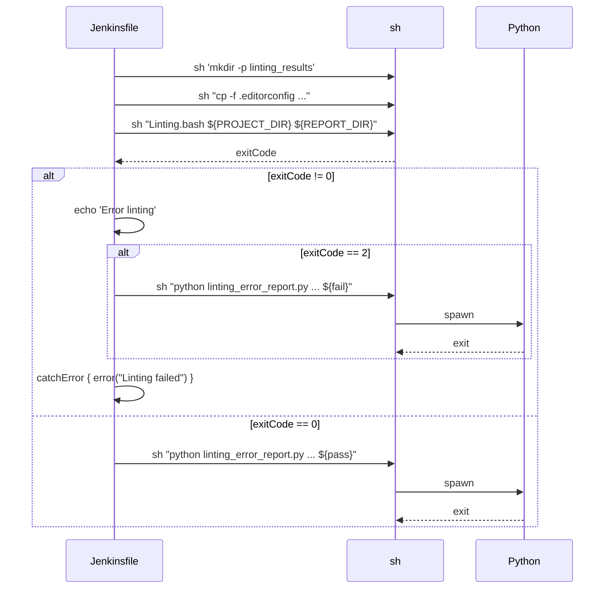

> **Problems**:
> - Same Stage logic Inline/Duplicated across 5 pipelines
> - Modifications require changes in all 5 places
> - No logging, untestable

##### After (`ff74ac8`) - 1 line

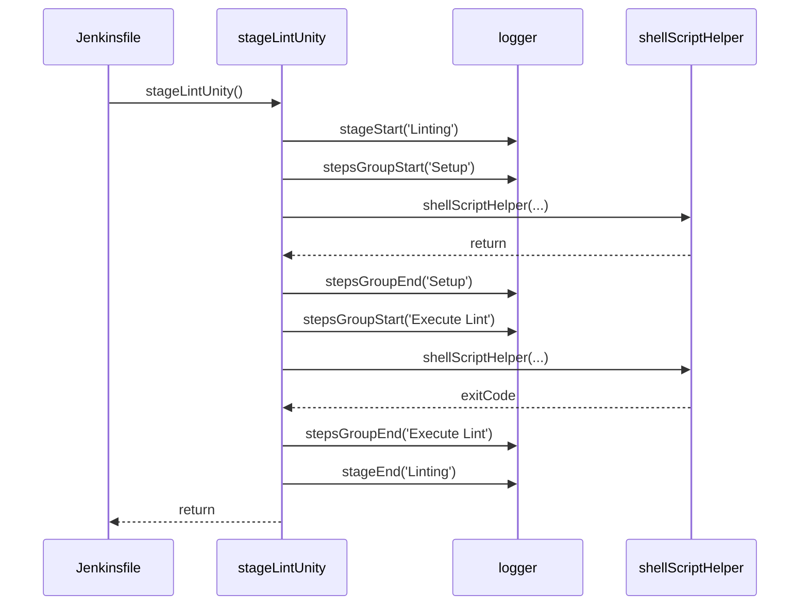

**Actual Logic**: Encapsulated in `sharedLibraries/vars/stageLintUnity.groovy`

> **Improvements**:
> - Stage logic separated into module files (`stage*.groovy`)
> - Pipeline calls replaced with 1-line invocation
> - Automatic Logger system integration
> - Single Source of Truth

#### 4.3.3 Complete Stage Modularization Design

```
Before (74fc356)                                    After (ff74ac8)
─────────────────                                   ─────────────────
> Stage logic Inline/Duplicated                     > Stage logic separated into stage*.groovy modules
> groovy/ Helper mixed with                         > Role-based Layer separation, 1-line calls
  Git/API/logging/domain logic (God Object)

DLXJenkins/Jenkinsfile                              DLXJenkins/Jenkinsfile
├── stage('Prepare WORKSPACE')                      ├── stage('Jenkins Initialization') { stageInitialization() }
├── stage('Linting')                                ├── stage('Prepare Project') { stageProjectPrepare() }
├── stage('EditMode Tests')                         ├── stage('Linting') { stageLintUnity() }
├── stage('PlayMode Tests in Editor')               ├── stage('Unity Execution') { stageUnityExecution() }
├── stage('Code Coverage Send Reports')             └── stage('Send Build Results') { stageSendBuildResults() }
└── stage('Build Project')
                                                    DLXJenkins/JenkinsfileDeployment
DLXJenkins/JenkinsfileDeployment                    ├── stage('Cleanup PR Branch Artifacts') { stageCleanupPRBranchArtifacts() }
├── stage('Delete Merged Branch')                   ├── stage('Jenkins Initialization') { stageInitialization() }
├── stage('Prepare WORKSPACE')                      ├── stage('Prepare Project') { stageProjectPrepare() }
├── stage('Linting')                                ├── stage('Linting') { stageLintUnity() }
├── stage('EditMode Tests')                         ├── stage('Unity Execution') { stageUnityExecution() }
├── stage('PlayMode Tests In Editor')               ├── stage('Deploy Build') { stageDeployBuild() }
├── stage('Build Project')                          └── stage('Send Build Results') { stageSendBuildResults() }
└── stage('Deploy Build')
                                                    JsJenkins/Jenkinsfile *
JsJenkins/Jenkinsfile                               ├── stage('Jenkins Initialization') { stageInitialization() }
├── stage('Prepare WORKSPACE')                      ├── stage('Install Dependencies') { stageInstallDependencies() }
├── stage('Install Dependencies')                   ├── stage('Linting') { stageLintJs() }
├── stage('Linting')                                ├── stage('Unit Testing') { stageUnitTesting() }
├── stage('Unit Testing')                           └── stage('Static Analysis') { stageStaticAnalysis() }
└── stage('Static Analysis')
                                                    JsJenkins/JenkinsfileDeployment *
JsJenkins/JenkinsfileDeployment                     ├── stage('Cleanup PR Branch Artifacts') { stageCleanupPRBranchArtifacts() }
├── stage('Delete Merged Branch')                   ├── stage('Jenkins Initialization') { stageInitialization() }
├── stage('Prepare WORKSPACE')                      ├── stage('Install Dependencies') { stageInstallDependencies() }
├── stage('Install Dependencies')                   ├── stage('Linting') { stageLintJs() }
├── stage('Linting')                                ├── stage('Unit Testing') { stageUnitTesting() }
├── stage('Unit Testing')                           ├── stage('Static Analysis') { stageStaticAnalysis() }
├── stage('Static Analysis')                        ├── stage('Server Build and Deploy') { stageServerBuildAndDeploy() }
├── stage('Check Build and Deploy Condition')       └── stage('Client Build and Deploy') { stageClientBuildAndDeploy() }
├── stage('Server Build and Deploy')
└── stage('Client Build and Deploy')                PipelineForJenkins/Jenkinsfile
                                                    ├── stage('Jenkins Initialization') { stageInitialization() }
PipelineForJenkins/Jenkinsfile                      ├── stage('Lint Groovy Code') { stageLintGroovyJenkinsfile() }
├── stage('Prepare Workspace')                      ├── stage('Generate Groovydoc') { stageGenerateGroovydoc() } *
├── stage('Lint Groovy Code')                       ├── stage('Run Unit Tests') { stageRunUnitTests() } *
├── stage('Generate Groovydoc')                     ├── stage('Publish Test Results') { stagePublishTestResults() } *
├── stage('Run Unit Tests')                         └── stage('Static Analysis') { stageStaticAnalysis() }
├── stage('Publish Test Results')
└── stage('Static Analysis')                        sharedLibraries/vars/
                                                    ├── stageInitialization.groovy
groovy/                                             ├── stageProjectPrepare.groovy
├── generalHelper.groovy                            ├── stageLintUnity.groovy
├── jsHelper.groovy                                 ├── stageLintGroovyJenkinsfile.groovy
└── unityHelper.groovy                              ├── stageStaticAnalysis.groovy
                                                    ├── stageUnityExecution.groovy
                                                    ├── stageDeployBuild.groovy
                                                    ├── stageCleanupPRBranchArtifacts.groovy
                                                    ├── stageSendBuildResults.groovy
                                                    ├── stageLintJs.groovy *
                                                    ├── stageInstallDependencies.groovy *
                                                    ├── stageUnitTesting.groovy *
                                                    ├── stageGenerateGroovydoc.groovy *
                                                    ├── stageRunUnitTests.groovy *
                                                    ├── stagePublishTestResults.groovy *
                                                    ├── stageServerBuildAndDeploy.groovy *
                                                    └── stageClientBuildAndDeploy.groovy *
```

> *Not yet developed

---

### 4.4 Testability

One of the core goals of refactoring was to **transition to a structure that enables unit testing**.

#### 4.4.1 Before: Helper + Python Script Structure

In the Before state, **2 untestable patterns** existed:

**Pattern 1: Direct `sh()` calls in Helper**

```groovy
// groovy/generalHelper.groovy (Before - commit 74fc356)
void checkoutBranch(String prBranch) {
    sh(script: "git checkout ${prBranch}", returnStdout: true)  // Direct Jenkins DSL call
    echo "Checked out branch: ${prBranch}"                       // Direct Jenkins DSL call
}
```

| File | Lines | Role |
|------|-------|------|
| generalHelper.groovy | 403 lines | 21 functions, 8 domains mixed |
| jsHelper.groovy | 408 lines | JS build, Python wrappers |
| unityHelper.groovy | 337 lines | Unity build |
| **Total** | **1,148 lines** | Testable: **1 function** |

**Pattern 2: API calls via Python scripts**

```python
# python/send_bitbucket_build_status.py (Before)
import requests
import os

# Direct environment variable access
access_token = os.getenv('BITBUCKET_ACCESS_TOKEN')
pr_repo = os.getenv('JOB_REPO')

# Direct HTTP request execution
url = f'{pr_repo}/commit/{args["pr-commit"]}/statuses/build'
response = requests.post(url, data=build_status, headers=headers)
```

**Python script call from Jenkins**:

```groovy
// jsHelper.groovy (Before)
sh "python3 python/send_bitbucket_build_status.py ${commitHash} SUCCESSFUL"
```

**Discovered Python API scripts (9)**:

| File | Role | HTTP Method |
|------|------|-------------|
| send_bitbucket_build_status.py | Send build status | POST |
| get_bitbucket_commit_hash.py | Get commit hash | GET |
| create_bitbucket_coverage_report.py | Coverage report | PUT |
| create_bitbucket_test_report.py | Test report | PUT/POST |
| create_bitbucket_webgl_build_report.py | WebGL build report | GET/DELETE/PUT |
| npm_audit.py | npm security audit | PUT/POST |
| linting_error_report.py | Linting error report | PUT/POST |
| Lint_groovy_report.py | Groovy linting report | PUT/POST |
| create_log_report.py | Log report | GET |

**Reasons for Being Untestable**:

| Before Structure | Problem |
|------------------|---------|
| Helper: Direct `sh()` call | Requires Jenkins DSL, cannot mock |
| Python: `os.getenv()` | Environment variable dependency, difficult to isolate |
| Python: `requests.post()` | Direct HTTP execution, complex mocking |
| Jenkins: `sh "python3 ..."` | External process call, integration test only |

#### 4.4.2 After: Library + Service Separation

**Core Change**: "Definition" and "Execution" separation + Dependency Injection

```
┌─────────────────────────────────────────────────────────────────────┐
│ Library (src/utils/)                                                │
│ → Shell command "definition" (returns Map)                          │
│ → No Jenkins dependency                                             │
│ → ✅ 100% unit testable                                             │
├─────────────────────────────────────────────────────────────────────┤
│ Service (src/service/)                                              │
│ → Business logic + API calls                                        │
│ → Constructor dependency injection                                  │
│ → ✅ Testable with mocks                                            │
├─────────────────────────────────────────────────────────────────────┤
│ Helper (vars/)                                                      │
│ → Command "execution" (sh calls)                                    │
│ → Jenkins DSL orchestration                                         │
│ → ⚠️ Integration test                                               │
└─────────────────────────────────────────────────────────────────────┘
```

**4.4.2.1 Library: Shell Command Definition (Map Return)**

```groovy
// src/utils/GitLibrary.groovy
class GitLibrary {
    static final Closure CheckoutBranch = { String branchName ->
        [
            script: "git checkout ${branchName}",
            label: "Checkout branch '${branchName}'",
            returnStdout: true
        ]
    }
}
```

**4.4.2.2 Service: API Call Logic (Dependency Injection)**

```groovy
// src/service/general/HttpApiService.groovy
class HttpApiService {
    def jenkinsfile  // Dependency injection
    def logger

    HttpApiService(def jenkinsfile) {
        this.jenkinsfile = jenkinsfile
        this.logger = jenkinsfile.logger
    }

    def post(String apiUrlString, String requestBodyJson, String bearerToken) {
        HttpPost httpPost = new HttpPost(apiUrlString)
        httpPost.setHeader(HttpHeaders.CONTENT_TYPE, 'application/json')
        return executeRequest(httpPost, bearerToken)
    }
}
```

**Service usage in bitbucketApiHelper**:

```groovy
// vars/bitbucketApiHelper.groovy
def call(Map bitbucketApiMap) {
    HttpApiService httpApiService = new HttpApiService(this)  // Dependency injection

    withCredentials([string(credentialsId: 'bitbucket-access-token', variable: 'bitbucketAccessToken')]) {
        if (bitbucketApiMap.method == 'POST') {
            return httpApiService.post(bitbucketApiMap.apiUrlString, bitbucketApiMap.requestBody, bitbucketAccessToken)
        }
    }
}
```

**Reasons for Testability**:

| After Structure | Benefit |
|-----------------|---------|
| Library: Map return | No Jenkins dependency, 100% unit test |
| Service: Constructor injection | jenkinsfile mockable |
| Service: Apache HttpClient | WireMock and other test servers available |

#### 4.4.3 Test Code Examples

**4.4.3.1 Library Test** - Pure unit test without Jenkins:

```groovy
// GitLibrarySpec.groovy
class GitLibrarySpec extends Specification {

    def "CheckoutBranch - branch name correctly inserted into script"() {
        when: 'Closure called'
        def result = GitLibrary.CheckoutBranch('feature/JIRA-123')

        then: 'Map contains correct values'
        result.script == "git checkout feature/JIRA-123"
        result.label == "Checkout branch 'feature/JIRA-123'"
        result.returnStdout == true
    }
}
```

**4.4.3.2 Service Test** - Behavior verification through dependency injection:

```groovy
// HttpApiServiceSpec.groovy
class HttpApiServiceSpec extends Specification {

    def "post - sends HTTP POST request with Bearer token"() {
        given: 'Mocked Jenkinsfile with logger'
        def jenkinsfile = Mock(JenkinsFile)
        def mockLogger = Mock(Object)
        jenkinsfile.logger >> mockLogger
        def service = new HttpApiService(jenkinsfile)

        when: 'POST request made'
        def result = service.post(
            "https://api.bitbucket.org/2.0/repositories/test/commit/abc123/statuses/build",
            '{"state": "SUCCESSFUL"}',
            "test-bearer-token"
        )

        then: 'Returns response with status code'
        result.statusCode != null
        result.success != null
    }
}
```

> **Note**: `HttpApiService` uses Apache HttpClient internally, so full integration tests can use WireMock for HTTP mocking.

#### 4.4.4 Before vs After: API Testability Comparison

**Before**: 9 Python script files

```
Jenkins Pipeline
    ↓ sh("python3 script.py")
Python Script
    ↓ os.getenv(), requests.post()
Bitbucket API
```

- Direct `requests.post()` call → Complex mocking (monkeypatch required)
- CLI script → Difficult to modularize
- Environment variable dependency → Difficult test environment isolation

**After**: 1 HttpApiService class

```
Jenkins Pipeline
    ↓ bitbucketApiHelper()
bitbucketApiLibrary (returns Map)
    ↓
HttpApiService (dependency injection)
    ↓ Apache HttpClient
Bitbucket API
```

- Constructor injection → Simple mocking
- Class structure → Modularization complete
- Apache HttpClient → WireMock integration available

| Item | Before (Python) | After (HttpApiService) |
|------|-----------------|------------------------|
| **Structure** | 9 CLI scripts | 1 Service class |
| **Test Method** | Integration only | Unit + Integration |
| **Mock Complexity** | High (process isolation) | Low (constructor injection) |
| **Reusability** | Low (copy-paste) | High (DI) |
| **Lines of Code** | ~1,484 lines | 172 lines |

**Core Difference**:

```
Before: sh("python3 script.py") ──→ Direct requests.post() call
        (external process)          (complex mocking)

After:  bitbucketApiLibrary ──→ Map { apiUrlString, requestBody, method }
        (pure data return)       (testable)

        HttpApiService ──→ Apache HttpClient
        (dependency injection)  (WireMock testable)
```

---

## 5. Reference

### Repository

- **Local clone**: `repos/devops-jenkins-linux`
- **GitHub**: `https://github.com/JindoKimKor/devops-jenkins-linux`

### Related Documents

- [problem-solving/](problem-solving/) - Step-by-step change records
- [logger-system-design-integration.md](logger-system-design-integration.md) - Logger System design details
