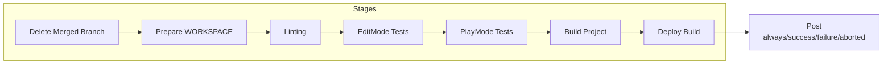
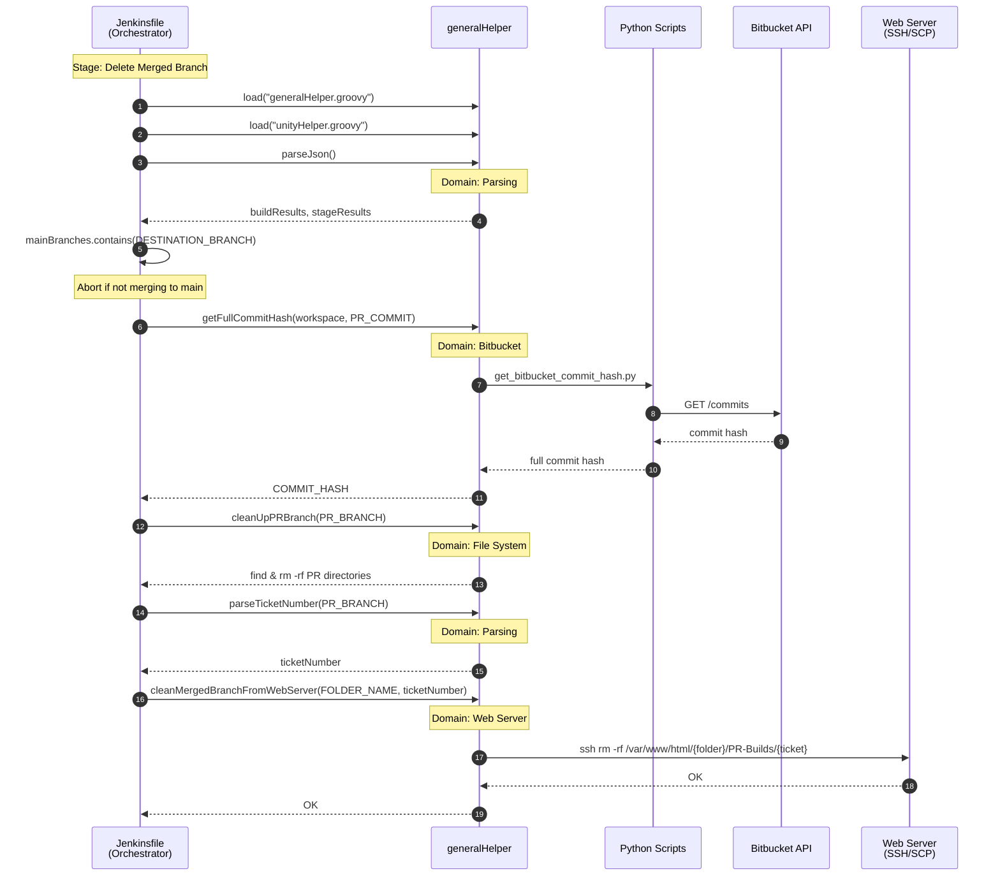
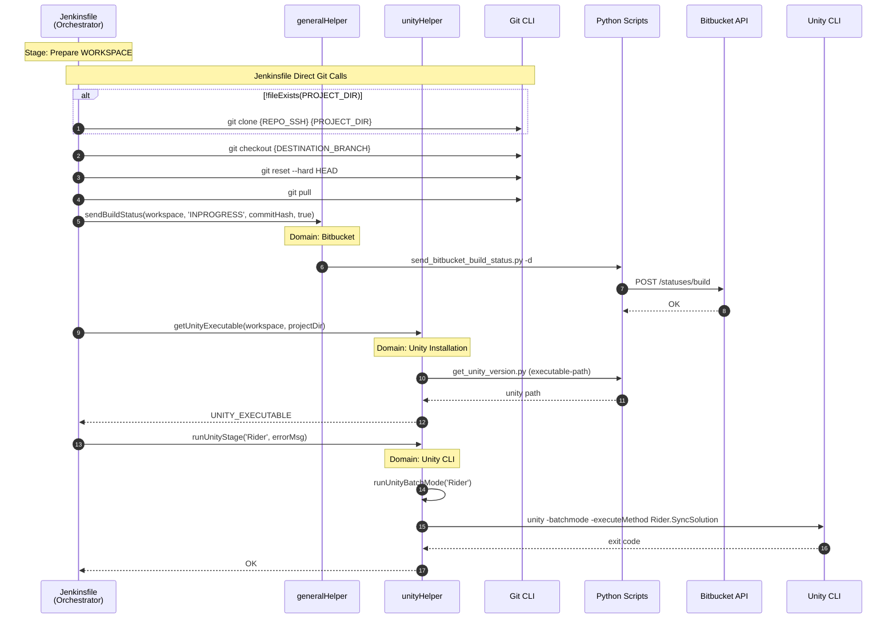
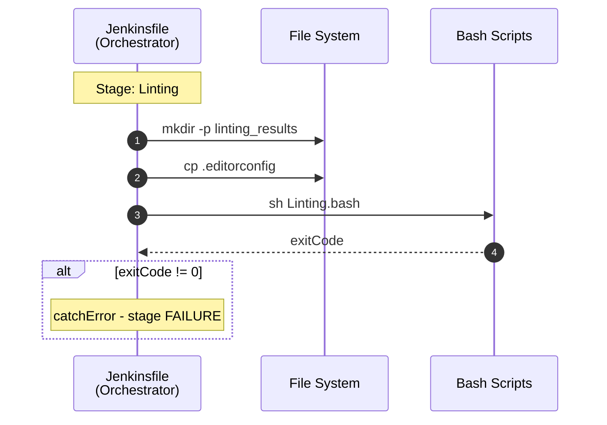
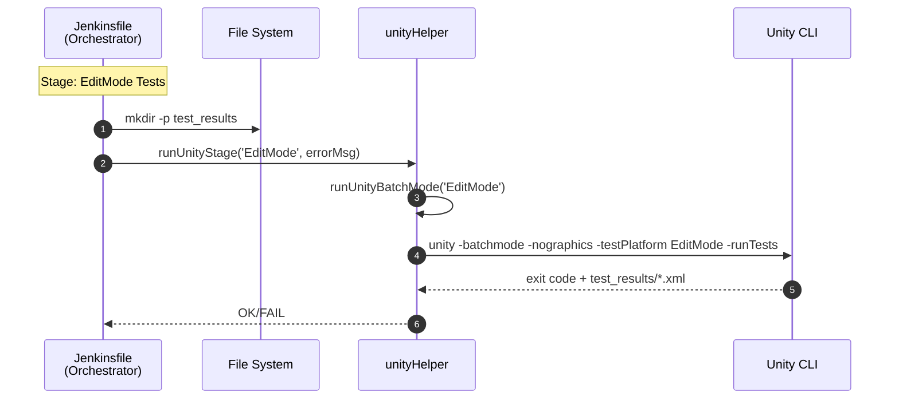
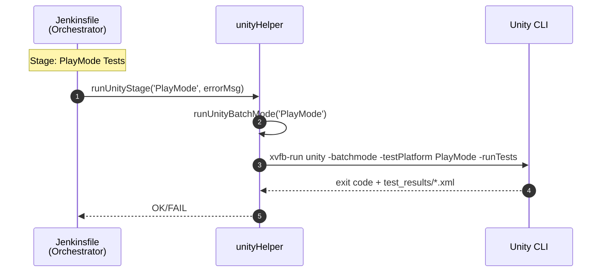
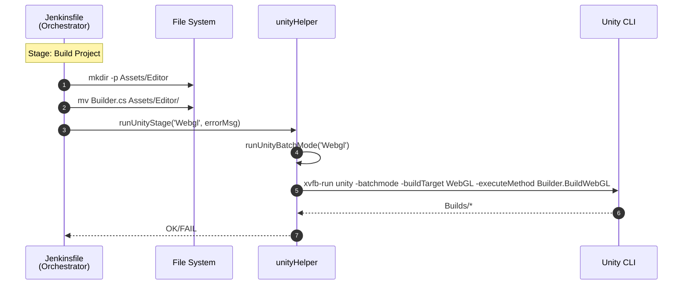
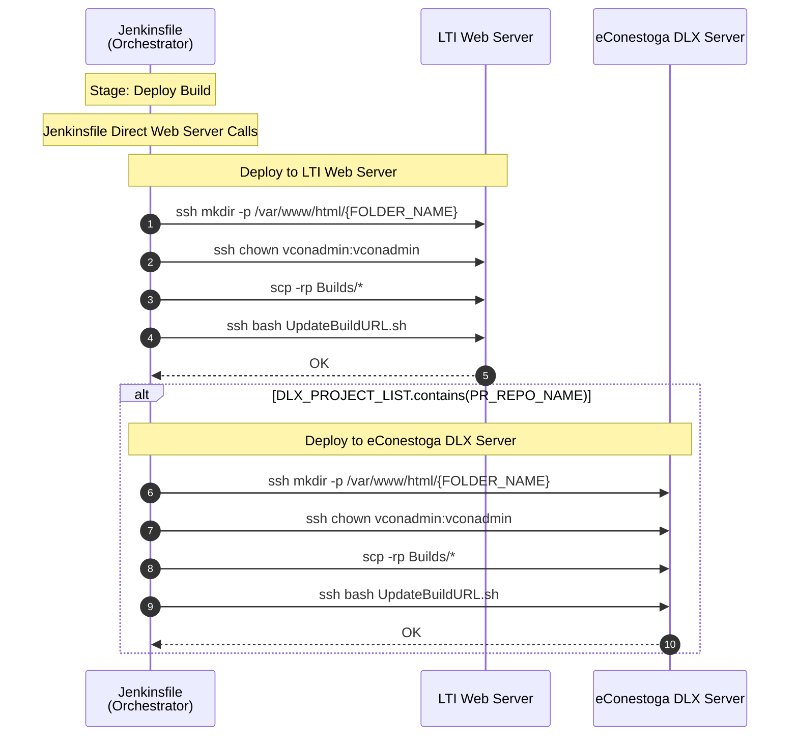
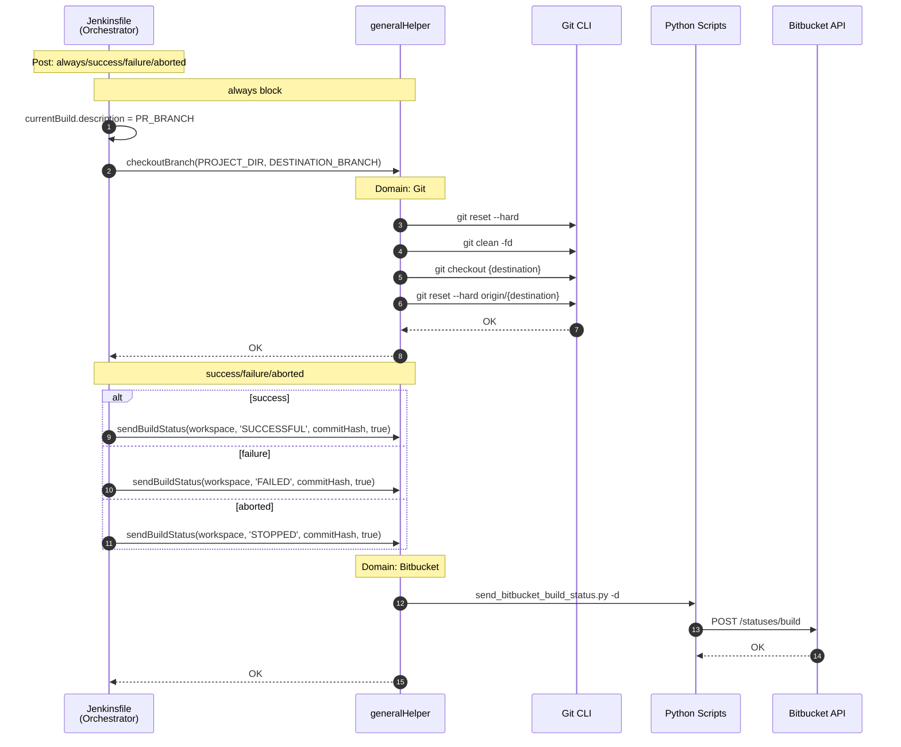

# DLX CD Pipeline Sequence Diagrams

> **Analysis Target**: `DLXJenkins/JenkinsfileDeployment` (DLX Unity CD Pipeline)
>
> **Related**: [Domain Mapping Summary](domain-mapping.md)

---

## Why Sequence Diagrams?

> **Q: Why use Sequence Diagrams for Jenkins Pipeline analysis?**
>
> A: Jenkins Pipeline is **procedural code**. Unlike OOP where classes naturally define domain boundaries, procedural code mixes multiple domains within sequential execution flow. Sequence Diagrams visualize the **call flow** between components, making it easier to identify which domains are involved at each stage.

> **Q: What is the goal of this analysis?**
>
> A: To **identify domains by function**. By tracing "who calls what", I can classify each function into its domain (Git, Bitbucket, Unity, etc.) and detect where domain boundaries are violated (e.g., one function mixing multiple domains).

---

## Domain Summary

### Helper Domains Used

| Helper | Domain | Functions Called | Used Stage |
|--------|--------|------------------|------------|
| generalHelper | Git | `checkoutBranch` | Post |
| generalHelper | Bitbucket | `getFullCommitHash`, `sendBuildStatus` | Delete Merged Branch, Prepare WORKSPACE, Post |
| generalHelper | Web Server | `cleanMergedBranchFromWebServer` | Delete Merged Branch |
| generalHelper | Parsing | `parseJson`, `parseTicketNumber` | Delete Merged Branch |
| generalHelper | File System | `cleanUpPRBranch` | Delete Merged Branch |
| unityHelper | Unity CLI | `runUnityStage` | Prepare WORKSPACE, EditMode, PlayMode, Build Project |
| unityHelper | Unity Installation | `getUnityExecutable` | Prepare WORKSPACE |

### Jenkinsfile Direct Calls

| Domain | Direct Call | Used Stage |
|--------|-------------|------------|
| Jenkins Pipeline DSL | `pipeline`, `stages`, `post`, `script`, `dir`, `credentials` | All |
| Git | `git clone`, `git checkout`, `git reset`, `git pull` | Prepare WORKSPACE |
| File System | `mkdir -p`, `cp`, `mv` | Linting, EditMode, Build Project |
| Linting (Bash) | `sh Linting.bash` | Linting |
| Web Server (SSH/SCP) | `ssh mkdir`, `ssh chown`, `scp`, `ssh bash UpdateBuildURL.sh` | Deploy Build |

### Domain Mapping by Stage

| Stage | Git | Bitbucket | Unity CLI | Unity Install | Web Server | Parsing | File System | Linting |
|-------|:---:|:---------:|:---------:|:-------------:|:----------:|:-------:|:-----------:|:-------:|
| Delete Merged Branch | | ✓ | | | ✓ | ✓ | ✓ | |
| Prepare WORKSPACE | ✓ | ✓ | ✓ | ✓ | | | | |
| Linting | | | | | | | ✓ | ✓ |
| EditMode Tests | | | ✓ | | | | ✓ | |
| PlayMode Tests | | | ✓ | | | | | |
| Build Project | | | ✓ | | | | ✓ | |
| Deploy Build | | | | | ✓ | | | |
| Post | ✓ | ✓ | | | | | | |

---

## Overall Pipeline Overview

---

## Stage 1: Delete Merged Branch

---

## Stage 2: Prepare WORKSPACE

---

## Stage 3: Linting

> **Note**: In DLX CD, linting results are **not** reported to Bitbucket (differs from CI)

---

## Stage 4: EditMode Tests

> **Note**: In DLX CD, Code Coverage is **not** generated (CI_PIPELINE=false)

---

## Stage 5: PlayMode Tests

---

## Stage 6: Build Project

> **Note**: In DLX CD, Build Report is **not** sent to Bitbucket (differs from CI)

---

## Stage 7: Deploy Build

---

## Post: always/success/failure/aborted

---

## Observations

### Delegation Pattern

| Pattern | Example | Count |
|---------|---------|:-----:|
| Jenkinsfile → generalHelper → External | `sendBuildStatus` → Python → Bitbucket API | 3 |
| Jenkinsfile → unityHelper → External | `runUnityStage` → Unity CLI | 4 |
| Jenkinsfile → Git direct | `git clone`, `git checkout`, `git pull` | 4 |
| Jenkinsfile → Web Server direct | `ssh`, `scp` in Deploy Build | 8 |
| Jenkinsfile → Bash direct | `Linting.bash` | 1 |

### CI vs CD Differences

| Item | DLX CI | DLX CD |
|------|--------|--------|
| Linting report to Bitbucket | ✓ | ✗ |
| Code Coverage generation | ✓ | ✗ |
| Build report to Bitbucket | ✓ | ✗ |
| Test report to Bitbucket | ✓ | ✗ |
| Web Server deployment | PR-Builds (reports) | Production (builds) |
| Git operations | Via generalHelper | Mixed (direct + helper) |

### Inconsistencies

| Issue | Description |
|-------|-------------|
| Mixed Git delegation | CI uses `cloneOrUpdateRepo`, CD uses direct Git commands in Prepare WORKSPACE |
| Mixed Web Server delegation | Delete Merged Branch uses helper, Deploy Build uses direct calls |
| No `initializeEnvironment` | CD calls `sendBuildStatus` directly instead of using mixed function |

---

[← Domain Mapping Summary](domain-mapping.md) | [DLX CI →](dlx-ci.md)