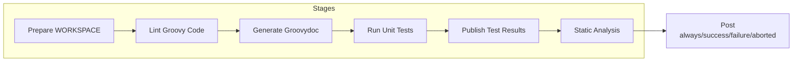
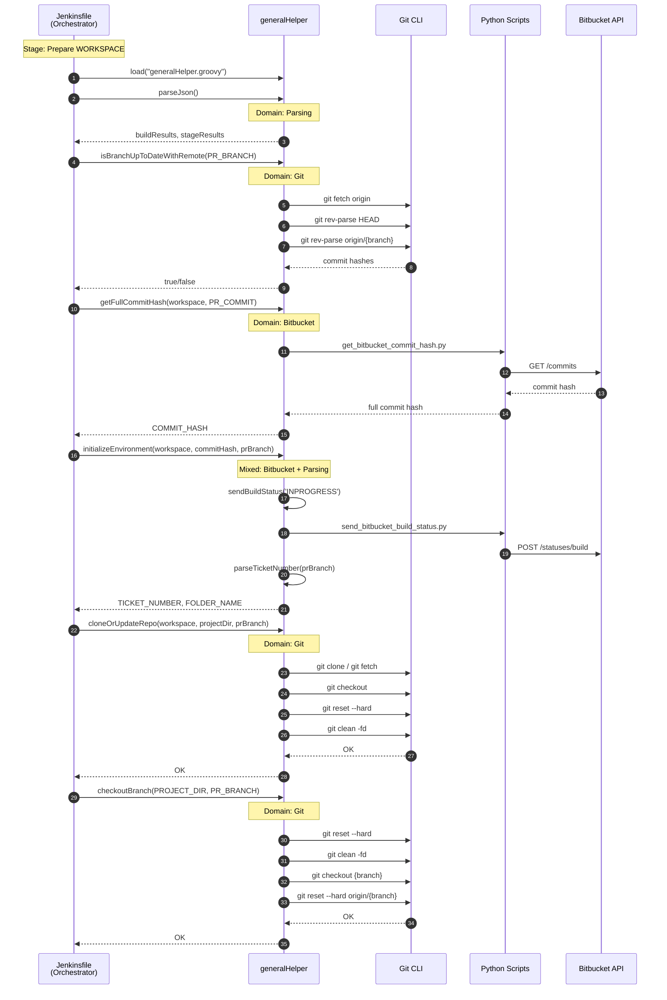
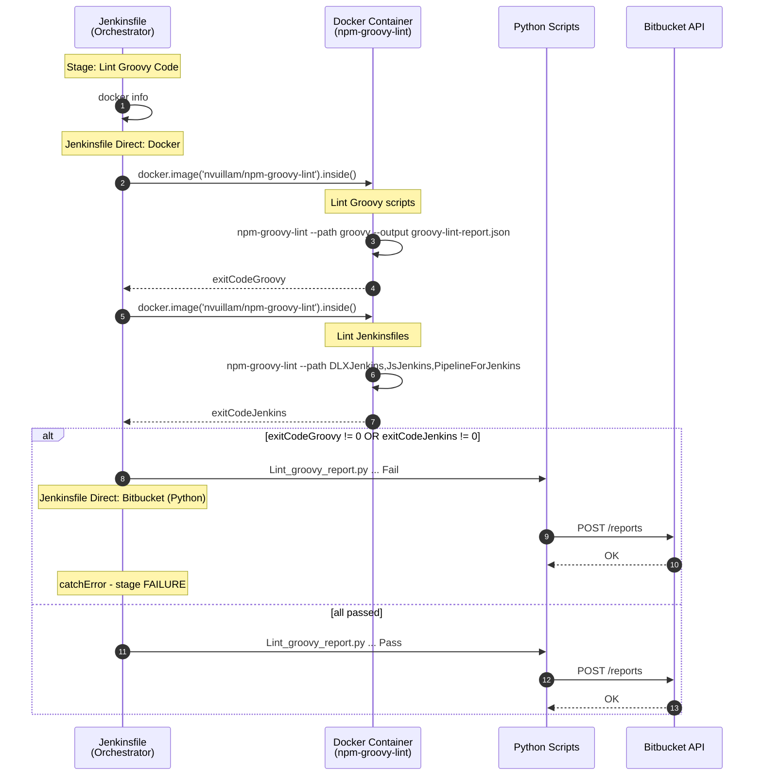
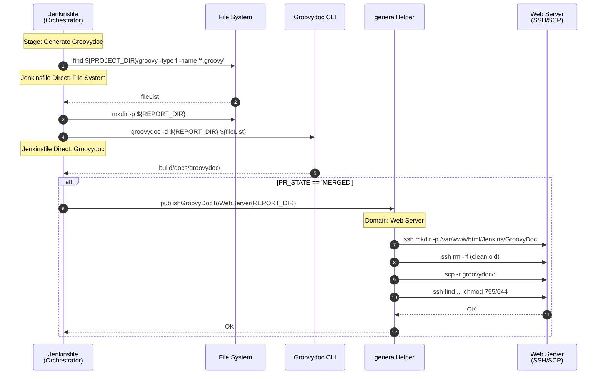
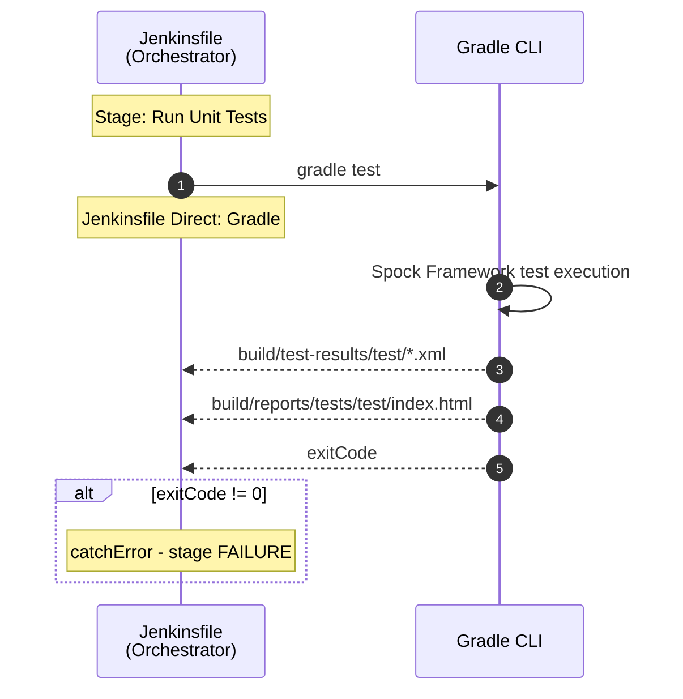
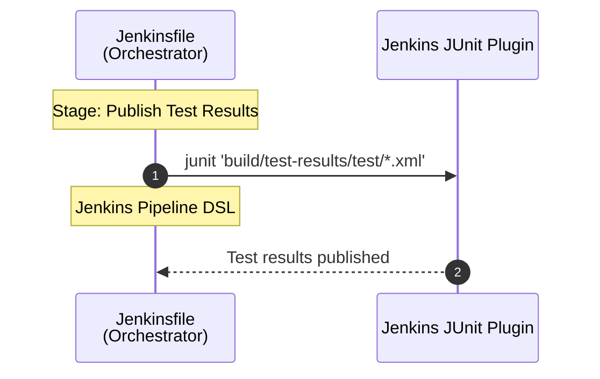
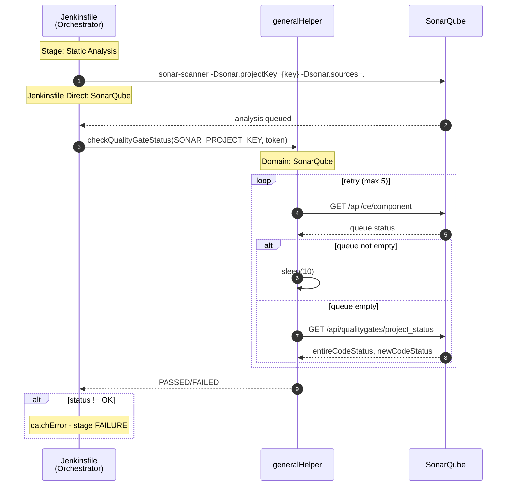
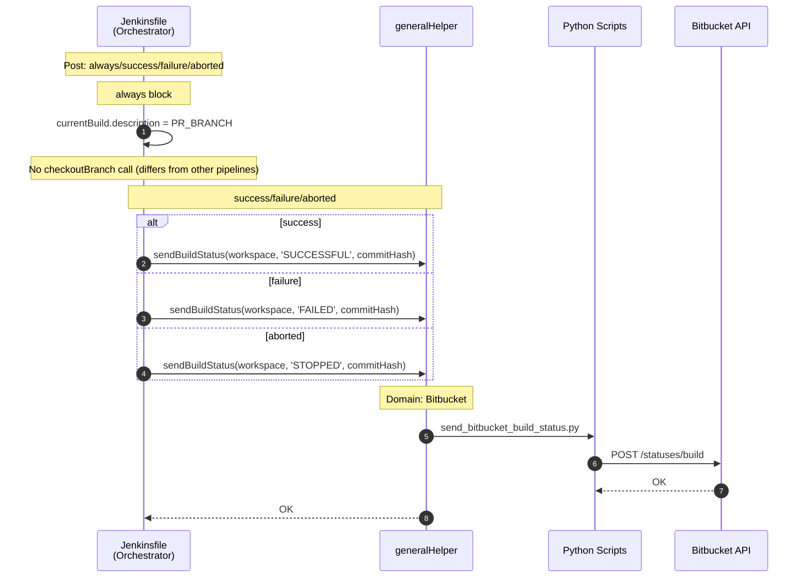

# Jenkins CI Pipeline Sequence Diagrams

> **Analysis Target**: `PipelineForJenkins/Jenkinsfile` (Jenkins Groovy CI Pipeline)
>
> **Trigger**: Runs when PR is `OPEN` or `MERGED` (differs from other pipelines)
>
> **Related**: [Domain Mapping Summary](domain-mapping.md)

---

## Why Sequence Diagrams?

> **Q: Why use Sequence Diagrams for Jenkins Pipeline analysis?**
>
> A: Jenkins Pipeline is **procedural code**. Unlike OOP where classes naturally define domain boundaries, procedural code mixes multiple domains within sequential execution flow. Sequence Diagrams visualize the **call flow** between components, making it easier to identify which domains are involved at each stage.

> **Q: What is the goal of this analysis?**
>
> A: To **identify domains by function**. By tracing "who calls what", I can classify each function into its domain (Git, Bitbucket, Unity, etc.) and detect where domain boundaries are violated (e.g., one function mixing multiple domains).

---

## Domain Summary

### Helper Domains Used

| Helper | Domain | Functions Called | Used Stage |
|--------|--------|------------------|------------|
| generalHelper | Git | `cloneOrUpdateRepo`, `isBranchUpToDateWithRemote`, `checkoutBranch` | Prepare WORKSPACE |
| generalHelper | Bitbucket | `getFullCommitHash`, `sendBuildStatus` | Prepare WORKSPACE, Post |
| generalHelper | Web Server | `publishGroovyDocToWebServer` | Generate Groovydoc (MERGED only) |
| generalHelper | SonarQube | `checkQualityGateStatus` | Static Analysis |
| generalHelper | Parsing | `parseJson` | Prepare WORKSPACE |
| generalHelper | Mixed (Bitbucket + Parsing) | `initializeEnvironment` | Prepare WORKSPACE |

### Jenkinsfile Direct Calls

| Domain | Direct Call | Used Stage |
|--------|-------------|------------|
| Jenkins Pipeline DSL | `pipeline`, `stages`, `post`, `script`, `dir`, `credentials`, `tool`, `withSonarQubeEnv`, `withCredentials`, `docker.image().inside()`, `junit` | All |
| Docker | `docker info`, `docker.image().inside()`, `npm-groovy-lint` | Lint Groovy Code |
| Gradle | `gradle test` | Run Unit Tests |
| Groovydoc | `groovydoc` | Generate Groovydoc |
| File System | `mkdir -p`, `find` | Generate Groovydoc |
| SonarQube | `sonar-scanner` | Static Analysis |
| Bitbucket (Python) | `Lint_groovy_report.py` | Lint Groovy Code |

### Domain Mapping by Stage

| Stage | Git | Bitbucket | Docker | Gradle | Groovydoc | Web Server | SonarQube | Parsing | File System |
|-------|:---:|:---------:|:------:|:------:|:---------:|:----------:|:---------:|:-------:|:-----------:|
| Prepare WORKSPACE | ✓ | ✓ | | | | | | ✓ | |
| Lint Groovy Code | | ✓ | ✓ | | | | | | |
| Generate Groovydoc | | | | | ✓ | ✓* | | | ✓ |
| Run Unit Tests | | | | ✓ | | | | | |
| Publish Test Results | | | | | | | | | |
| Static Analysis | | | | | | | ✓ | | |
| Post | | ✓ | | | | | | | |

> *Web Server: Groovydoc deployed only when `PR_STATE == 'MERGED'`

---

## Overall Pipeline Overview

---

## Stage 1: Prepare WORKSPACE

> **Note**: Unlike other CI pipelines, Jenkins CI does **not** call `mergeBranchIfNeeded`

---

## Stage 2: Lint Groovy Code

---

## Stage 3: Generate Groovydoc

---

## Stage 4: Run Unit Tests

---

## Stage 5: Publish Test Results

> **Note**: Unlike other pipelines, Jenkins CI does **not** send test/coverage reports to Bitbucket via Python scripts

---

## Stage 6: Static Analysis

---

## Post: always/success/failure/aborted

---

## Observations

### Delegation Pattern

| Pattern | Example | Count |
|---------|---------|:-----:|
| Jenkinsfile → generalHelper → External | `sendBuildStatus` → Python → Bitbucket API | 4 |
| Jenkinsfile → Docker direct | `docker.image().inside()` → npm-groovy-lint | 2 |
| Jenkinsfile → Gradle direct | `gradle test` | 1 |
| Jenkinsfile → Groovydoc direct | `groovydoc` | 1 |
| Jenkinsfile → SonarQube direct | `sonar-scanner` | 1 |
| Jenkinsfile → Python direct | `Lint_groovy_report.py` | 1 |

### CI Pipeline Comparison (DLX CI vs JS CI vs Jenkins CI)

| Item | DLX CI | JS CI | Jenkins CI |
|------|--------|-------|------------|
| Tool | Unity CLI | Node.js (npm) | Gradle + Docker |
| Helper | unityHelper | jsHelper | **(none)** |
| Trigger | OPEN | OPEN | **OPEN + MERGED** |
| `initializeEnvironment` | ✓ | ✓ | ✓ |
| `mergeBranchIfNeeded` | ✓ | ✓ | **✗** |
| `checkoutBranch` in Post | ✓ | ✓ | **✗** |
| Linting | Bash Script (C#) | jsHelper (ESLint) | Docker (npm-groovy-lint) |
| Test Type | EditMode/PlayMode | Jest | Spock (Gradle) |
| Code Coverage | Unity Code Coverage | lcov-report | JaCoCo |
| Static Analysis | No | SonarQube | SonarQube |
| Build Project | WebGL | No | No |
| Documentation | No | No | **Groovydoc** |
| Test Report to Bitbucket | ✓ (Python) | ✓ (Python) | **✗** |

### Inconsistencies

| Issue | Description |
|-------|-------------|
| Mixed domain function | `initializeEnvironment` combines Bitbucket + Parsing (SRP violation) |
| No `mergeBranchIfNeeded` | Unlike other CI pipelines, does not merge default branch before build |
| No `checkoutBranch` in Post | Unlike other pipelines, does not return to destination branch after build |
| No test report to Bitbucket | Unlike DLX CI and JS CI, does not send test/coverage reports via Python |
| No dedicated Helper | Unlike DLX (unityHelper) and JS (jsHelper), no project-specific helper |

---

[← JS CD](js-cd.md) | [Domain Mapping Summary →](domain-mapping.md)