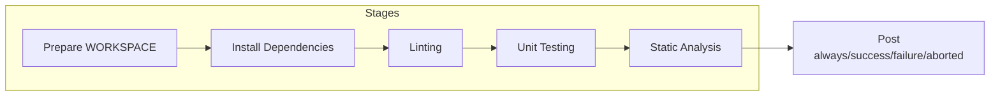
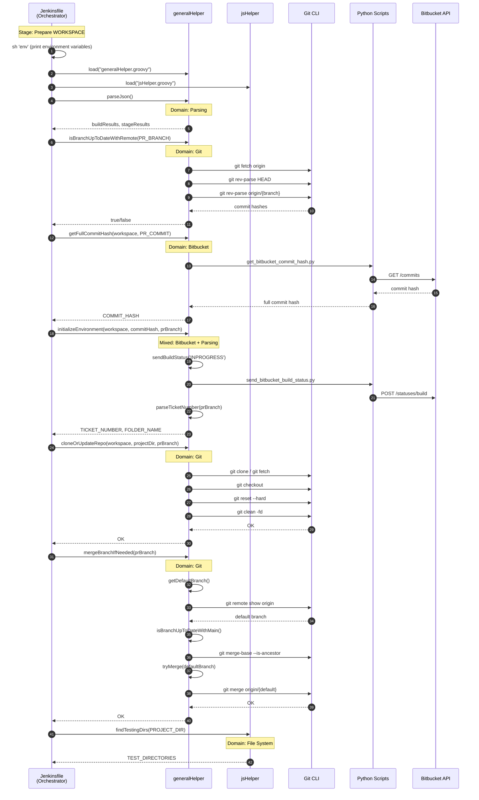
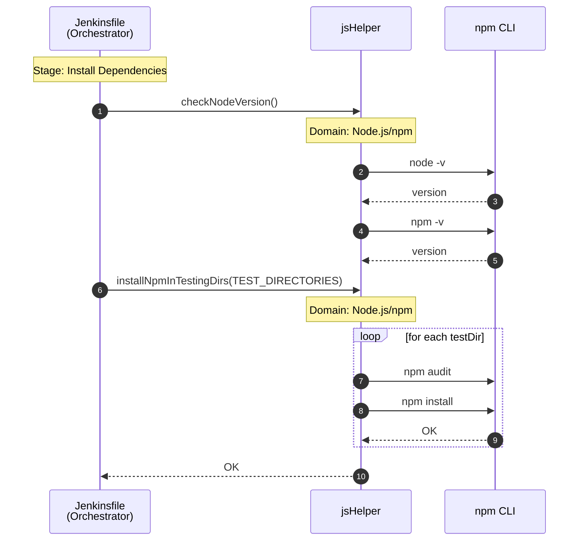
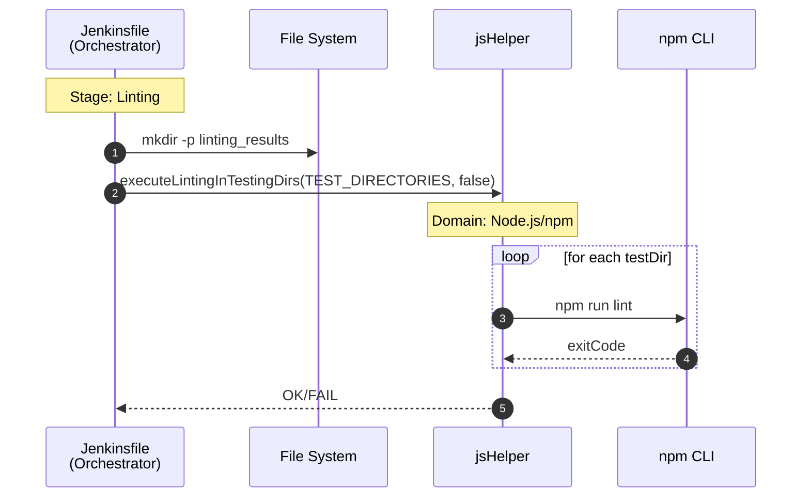
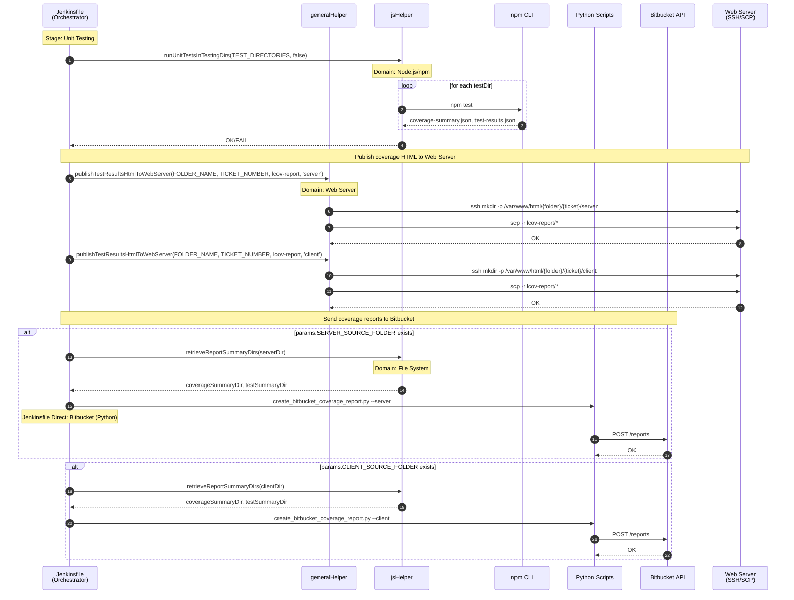
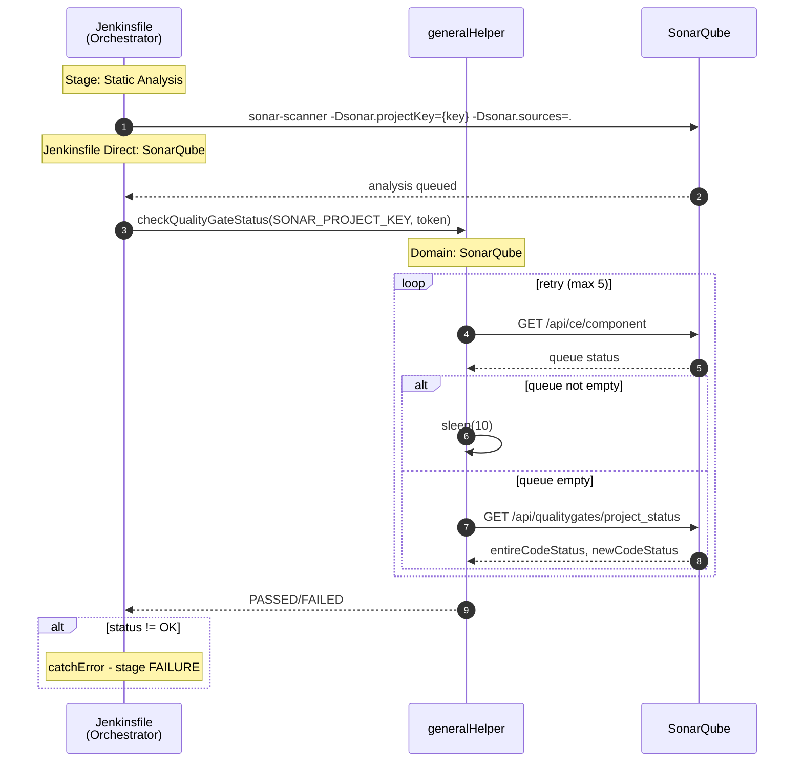
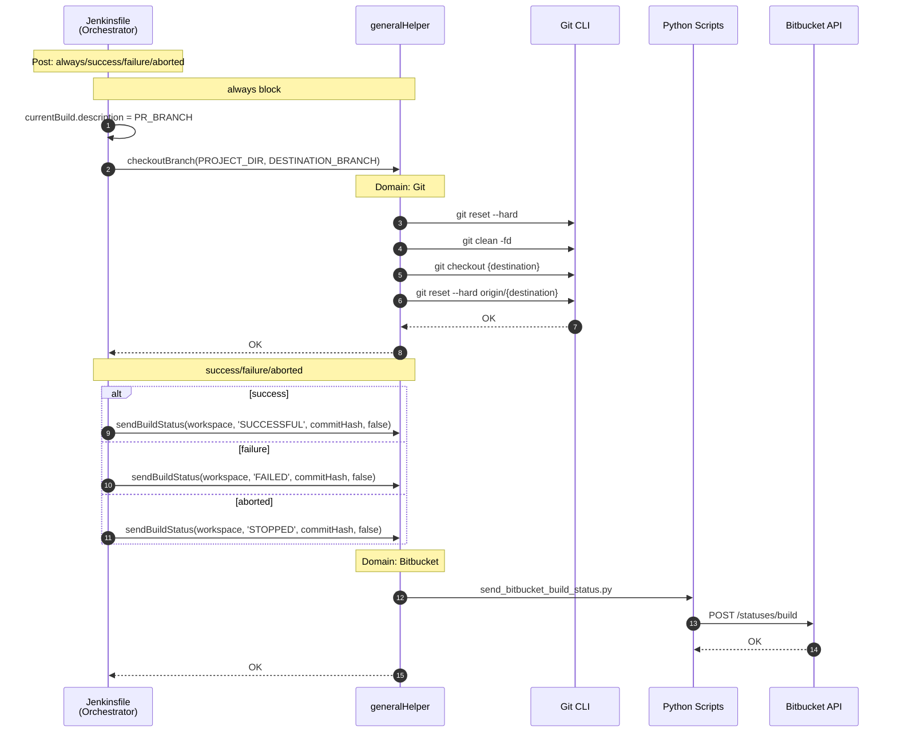

# JS CI Pipeline Sequence Diagrams

> **Analysis Target**: `JsJenkins/Jenkinsfile` (JavaScript CI Pipeline)
>
> **Trigger**: Runs when PR is `OPEN`
>
> **Related**: [Domain Mapping Summary](domain-mapping.md)

---

## Why Sequence Diagrams?

> **Q: Why use Sequence Diagrams for Jenkins Pipeline analysis?**
>
> A: Jenkins Pipeline is **procedural code**. Unlike OOP where classes naturally define domain boundaries, procedural code mixes multiple domains within sequential execution flow. Sequence Diagrams visualize the **call flow** between components, making it easier to identify which domains are involved at each stage.

> **Q: What is the goal of this analysis?**
>
> A: To **identify domains by function**. By tracing "who calls what", I can classify each function into its domain (Git, Bitbucket, Unity, etc.) and detect where domain boundaries are violated (e.g., one function mixing multiple domains).

---

## Domain Summary

### Helper Domains Used

| Helper | Domain | Functions Called | Used Stage |
|--------|--------|------------------|------------|
| generalHelper | Git | `cloneOrUpdateRepo`, `mergeBranchIfNeeded`, `isBranchUpToDateWithRemote`, `checkoutBranch` | Prepare WORKSPACE, Post |
| generalHelper | Bitbucket | `getFullCommitHash`, `sendBuildStatus` | Prepare WORKSPACE, Post |
| generalHelper | Web Server | `publishTestResultsHtmlToWebServer` | Unit Testing |
| generalHelper | SonarQube | `checkQualityGateStatus` | Static Analysis |
| generalHelper | Parsing | `parseJson` | Prepare WORKSPACE |
| generalHelper | Mixed (Bitbucket + Parsing) | `initializeEnvironment` | Prepare WORKSPACE |
| jsHelper | Node.js/npm | `checkNodeVersion`, `installNpmInTestingDirs`, `executeLintingInTestingDirs`, `runUnitTestsInTestingDirs` | Install Dependencies, Linting, Unit Testing |
| jsHelper | File System | `findTestingDirs`, `retrieveReportSummaryDirs` | Prepare WORKSPACE, Unit Testing |

### Jenkinsfile Direct Calls

| Domain | Direct Call | Used Stage |
|--------|-------------|------------|
| Jenkins Pipeline DSL | `pipeline`, `stages`, `post`, `script`, `dir`, `credentials`, `tool`, `withSonarQubeEnv`, `withCredentials` | All |
| File System | `mkdir -p` | Linting |
| SonarQube | `sonar-scanner` | Static Analysis |
| Bitbucket (Python) | `create_bitbucket_coverage_report.py` | Unit Testing |

### Domain Mapping by Stage

| Stage | Git | Bitbucket | Node.js | Web Server | SonarQube | Parsing | File System |
|-------|:---:|:---------:|:-------:|:----------:|:---------:|:-------:|:-----------:|
| Prepare WORKSPACE | ✓ | ✓ | | | | ✓ | ✓ |
| Install Dependencies | | | ✓ | | | | |
| Linting | | | ✓ | | | | ✓ |
| Unit Testing | | ✓ | ✓ | ✓ | | | ✓ |
| Static Analysis | | | | | ✓ | | |
| Post | ✓ | ✓ | | | | | |

---

## Overall Pipeline Overview

---

## Stage 1: Prepare WORKSPACE

---

## Stage 2: Install Dependencies

---

## Stage 3: Linting

---

## Stage 4: Unit Testing

---

## Stage 5: Static Analysis

---

## Post: always/success/failure/aborted

---

## Observations

### Delegation Pattern

| Pattern | Example | Count |
|---------|---------|:-----:|
| Jenkinsfile → generalHelper → External | `sendBuildStatus` → Python → Bitbucket API | 6 |
| Jenkinsfile → jsHelper → External | `installNpmInTestingDirs` → npm CLI | 4 |
| Jenkinsfile → Python direct | `create_bitbucket_coverage_report.py` | 2 |
| Jenkinsfile → SonarQube direct | `sonar-scanner` | 1 |

### DLX CI vs JS CI Comparison

| Item | DLX CI | JS CI |
|------|--------|-------|
| Build Tool | Unity CLI | Node.js (npm) |
| Helper | unityHelper | jsHelper |
| Install Dependencies | No | Yes (`installNpmInTestingDirs`) |
| Linting | Bash Script (C#) | jsHelper (`executeLintingInTestingDirs`) |
| Test Type | EditMode/PlayMode | Jest (`runUnitTestsInTestingDirs`) |
| Code Coverage | Unity Code Coverage | lcov-report |
| Static Analysis | No | SonarQube |
| Build Project | WebGL | No |
| `initializeEnvironment` | ✓ | ✓ |

### Inconsistencies

| Issue | Description |
|-------|-------------|
| Mixed domain function | `initializeEnvironment` combines Bitbucket + Parsing (SRP violation) |
| Direct Python calls | `create_bitbucket_coverage_report.py` bypasses Helper |
| Direct SonarQube call | `sonar-scanner` called directly, but `checkQualityGateStatus` via generalHelper |

---

[← Domain Mapping Summary](domain-mapping.md) | [JS CD →](js-cd.md)