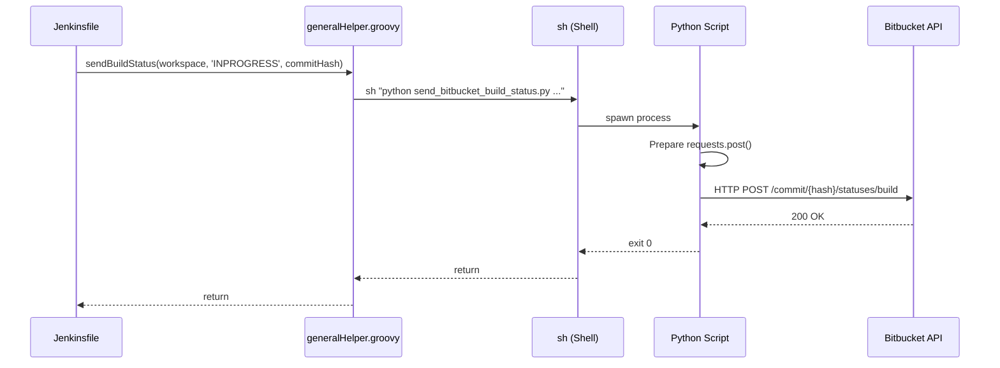
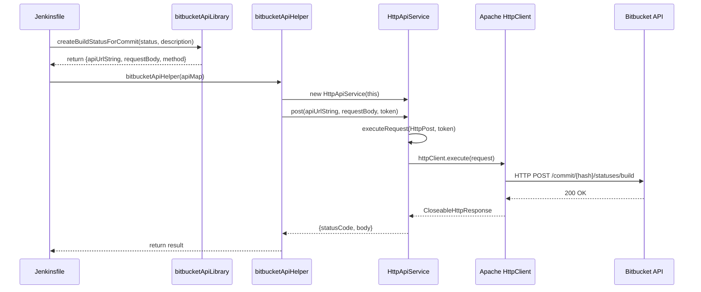
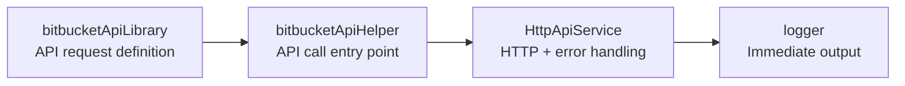
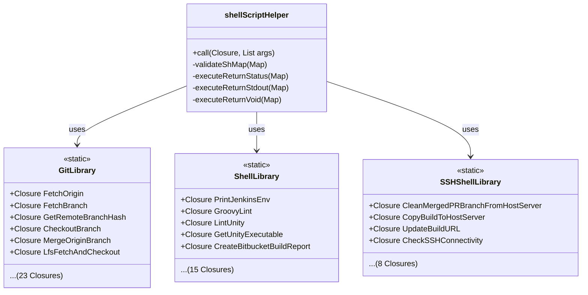
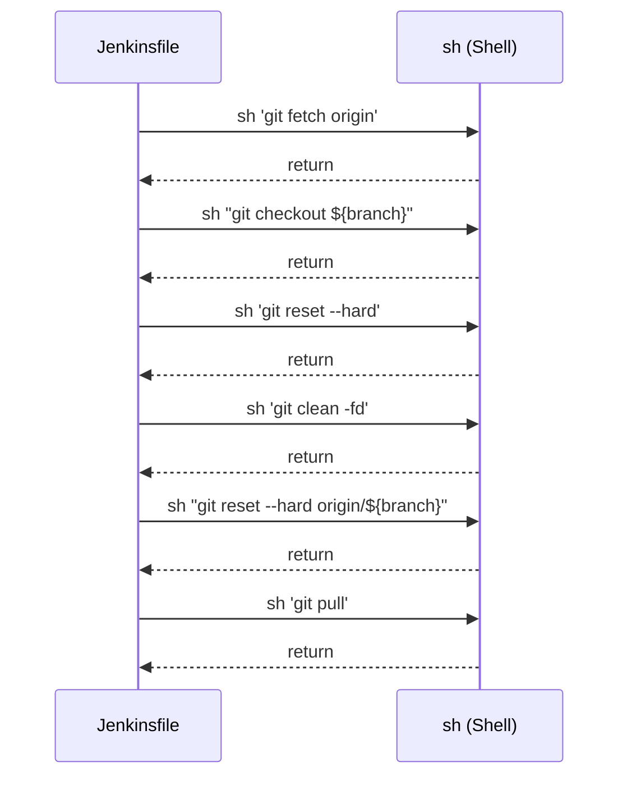
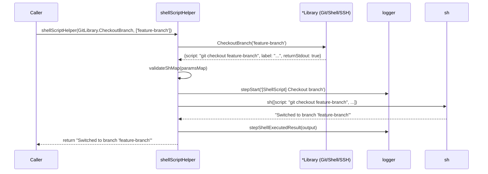
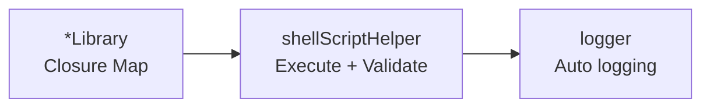
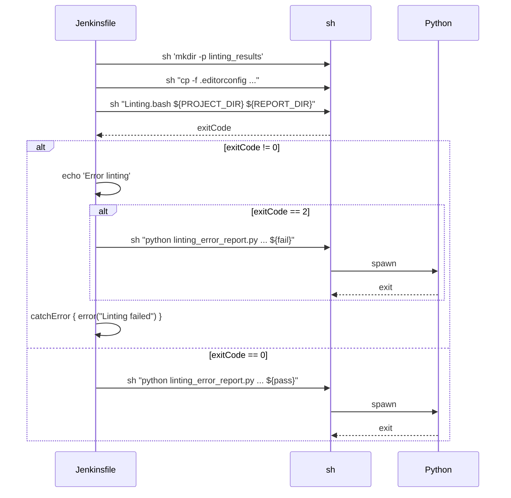
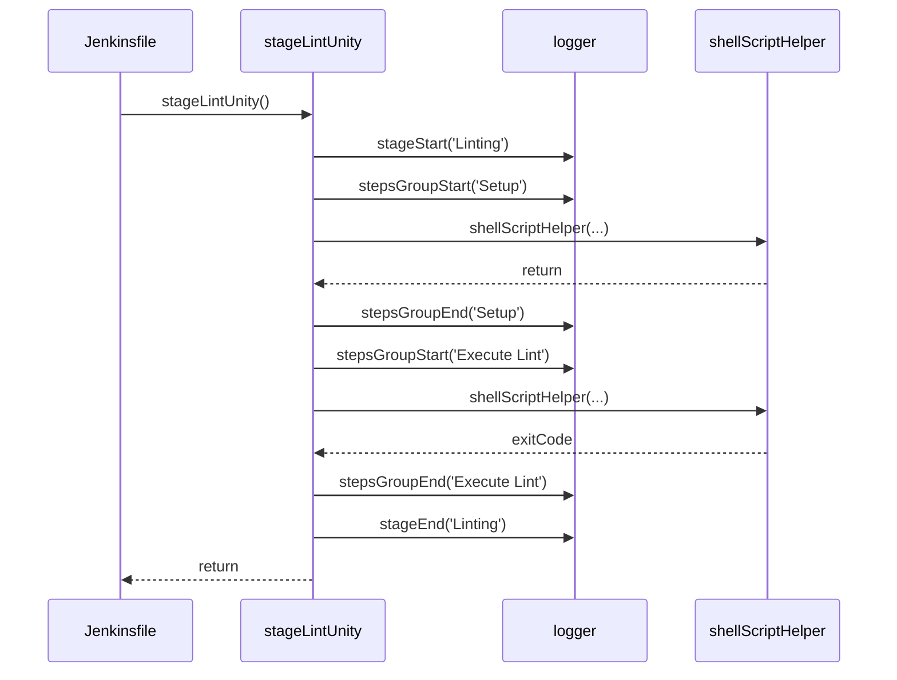

# Solution by Feature

> Feature-by-feature breakdown of the refactoring changes.
>
> For layer-by-layer architecture analysis, see [solution-by-layer.md](solution-by-layer.md).
> For high-level overview, see [README.md](README.md).

---

## Reference Commits

| State | Commit Hash | Date |
|-------|-------------|------|
| **Baseline (Before)** | [`74fc356`](https://github.com/JindoKimKor/devops-jenkins-linux/tree/74fc3563713df593f070f1c418ef9ee68f2682ed) | 2025-03-20 |
| **Final (After)** | [`ff74ac8`](https://github.com/JindoKimKor/devops-jenkins-linux/tree/ff74ac8) | 2025-05-12 |

---

## Table of Contents

- [Bitbucket API Migration](#1-bitbucket-api-migration)
- [Shell Script Libraries](#2-shell-script-libraries)
- [Stage Modularization](#3-stage-modularization)
- [Testability](#4-testability)
- [Logger System Integration](#5-logger-system-integration)
- [Reference](#6-reference)

---

## 1. Bitbucket API Migration

Migrated from Python subprocess to Native Groovy/Java HTTP Client.

### 1.1 Folder Structure Comparison

```
Before (74fc356)                          After (ff74ac8)
─────────────────                         ─────────────────
devops-jenkins-linux/                     devops-jenkins-linux/
├── DLXJenkins/                           ├── DLXJenkins/
│   └── Jenkinsfile ←───────────┐         │   └── Jenkinsfile ←─────────────────────────┐
├── groovy/                     │         └── sharedLibraries/                          │
│   └── generalHelper.groovy ←──┤             ├── vars/                                 │
└── python/                     │             │   ├── bitbucketApiHelper.groovy ←───────┤
    └── send_bitbucket_build_   │             │   └── bitbucketApiLibrary.groovy ←──────┤
        status.py ←─────────────┘             └── src/service/general/                  │
                                                  └── HttpApiService.groovy ←───────────┘
                                                     (formerly BitbucketApiService)
```

### 1.2 Before (`74fc356`)



**Code Path**:
- `DLXJenkins/Jenkinsfile` → `groovy/generalHelper.groovy:sendBuildStatus()` → `python/send_bitbucket_build_status.py`

> **Problems**:
> - Python process spawn overhead
> - External dependency (requests library)
> - Distributed error handling

### 1.3 After (`ff74ac8`)



> Note: `HttpApiService` was initially named `BitbucketApiService`, later renamed for generalization.

**Code Path**:
```
Jenkinsfile (post block)
  → bitbucketApiLibrary.createBuildStatusForCommit()  // returns Map
  → bitbucketApiHelper(Map)                           // entry point
    → HttpApiService.post()                           // HTTP execution
      → executeRequest()                              // error handling
```

> **Improvements**:
> - HTTP processing within JVM (no process spawn)
> - Structured error handling (Exception hierarchy)
> - Reusable API Service class

### 1.4 Design Decisions

#### Problem Situation

- Time-consuming to diagnose Bitbucket API communication failures when Jenkins service URL's third-party certificate expired
- Inconsistent error handling across Python scripts
- No distinction between network error types

#### Solution: Centralized Error Handling

`HttpApiService.executeRequest()` classifies all HTTP request errors by type:

| Exception | Cause | Log Message |
|-----------|-------|-------------|
| `UnknownHostException` | DNS/URL issue | "Unable to resolve host" |
| `ConnectException` | TCP connection failure | "Failed to establish TCP connection" |
| `SocketTimeoutException` | Network timeout | "Connection timed out" |
| `SSLHandshakeException` | Certificate error | "TLS Handshake failed - possible certificate error" |
| `ConnectionClosedException` | Premature connection closure | "Connection closed prematurely" |
| `IOException` | General I/O error | "I/O error occurred" |

#### Structure



---

## 2. Shell Script Libraries

Library system abstracting shell commands using Closure pattern. Three domain-specific Libraries: Git, Shell, SSH.

### 2.1 File Structure

```
sharedLibraries/
├── vars/
│   └── shellScriptHelper.groovy      ← Closure execution + logging integration
│       ├── call(Closure, List args)
│       ├── validateShMap(Map)
│       ├── executeReturnStatus(Map)
│       ├── executeReturnStdout(Map)
│       └── executeReturnVoid(Map)
│
└── src/utils/
    ├── GitLibrary.groovy (258 lines)     ← Git command Closures (23)
    ├── ShellLibrary.groovy (210 lines)   ← General shell command Closures (15)
    └── SSHShellLibrary.groovy (99 lines) ← SSH/SCP remote command Closures (8)
```

### 2.2 Closure Pattern Structure



### 2.3 Before (`74fc356`)



> **Problems**:
> - Same git commands duplicated across multiple pipelines
> - No error handling
> - No logging
> - Untestable

### 2.4 After (`ff74ac8`)



> **Improvements**:
> - Shell command reuse through Closure pattern
> - Automatic logging integration
> - Consistent error handling
> - Centralized validation logic

### 2.5 Closure List by Library

<details>
<summary><strong>GitLibrary (23 Closures) - Git Version Control</strong></summary>

| Closure | Parameters | Return Type | Purpose |
|---------|------------|-------------|---------|
| `FetchOrigin` | - | void | Fetch origin |
| `FetchBranch` | branchName | void | Fetch specific branch |
| `GetRemoteBranchHash` | branchName | stdout | Remote branch commit hash |
| `CloneRepository` | gitUrl, projectDir | void | Clone repository |
| `ShowCurrentBranch` | - | stdout | Current branch name |
| `RemoveIndexLock` | - | void | Remove .git/index.lock |
| `ResetHardHead` | - | stdout | Hard reset to HEAD |
| `CleanUntracked` | - | stdout | Delete untracked files |
| `CheckoutBranch` | branchName | stdout | Checkout branch |
| `ResetHardOriginBranch` | branchName | stdout | Reset to origin branch |
| `Pull` | - | stdout | Git pull |
| `GetOriginDefaultBranch` | - | stdout | Default branch name |
| `CheckOriginBranchExists` | branchName | status | Check remote branch exists |
| `CheckBranchExists` | targetBranch | status | Check local branch exists |
| `CheckUpToDateWithRemote` | branchName | status | Check sync with remote |
| `CheckIsRemoteBranchAncestor` | remoteBranchName | status | Check ancestor branch |
| `MergeOriginBranch` | branchToMerge | status | Merge remote branch |
| `LfsFetchAndCheckout` | - | status | LFS file fetch & checkout |

</details>

<details>
<summary><strong>ShellLibrary (15 Closures) - General Shell Commands</strong></summary>

| Closure | Parameters | Return Type | Purpose |
|---------|------------|-------------|---------|
| `PrintJenkinsEnv` | - | stdout | Print environment variables |
| `FindPRJobDirectory` | workingDir, prBranch | stdout | Search PR Job directory |
| `FindProjectDirectory` | workingDir, projectType | status | Search project directory |
| `DockerInfo` | - | stdout | Print Docker info |
| `GroovyLint` | reportFile, configFile, targetDir, desc | status | Groovy linting |
| `GetUnityExecutable` | workspace, projectDir | stdout | Unity executable path |
| `CreateLintingResultsDir` | workingDir | status | Create linting results directory |
| `CopyWebGLBuilder` | projectDir | status | Copy WebGL Builder |
| `CopyLintConfig` | workingDir, projectDir | status | Copy .editorconfig |
| `LintUnity` | workingDir, projectDir, reportDir | status | Unity project linting |
| `ExecutePythonStatusReport` | workingDir, projectDir, reportDir, status, commit | stdout | Python status report |
| `CreateBitbucketBuildReport` | workspace, commit, logPath, debugMode | status | Bitbucket build report |
| `CreateBitbucketTestReport` | workspace, commitHash, reportDir | status | Bitbucket test report |

</details>

<details>
<summary><strong>SSHShellLibrary (8 Closures) - SSH/SCP Remote Commands</strong></summary>

| Closure | Parameters | Return Type | Purpose |
|---------|------------|-------------|---------|
| `CleanMergedPRBranchFromHostServer` | folderName, ticketNumber, sshKey, hostUrl | stdout | Clean PR branch artifacts |
| `CreateDirectoryAndSetPermission` | folderName, sshKey, hostUrl | status | Create remote directory |
| `CopyBuildToHostServer` | folderName, sshKey, hostUrl, projectDir | status | SCP build transfer |
| `UpdateBuildURL` | folderName, sshKey, hostUrl | status | Update build URL |
| `CreateDirectoryAndSetPermissionForEconestogaDlxServer` | folderName, sshKey, econestogaUrl | status | Econestoga server directory creation |
| `CopyBuildToEconestogaDlxServer` | folderName, sshKey, econestogaUrl, projectDir | status | Econestoga server SCP transfer |
| `UpdateBuildURLForEconestogaDlxServer` | folderName, sshKey, econestogaUrl | status | Econestoga URL update |
| `CheckSSHConnectivity` | sshKey, hostUrl | stdout | SSH connection test |

</details>

### 2.6 Closure Map Schema

```groovy
[
    script: String,        // (Required) Shell script to execute
    label: String,         // (Required) Description shown in Jenkins build log
    returnStdout: Boolean, // (Optional) Return stdout
    returnStatus: Boolean, // (Optional) Return exit code
    returnStderr: Boolean, // (Optional) Return stderr
    encoding: String       // (Optional) Encoding (default: UTF-8)
]
```

**Constraint**: Only one of `returnStdout`, `returnStatus`, `returnStderr` can be true

### 2.7 Design Decisions

#### Pattern Identification

Analysis of all `sh` calls across pipelines revealed three domains:

| Domain | Library | Purpose |
|--------|---------|---------|
| **Git** | GitLibrary | Version control commands (fetch, checkout, merge, etc.) |
| **Shell** | ShellLibrary | General system commands (lint, copy, mkdir, etc.) |
| **SSH** | SSHShellLibrary | Remote server commands (scp, ssh, etc.) |

#### Logger System Integration

Clear return type rules enable automatic logging in `shellScriptHelper`:



- **Success**: Call `stepSuccess()`
- **Failure**: Call `stepError()` (pipeline abort)
- **Warning**: Call `stepWarning()` (specific status codes)

---

## 3. Stage Modularization

### 3.1 Folder Structure Comparison (Linting Stage Example)

```
Before (74fc356)                                    After (ff74ac8)
─────────────────                                   ─────────────────
devops-jenkins-linux/                               devops-jenkins-linux/
├── DLXJenkins/                                     ├── DLXJenkins/
│   ├── Jenkinsfile                                 │   ├── Jenkinsfile
│   │   stage('Linting') {Inline/Duplicated}        │   │   stage('Linting') { stageLintUnity() }
│   └── JenkinsfileDeployment                       │   └── JenkinsfileDeployment
│       stage('Linting') {Inline/Duplicated}        │       stage('Linting') { stageLintUnity() }
├── JsJenkins/                                      ├── JsJenkins/
│   ├── Jenkinsfile                                 │   ├── Jenkinsfile
│   │   stage('Linting') {Inline/Duplicated}        │   │   stage('Linting') { stageLintJs() } *
│   └── JenkinsfileDeployment                       │   └── JenkinsfileDeployment
│       stage('Linting') {Inline/Duplicated}        │       stage('Linting') { stageLintJs() } *
├── PipelineForJenkins/                             ├── PipelineForJenkins/
│   └── Jenkinsfile                                 │   └── Jenkinsfile
│       stage('Lint Groovy Code') {                 │       stage('Lint Groovy Code') {
│           Inline/Duplicated }                     │           stageLintGroovyJenkinsfile() }
│                                                   │
└── groovy/                                         └── sharedLibraries/vars/
    ├── generalHelper.groovy                            ├── stageLintUnity.groovy
    └── unityHelper.groovy                              ├── stageLintJs.groovy *
                                                        └── stageLintGroovyJenkinsfile.groovy
```

> *stageLintJs is not yet developed

### 3.2 Linting Stage Example

#### Before (`74fc356`) - ~50 lines



> **Problems**:
> - Same Stage logic Inline/Duplicated across 5 pipelines
> - Modifications require changes in all 5 places
> - No logging, untestable

#### After (`ff74ac8`) - 1 line



> **Improvements**:
> - Stage logic separated into module files (`stage*.groovy`)
> - Pipeline calls replaced with 1-line invocation
> - Automatic Logger system integration
> - Single Source of Truth

### 3.3 Complete Stage Modularization Design

<details>
<summary><strong>Before/After Stage Mapping (Click to expand)</strong></summary>

```
Before (74fc356)                                    After (ff74ac8)
─────────────────                                   ─────────────────
DLXJenkins/Jenkinsfile                              DLXJenkins/Jenkinsfile
├── stage('Prepare WORKSPACE')                      ├── stage('Jenkins Initialization') { stageInitialization() }
├── stage('Linting')                                ├── stage('Prepare Project') { stageProjectPrepare() }
├── stage('EditMode Tests')                         ├── stage('Linting') { stageLintUnity() }
├── stage('PlayMode Tests in Editor')               ├── stage('Unity Execution') { stageUnityExecution() }
├── stage('Code Coverage Send Reports')             └── stage('Send Build Results') { stageSendBuildResults() }
└── stage('Build Project')
                                                    DLXJenkins/JenkinsfileDeployment
DLXJenkins/JenkinsfileDeployment                    ├── stage('Cleanup PR Branch Artifacts') { stageCleanupPRBranchArtifacts() }
├── stage('Delete Merged Branch')                   ├── stage('Jenkins Initialization') { stageInitialization() }
├── stage('Prepare WORKSPACE')                      ├── stage('Prepare Project') { stageProjectPrepare() }
├── stage('Linting')                                ├── stage('Linting') { stageLintUnity() }
├── stage('EditMode Tests')                         ├── stage('Unity Execution') { stageUnityExecution() }
├── stage('PlayMode Tests In Editor')               ├── stage('Deploy Build') { stageDeployBuild() }
├── stage('Build Project')                          └── stage('Send Build Results') { stageSendBuildResults() }
└── stage('Deploy Build')

groovy/                                             sharedLibraries/vars/
├── generalHelper.groovy                            ├── stageInitialization.groovy
├── jsHelper.groovy                                 ├── stageProjectPrepare.groovy
└── unityHelper.groovy                              ├── stageLintUnity.groovy
                                                    ├── stageLintGroovyJenkinsfile.groovy
                                                    ├── stageStaticAnalysis.groovy
                                                    ├── stageUnityExecution.groovy
                                                    ├── stageDeployBuild.groovy
                                                    ├── stageCleanupPRBranchArtifacts.groovy
                                                    └── stageSendBuildResults.groovy
```

</details>

---

## 4. Testability

One of the core goals of refactoring was to **transition to a structure that enables unit testing**.

### 4.1 Before: Helper + Python Script Structure

**2 untestable patterns** existed:

**Pattern 1: Direct `sh()` calls in Helper**

```groovy
// groovy/generalHelper.groovy (Before - commit 74fc356)
void checkoutBranch(String prBranch) {
    sh(script: "git checkout ${prBranch}", returnStdout: true)  // Direct Jenkins DSL call
    echo "Checked out branch: ${prBranch}"                       // Direct Jenkins DSL call
}
```

| File | Lines | Role |
|------|-------|------|
| generalHelper.groovy | 403 lines | 21 functions, 8 domains mixed |
| jsHelper.groovy | 408 lines | JS build, Python wrappers |
| unityHelper.groovy | 337 lines | Unity build |
| **Total** | **1,148 lines** | Testable: **1 function** |

**Pattern 2: API calls via Python scripts**

```python
# python/send_bitbucket_build_status.py (Before)
import requests
import os

access_token = os.getenv('BITBUCKET_ACCESS_TOKEN')
url = f'{pr_repo}/commit/{args["pr-commit"]}/statuses/build'
response = requests.post(url, data=build_status, headers=headers)
```

**Reasons for Being Untestable**:

| Before Structure | Problem |
|------------------|---------|
| Helper: Direct `sh()` call | Requires Jenkins DSL, cannot mock |
| Python: `os.getenv()` | Environment variable dependency, difficult to isolate |
| Python: `requests.post()` | Direct HTTP execution, complex mocking |
| Jenkins: `sh "python3 ..."` | External process call, integration test only |

### 4.2 After: Library + Service Separation

**Core Change**: "Definition" and "Execution" separation + Dependency Injection

```
┌─────────────────────────────────────────────────────────────────────┐
│ Library (src/utils/)                                                │
│ → Shell command "definition" (returns Map)                          │
│ → No Jenkins dependency                                             │
│ → ✅ 100% unit testable                                             │
├─────────────────────────────────────────────────────────────────────┤
│ Service (src/service/)                                              │
│ → Business logic + API calls                                        │
│ → Mock-friendly constructor (receives context, uses only logger)    │
│ → ✅ Testable with mocks                                            │
├─────────────────────────────────────────────────────────────────────┤
│ Helper (vars/)                                                      │
│ → Command "execution" (sh calls)                                    │
│ → Jenkins DSL orchestration                                         │
│ → ⚠️ Integration test                                               │
└─────────────────────────────────────────────────────────────────────┘
```

#### Library: Shell Command Definition (Map Return)

```groovy
// src/utils/GitLibrary.groovy
class GitLibrary {
    static final Closure CheckoutBranch = { String branchName ->
        [
            script: "git checkout ${branchName}",
            label: "Checkout branch '${branchName}'",
            returnStdout: true
        ]
    }
}
```

#### Service: API Call Logic (Mock-friendly Constructor)

```groovy
// src/service/general/HttpApiService.groovy
class HttpApiService {
    def jenkinsfile
    def logger  // Only dependency actually used

    HttpApiService(def jenkinsfile) {
        this.jenkinsfile = jenkinsfile
        this.logger = jenkinsfile.logger
    }

    def post(String apiUrlString, String requestBodyJson, String bearerToken) {
        HttpPost httpPost = new HttpPost(apiUrlString)
        return executeRequest(httpPost, bearerToken)
    }
}
```

**Why "Mock-friendly"**: The constructor receives pipeline context, but internally only uses `logger`. For testing, simply pass a mock object:

```groovy
def mockJenkinsfile = [logger: mockLogger]
def service = new HttpApiService(mockJenkinsfile)
// Now service is fully testable without Jenkins environment
```

### 4.3 Test Code Examples

**Library Test** - Pure unit test without Jenkins:

```groovy
// GitLibrarySpec.groovy
class GitLibrarySpec extends Specification {
    def "CheckoutBranch - branch name correctly inserted into script"() {
        when:
        def result = GitLibrary.CheckoutBranch('feature/JIRA-123')

        then:
        result.script == "git checkout feature/JIRA-123"
        result.label == "Checkout branch 'feature/JIRA-123'"
        result.returnStdout == true
    }
}
```

### 4.4 Before vs After: API Testability Comparison

| Item | Before (Python) | After (HttpApiService) |
|------|-----------------|------------------------|
| **Structure** | 9 CLI scripts | 1 Service class |
| **Test Method** | Integration only | Unit + Integration |
| **Mock Complexity** | High (process isolation) | Low (mock logger only) |
| **Reusability** | Low (copy-paste) | High (DI) |
| **Lines of Code** | ~1,484 lines | 172 lines |

---

## 5. Logger System Integration

> For detailed design documentation including problem analysis, solution discovery, and architecture integration, see [logger-system-design-integration.md](logger-system-design-integration.md).

### Summary

| Aspect | Implementation |
|--------|----------------|
| **Structure** | 3-Level hierarchy: Stage → Steps Group → Step |
| **Visual Indicators** | Emoji-based status (✅ ➡️ ⚠️ ❌ 🔥) |
| **Integration** | Auto-logging via shellScriptHelper and bitbucketApiHelper |
| **Benefit** | Consistent format, immediate error tracing |

### Before/After

| Before (`74fc356`) | After (`ff74ac8`) |
|-------------------|-------------------|
| Scattered `echo` calls | Centralized `logger.groovy` |
| No hierarchy | Stage → Steps Group → Step |
| Inconsistent format | Emoji + delimiter based formatting |
| Error location unclear | Immediate identification |

---

## 6. Reference

### Repository

- **GitHub**: `https://github.com/JindoKimKor/devops-jenkins-linux`

### Related Documents

- [solution-by-layer.md](solution-by-layer.md) - Layer-by-layer architecture analysis
- [logger-system-design-integration.md](logger-system-design-integration.md) - Logger System design details
- [domain-driven-analysis.md](domain-driven-analysis.md) - DDD pattern analysis