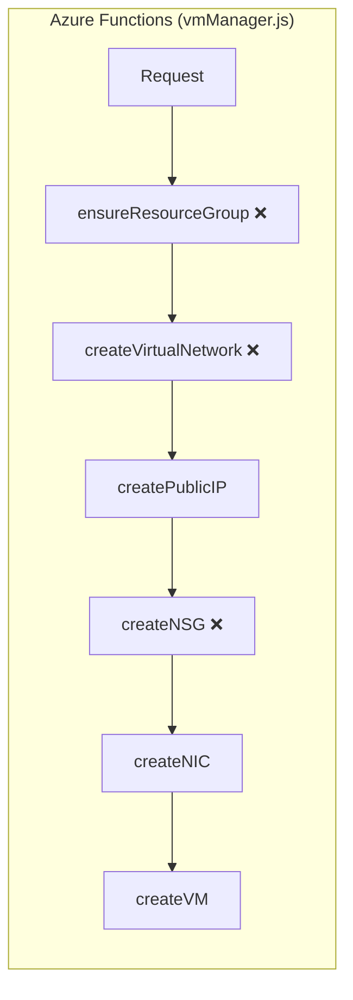
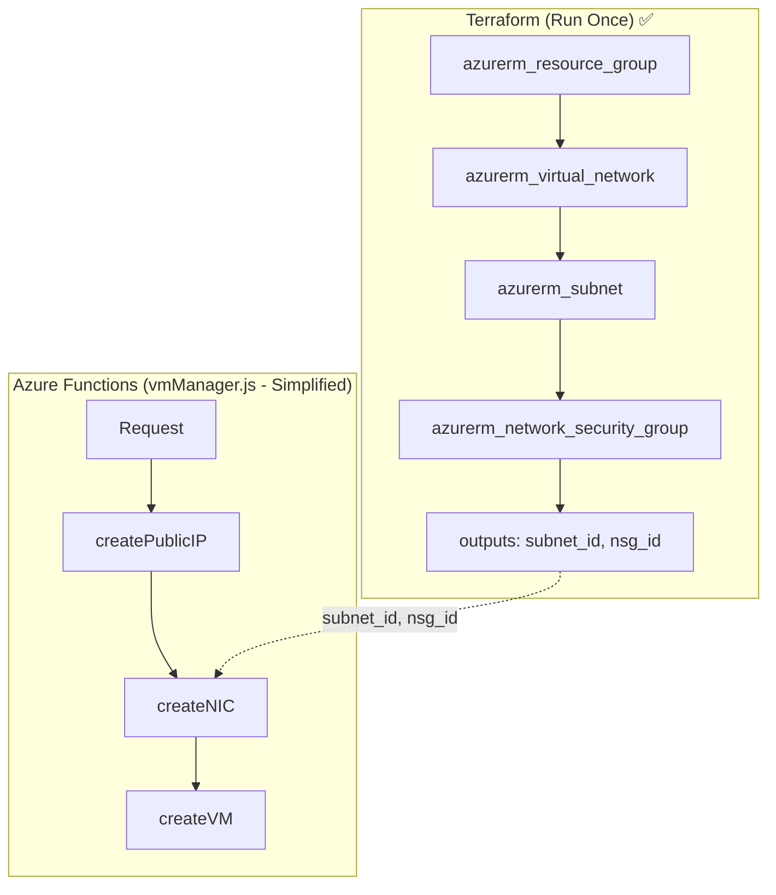
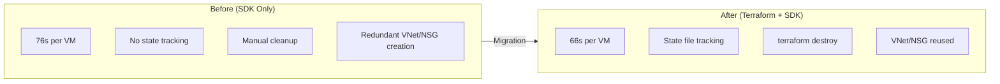
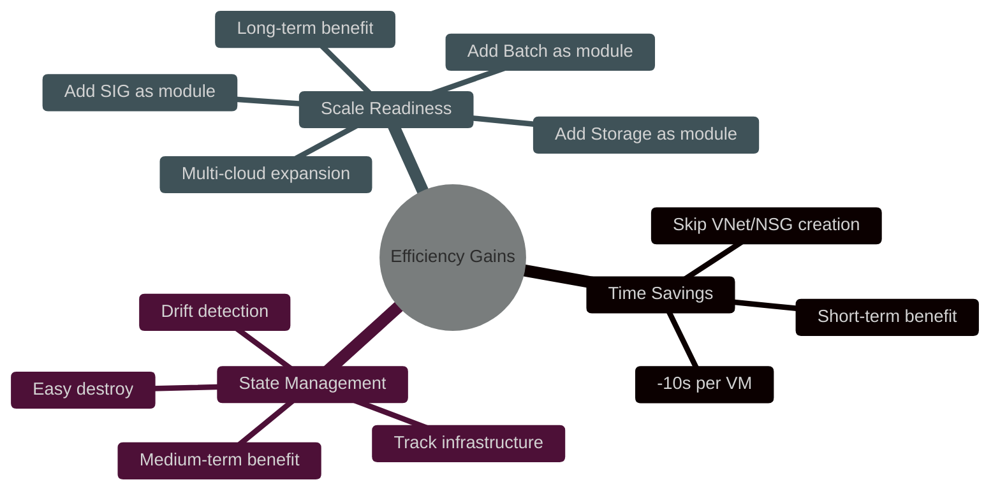
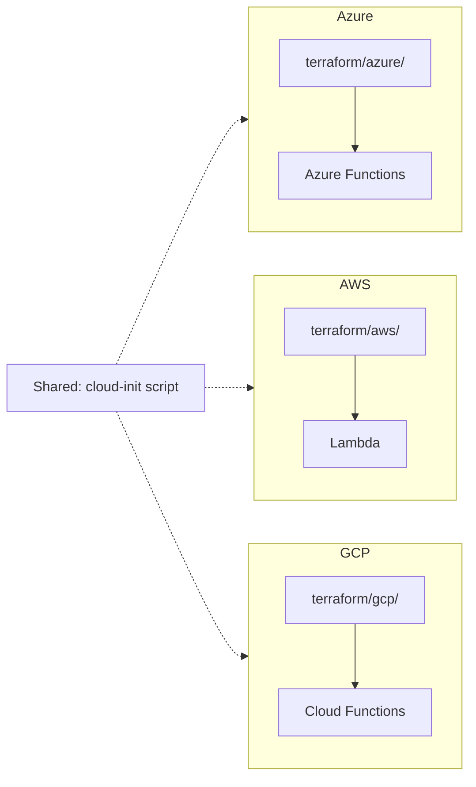

# Terraform Migration Analysis

## Overview

This document analyzes the migration from Azure SDK to Terraform for the Unity CI Enabler project.

---

## Current Architecture (All SDK)

**Legend:**
- ❌ Redundant work (recreated every request)

**Timeline per VM request:**

| Step | Resource Group | VNet | Public IP | NSG | NIC | VM |
|------|----------------|------|-----------|-----|-----|-----|
| Time | ~2s | ~5s | ~3s | ~3s | ~3s | ~60s |

**Total: ~76 seconds**

---

## Proposed Architecture (Hybrid: Terraform + SDK)

**Legend:**
- ✅ Terraform managed (created once, reused)
- SDK managed (dynamic, per request)

**Timeline per VM request:**

| Step | Public IP | NIC | VM |
|------|-----------|-----|-----|
| Time | ~3s | ~3s | ~60s |

**Total: ~66 seconds (-13%)**

---

## Efficiency Comparison

| Aspect | Before (SDK Only) | After (Terraform + SDK) |
|--------|-------------------|-------------------------|
| **VM Creation Time** | ~76s | ~66s (-13%) |
| **Redundant Work** | VNet/NSG created every request | None (reused) |
| **State Tracking** | None | Terraform state |
| **Cleanup** | Manual | `terraform destroy` |
| **Scalability** | Code complexity increases | Modular |

---

## Where Efficiency Gains Occur

---

## Resource Mapping: SDK to Terraform

| SDK Function | Terraform Resource | Migration |
|--------------|-------------------|-----------|
| `ensureResourceGroup()` | `azurerm_resource_group` | Terraform |
| `createVirtualNetwork()` | `azurerm_virtual_network` + `azurerm_subnet` | Terraform |
| `createNetworkSecurityGroup()` | `azurerm_network_security_group` | Terraform |
| `createPublicIP()` | - | Keep SDK |
| `createNetworkInterface()` | - | Keep SDK |
| `createVirtualMachine()` | - | Keep SDK |

---

## Multi-cloud Expansion Path

---

## Decision Rationale

**Summary**: Proactive IaC adoption for multi-cloud expansion and increasing infrastructure complexity

| Reason | SDK Limitation | Terraform Solution |
|--------|----------------|-------------------|
| **Multi-cloud** | Need to learn/maintain SDK per cloud | Same HCL syntax, just swap providers |
| **State Management** | No resource tracking | State file tracks current infrastructure |
| **Cleanup** | Manual deletion required | `terraform destroy` auto-cleanup |
| **Scalability** | Complexity spikes with Batch, SIG, Storage | Modular management |
| **Collaboration** | Hard to understand infra from code alone | Code = Infrastructure documentation |

**Decision Context (2026-01-29)**:
- Current: 1 VM + network resources
- Planned: Azure Batch, SIG, Blob Storage, Static Website, Multi-cloud

**Hybrid Approach Rationale**:
- Static infrastructure (VNet, NSG, Storage): Terraform - create once, maintain long-term
- Dynamic resources (VM): Keep SDK - fast response needed in Serverless

---

## Implementation Phases

### Phase 1: Terraform Static Infrastructure
- `terraform/azure/main.tf` - Resource Group, VNet, Subnet, NSG
- `terraform/azure/variables.tf` - Variable definitions
- `terraform/azure/outputs.tf` - subnet_id, nsg_id for SDK

### Phase 2: Security Improvements
- Remove hardcoded passwords
- Add `.gitignore` for state files
- (Optional) Azure Key Vault integration

### Phase 3: SDK Refactoring
- Remove VNet/NSG creation from vmManager.js
- Reference Terraform outputs
- Simplify to dynamic VM creation only

### Phase 4: Multi-cloud Expansion
- `terraform/aws/` + Lambda
- `terraform/gcp/` + Cloud Functions
