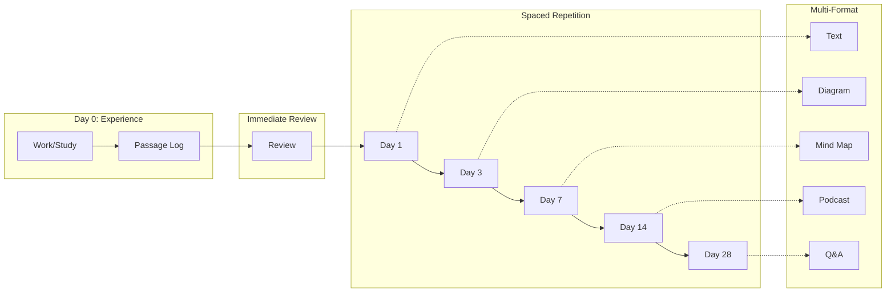

<!-- TODO: Reorganization Plan
| 카테고리 | 설명 | 위치 |
|---------|------|------|
| 1. Voyage Rules | 모든 voyage에 적용되는 규칙 | standing-orders.md |
| 2. Personal Rules | 개인 규칙/습관 | ? (별도 섹션 or 새 파일) |
| 3. System Ideas | Self-Binnacle 시스템 개선 | _system/ or Blueprint/ |
| 4. Embryonic Voyages | Voyage 아이디어 | Voyages/embryonic-voyages.md ✓ |
-->

# Standing Orders

Rules that affect all Voyages. Regulations the captain must continuously maintain.

**Note:** Standing Orders must be actionable. Each rule should have a clear trigger, action, and verification method within the Self-Binnacle system.

---
- 추가해야되는 룰이 하나가 있어 어떻게 해야 한국어를 쓰지않고, 영어만 계속 당분간 쓰면서 할까? 아마 시간은 걸리겠지만 예를 들어서 물어봐야되는것에 대해서는 영어로 못쓰겠으면 어떻게 쓸지 물어보고 다시 영어로 써서 계속 익숙해지고 계속 말하고 듣고 당분간 유튜브 시청 끝, 

- 매일 자기 전에 Gemini AI voice랑 기술적 인터뷰 준비 및 Behavior 인터뷰 답변 준비해보기

- 7시 이후에 뭐 먹지 않기
- 나는 40분 집중과 10분 휴식을 잘 챙겼는지

- 무조건 비는 시간을 스케줄에 집어넣기 이거 뭐였더라..그...거기에 있는건데 응급실에 방 하나를 비워노았더니 전체 시스템이 잘 돌아갔다 이거

- 우선은 AI 부분을 자동화시키는것은 하나쯤을 만들어볼수 잇을듯 민감한 정보를 확인하는 AI? 오직 Git Tracked된것들만 그리고 모든것을 확인하면 어려우니 해당 Git commit에 포함되는 파일만 오직.

## Active Rules

*(No active rules yet - ideas below need to be refined into actionable rules)*

---

## Ideas (Not Yet Actionable)

> **Core Insight:** Learning is not a battle of willpower—how long you studied or how much you read. It's system design: constantly throwing uncomfortable stimuli at your brain so it desperately synthesizes proteins to retain information.
>
> Sources: [1](https://www.youtube.com/watch?v=jMKxunkIBeY), [2](https://www.youtube.com/watch?v=mOsL6wfBAjY)



### 1. Immediate Review After Each Passage
**Concept:** Review immediately after completing work (like Go masters who review even lost games)
**Why:** Brain treats unreviewed experiences as garbage data. Error detection system in prefrontal cortex needs reinforcement.

**To make actionable, define:**
- [ ] Trigger: When exactly? (After each Passage? After each session?)
- [ ] Action: What specifically to review? (passage-forecast-review.md?)
- [ ] Duration: How long?
- [ ] Verification: How to track compliance?

### 2. Spaced Repetition System
**Concept:** Review at 1, 3, 7, 14, 28 day intervals with varied questions/scenarios
**Why:** Long-term memory formation requires protein synthesis time. Synapses need reinforcement from multiple angles.

**To make actionable, define:**
- [ ] What content to review? (Passage logs? Key learnings?)
- [ ] Tool: Anki? Notion? Custom script?
- [ ] Integration: How does this fit into Self-Binnacle workflow?

### 3. Multi-Format Knowledge Reprocessing
**Concept:** Reprocess information through different media/formats each time you review
**Why:** Brain stops protein synthesis when it recognizes identical stimuli ("I already know this"). Different formats force brain to reconstruct knowledge from new angles, creating multiple neural pathways.

**Examples:**
- Text → Diagram (draw what you read)
- Case study → Relationship map
- Design theory → Component sketch
- Notes → Podcast/Q&A (via NotebookLM)
- Code → Flowchart
- **Reverse Thinking:** Apply knowledge backwards
  - Medical: "How would this be used in an emergency?"
  - Law: "What logic makes this favor the defendant?"
  - Engineering: "What symptoms appear when this breaks?"

**To make actionable, define:**
- [ ] Which content to transform? (Completed voyages? Key learnings?)
- [ ] How to track which format was used last time?
- [ ] Predefined list of format variations to cycle through?
- [ ] Integration with Spaced Repetition system?
- [ ] Output location: Where to store transformed content?

---

## Rule Template

When adding a new Standing Order, use this format:

```markdown
### [Rule Name]
**Trigger:** [When does this rule apply?]
**Action:** [What exactly must be done?]
**Verification:** [How to check compliance?]
**Rationale:** [Why this rule exists - brief]
``` 